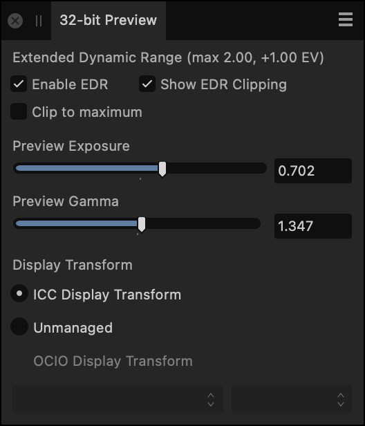
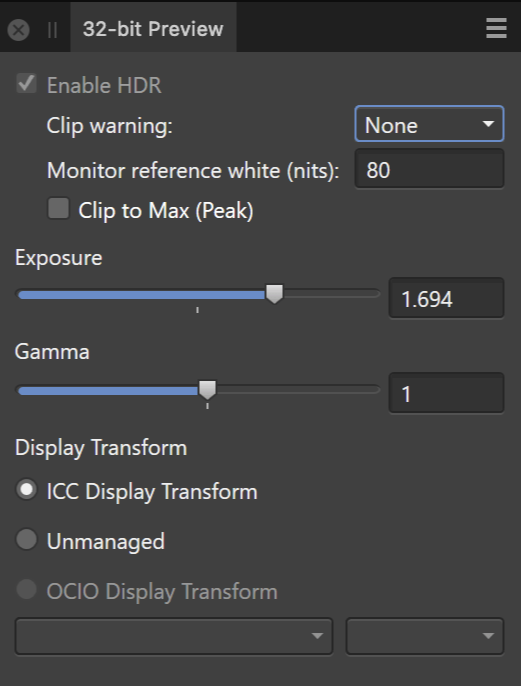

# 32-bit Preview panel

The 32-bit Preview panel provides configurable exposure and gamma controls to preview the vast tonal range of a 32-bit document without tonally modifying it. This is especially useful for floating point lossless workflows (e.g., 3D rendering), where edits need to be made to the image without sacrificing the available tonal range through tonal compression or adjustments.

## About the 32-bit Preview panel

> **Note:** This panel is hidden by default. It can be switched on via the **Window** menu.

**macOS:**

EDR (Extended Dynamic Range) mode is supported which is designed for HDR content creation.

#### EDR-compatible displays

For these displays, enabling EDR display support will switch the operating system into a mode whereby it will increase the backlight intensity and darken screen content—increasing the dynamic range available when rendering content in your 32-bit document.

A settings option will automatically enable EDR display support when viewing 32-bit documents.

*32-bit Preview panel set up for EDR-compatible displays*

**Windows:**

HDR (High Dynamic Range) mode is supported which is designed for HDR content creation.

#### HDR-compatible displays

For these displays, enabling HDR display support will switch the operating system into a mode whereby it will increase the backlight intensity and darken screen content—increasing the dynamic range available when rendering content in your 32-bit document.

A settings option will automatically enable HDR display support when viewing 32-bit documents.

*32-bit Preview panel set up for HDR-compatible displays*

The panel options include:

- **macOS:** **Enable EDR**—enables *Extended Dynamic Range* mode to allow peak brightness values greater than diffuse/paper white to be displayed, increasing the dynamic range of the document view.
- **Windows:** **Enable HDR**—enables *High Dynamic Range* mode to allow peak brightness values greater than diffuse/paper white to be displayed, increasing the dynamic range of the document view.
- **macOS:** **Show EDR Clipping**—displays over-exposed areas while in EDR mode. These are areas outside of the peak brightness value that the display is capable of (e.g. 1000 nits).
- **Windows:** **Clip warning**—displays over-exposed areas while in HDR mode. Choose between **average** or **peak** brightness, measured in nits. These values are obtained from the display's metadata.
- **Windows:** **Monitor reference white (nits)**—used in conjunction with clipping. Set this value to the diffuse/paper white brightness value you have calibrated your display to (if using a profiling device, this may be measured in *cd/m2* which is equal to *nits*). This ensures accurate clipping information is displayed.
- **macOS:** **Clip to maximum**—prevents the display from tone mapping while in EDR mode. Ordinarily, the display will tone map brightness values above its peak brightness threshold, but with this option enabled those values will instead be clipped.
- **Windows:** **Clip to Max (Peak)**—prevents the display from tone mapping while in HDR mode. Ordinarily, the display will tone map brightness values above its peak brightness threshold, but with this option enabled those values will instead be clipped.
- **Preview Exposure**—increases or decreases the preview exposure of the image, allowing you to better visualize the highlight or shadow tonal ranges for editing.
- **Preview Gamma**—alters the gamma correction value.
- **Display Transform**—allows you to switch between a non-linear view using the current display profile, linear light or an OCIO transform:
  - **ICC Display Transform**—non-linear transform using the current display profile.
  - **Unmanaged**—a linear light view where no transform is applied.
  - **OCIO Display Transform**—choose a device transform and a view transform to preview your document using OpenColorIO. The options presented for both pop-up menus will differ depending on your current OpenColorIO configuration.

> **Tip:** In order to use the **Display Transform** options, you must have a valid **OpenColorIO** configurable file and directory defined. See [Using OpenColorIO](../16-hdr/05-using-opencolorio.md) for more information.

> **Tip:** The **Preview Exposure** and **Preview Gamma** options are *non-destructive* and only alter the presentation to screen, they do not affect the document's exposure or gamma. If you wish to modify the document, use an [Exposure](../10-adjustments/02-tonal-adjustments/03-adjustment-exposure.md) or [Levels](../10-adjustments/02-tonal-adjustments/04-adjustment-levels.md) adjustment layer.

> **Preferences — Settings:** Related behaviors can be adjusted from [the app's settings](../37-settings-preferences/01-settings-preferences.md):
>
> - **macOS:** **Color>Enable EDR by default in 32-bit RGB Views**
> - **Windows:** **Color>Enable HDR by default in 32-bit RGB Views**

#### SEE ALSO:

- [Editing HDR images](../16-hdr/01-32-bit-hdr-editing.md)
- [Using OpenColorIO](../16-hdr/05-using-opencolorio.md)
- [Customizing the workspace](../31-workspace/04-customize/02-workspace.md)
