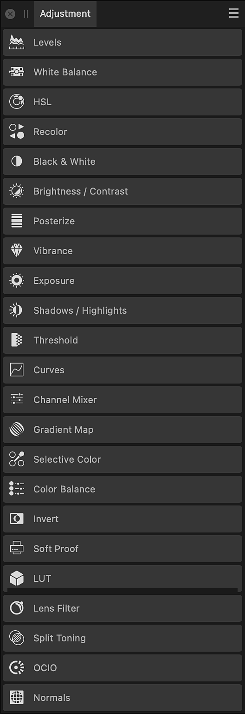

# Adjustment panel (Photo Persona only)

The **Adjustment** panel allows you to apply color and tonal corrections to your image non-destructively, i.e., without making permanent changes to the underlying pixels.

> **Note:** This panel is hidden by default. It can be switched on via the **Window** menu.

## About the Adjustment panel

The **Adjustment** panel presents color and tonal adjustments under adjustment type (e.g., HSL) as a series of preset thumbnails.

*The Adjustment panel.*

Selecting an adjustment type expands the view to show adjustment thumbnails, with each thumbnail applying an adjustment intended for specific uses (e.g., Desaturate); clicking on a thumbnail applies that preset.

The adjustment is added as an adjustment layer to your layer stack.

As you apply a preset you can fine-tune the preset's settings, optionally creating the modified adjustment as a new preset.

> **Note:** You can also apply an adjustment layer directly from the **Layers** panel instead of starting from a preset.

### Settings

The following general settings are available from all adjustment dialogs:

- **Add Preset**—adds the current adjustment settings as a preset for use with later images and projects.
- **Merge**—merges the current adjustment layer with the layer immediately below it in the layer order.
- **Delete**—closes the dialog and deletes the adjustment layer, removing the adjustment from the image.
- **Reset**—reverts all dialog settings to default.
- **Opacity**—how see-through the adjustment layer is.
- **Blend mode**—changes how the applied pixels interact with existing pixels on the layer below. Choose mode type from a pop-up menu.

> **Note:** Not all adjustments have a dedicated dialog or customizable settings.

#### SEE ALSO:

- [Applying adjustments](../10-adjustments/01-applying-adjustments.md)
- [Customizing the workspace](../31-workspace/04-customize/02-workspace.md)
