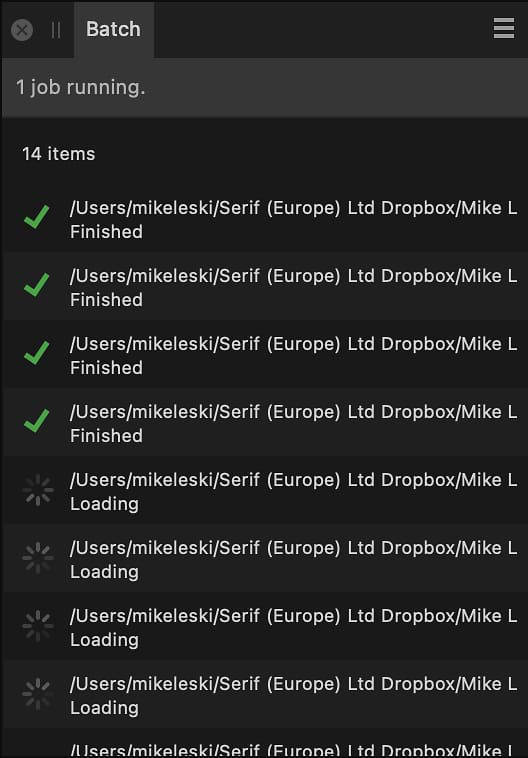

# Batch panel

The **Batch** panel lists all images that are currently being processed as part of a batch job. The panel can be accessed via the top menu's **File>New Batch Job** option, but has no use outside of previewing the progress of a batch job.

*Batch panel*

> **Note:** Upon starting a [Batch Job](../21-macros-and-batch-jobs/02-batch-jobs.md), the **Batch** panel will automatically appear to provide a progress report.

#### SEE ALSO:

- [Batch Jobs](../21-macros-and-batch-jobs/02-batch-jobs.md)
- [Customizing the workspace](../31-workspace/04-customize/02-workspace.md)
