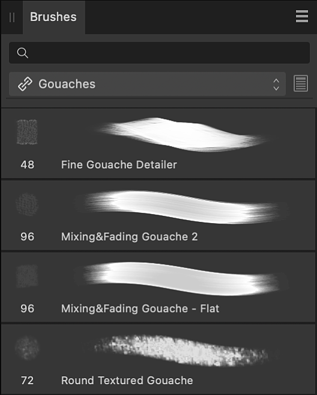

# Brushes panel (Photo Persona only)

The **Brushes** panel hosts a selection of brush presets which can be selected for use with the Paint Brush Tool and other brush-based tools. Any custom brushes you design can be saved to your own panel categories. ABR Brush files can be imported and will be available in their own separate categories.

## About the Brushes panel

A choice of pre-designed brushes is available as selectable thumbnails. With the brush tool selected, the selected thumbnail sets the type of brush to be used. Brushes are arranged in categories.

For convenience, a brush name is displayed under each brush the first time you open the panel (default). You can disable this option, if preferred, via the panel's **Settings** (or **Preferences**).

*The Brushes panel.*

## Importing and exporting brushes

Brushes can be exported to and imported from external files (add-ons) via the Panel Preferences menu. For more information on add-ons, see the [About add-ons](../29-add-ons/01-about-add-ons.md) topic.

### Options

The following options are available on the panel:

- Search—locate brushes in the current category by name.
- Categories—display brush thumbnails for the chosen category.
-  **Edit Brush**. Loads the selected brush, allowing it to be customized and optionally saved as a new brush preset.
- Brush thumbnails for the current category.

The following options are available from the  Panel Preferences menu:

- **Create New Category**—adds a new, empty category to the pop-up menu.
- **Rename Category**—allows you to rename the currently selected brush category.
- **Duplicate Category**—adds a second copy of the currently selected category to the panel. The new copy is not automatically linked to your other Affinity apps.
- **Link Category**—makes the currently selected category available in all your Affinity 2 apps.
- **Delete Category**—removes the selected category.
- **Sort Categories By**—allows you to sort brush categories by **Name** or **Date Added**.
- **Show as List**—by default, brushes are shown in lists; uncheck to present brushes as nozzle thumbnails in a grid.
- **Show Brush Names**—when selected (default), brush names will be displayed under each brush.
- **Auto-scroll**—when enabled, the last used brush will be automatically scrolled to and displayed when you return to the brush tool from other tools. When disabled, auto-scrolling does not occur.
- **Auto-switch category**—when enabled, the option automatically switches to the brush category containing the last used brush when you return to the brush tool from other tools. When disabled, auto-switching does not occur.
- **Enable Associated Tools**—when enabled, the setting will associate the tool set with the brush you are modifying. When disabled, the setting disables the switching for brushes that already have associated tools assigned to them.
- **[Import Brushes](../29-add-ons/04-importing-add-ons.md)**—allows you to import a set of pre-designed brushes, including those in ABR format.
- **[Export Brushes](../29-add-ons/03-exporting-add-ons.md)**—allows you to export the currently selected brush category, ready for sharing with other users.
- **New Intensity Brush**—creates a brush stroke based on the opacity values of a raster image. In the pop-up dialog, navigate to and select a file, and click **Open**.
- **New Round Brush**—creates a brush stroke with a soft, feathered edge.
- **New Square Brush**—creates a brush stroke with a hard edge.
- **New Image Brush**—creates a brush stroke based on an image. In the pop-up dialog, navigate to and select a file, and click **Open**.
- **New Brush From Selection**—creates a custom image brush from any pixel selection or an intensity brush from a mask.

Additionally, the following are available via -click on a brush:

- **Update**—saves new settings modified via the context toolbar with the brush.
- **Reset Brush**—returns to the brush default settings.
- **Rename Brush**—opens a dialog where a brush can be renamed.
- **Duplicate Brush**—copies the selected brush and places it directly underneath the selected brush.
- **Delete Brush**—removes the brush from the panel.
- **macOS:** **Move Brush to Category/Copy Brush to Category**— use the `Alt`  to switch between options where a brush can be moved or copied into a category.
- **Windows:** **Move Brush to Category**—opens a dialog with a list of brush categories where a brush can be moved into.
- **Windows:** **Copy Brush to Category**—opens a dialog with a list of brush categories where a brush can be copied into.

> **Note:** For more information on creating custom brushes, see [Creating custom brushes](../23-painting-and-erasing/05-creating-custom-brushes.md).

#### SEE ALSO:

- [Painting brush strokes](../23-painting-and-erasing/01-painting-brush-strokes.md)
- [Creating custom brushes](../23-painting-and-erasing/05-creating-custom-brushes.md)
- [Brush tools](../32-tools/05-paint-tools/01-paint-brush-tool.md)
- [Mixing paint colors](../23-painting-and-erasing/07-mixing-paint-colors.md)
- [Erasing](../23-painting-and-erasing/02-erasing.md)
- [Retouch](../09-retouching/02-retouching.md)
- [Customizing the workspace](../31-workspace/04-customize/02-workspace.md)
- [About add-ons](../29-add-ons/01-about-add-ons.md)
