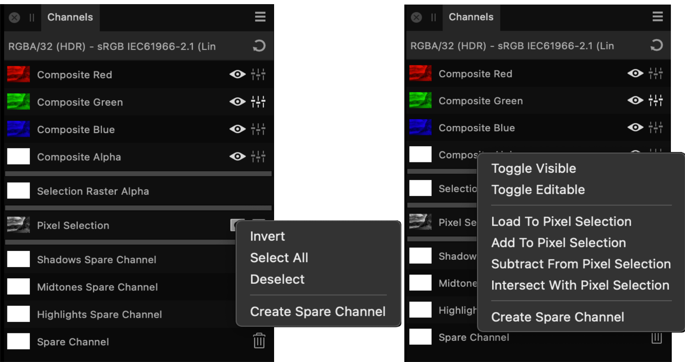

# Channels panel (Photo Persona only)

The **Channels** panel displays the color channels and alpha channel for the whole image or selected layer.

The panel also lets you create and manipulate selections from channels and store selections as channels.

## About the Channels panel

As well as the channel information for the image and current layer, you may also see the:

- current pixel selection
- Mask alpha*
- Adjustment layer alpha*
- Live filter layer alpha*
- Any stored selections (as spare channels) for future use.
- Spare channel alpha
- Selection raster alpha

* When selected in the **Layers** panel.

By default, all color channels are visible and editable.

*Channels panels showing channel for the image and selected layer (top), plus selected mask and stored selections for future use (bottom).*

### Settings

The following options are displayed on the Channels panel:

- Reset—reverts the channel settings back to default.
- Channel thumbnail—displays the color channel as a thumbnail.
-  **Visible**—hides/shows the channel.
-  **Editable**—protects/makes editable the channel.
-  **Invert**—inverts the pixel selection.

More options are available via the context menu (`Click`-click) to allow you to:

- Create selections from channels.
- Add to, subtract from, and intersect channel with current selection.
- Retrieve stored selections.
- Load selections to current layer channel, mask, adjustment layer, or filter layer.
- Create grayscale layers.
- Create mask layers.
- Invert selections, layer channels and masks.
- Create, duplicate and rename spare channels from channels, layer channels, masks and pixel selections.
- Mask channels using Quick Mask.

#### SEE ALSO:

- [Spare channels](../13-channels/03-spare-channels.md)
- [Pixel selections from channels](../08-selections/01-creating-pixel-selections/07-from-channels.md)
- [Saving and loading selections](../08-selections/08-saving-and-loading-selections.md)
- [Customizing the workspace](../31-workspace/04-customize/02-workspace.md)
