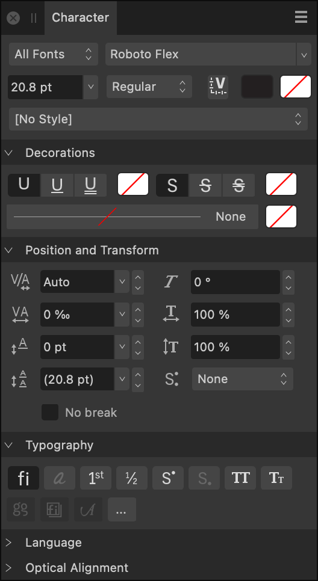
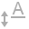
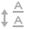
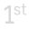
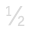

# Character panel

The **Character** panel allows you to apply local formatting to individual letters, words, sentences and paragraphs as well as entire stories.

> **Note:** This panel is hidden by default. It can be switched on via **Window>Text**.

## About the Character panel

The **Character** panel is unique in providing the ability to:

- List typefaces within particular collections (including Missing Fonts).
- Apply double underline or strikethrough as well as controlling their color independently of text color.
- Set kerning and shearing.
- Apply horizontal and vertical scaling.

*The Character panel.*

### Settings

 From the Panel Preferences menu, you can access the following option:

- **Show Typography**—when selected, displays the language script to be used when applying OpenType rules. Typography options depend on the font having the necessary glyphs to support them.

The following panel options are available:

- Collection—sets the typefaces which are accessible via the panel. Select from the pop-up menu.
- Font Family—sets the typeface for the selected text. Select from the pop-up menu.
- Font Size—controls the point size of characters.
- Font Style—controls which typeface style is applied to the selected text.
- **Font Variations**—when a variable font is applied to the selected text, click to reveal settings for each of the font's adjustable axes.
- **Font color**—sets the color of the text. Select from the pop-up panel.
- **Background color**—sets the color applied behind the selected text (i.e., creating a highlight effect). Select from the pop-up panel.
- Text Style—allows a character [text style](../26-text/13-text-styles/01-using-text-styles.md) to be applied to selected text.

**Decorations**

-    Underline—select whether the text has **No Underline** or a single or double underline.
- **Underline color**—sets the color of the text underline. If this is set to 'None', the underline color will match the Font's color. Select from the pop-up panel.
-    Strikethrough—select whether the text has **No Strikethrough** or a single or double strikethrough.
- **Strikethrough color**—sets the color of the text strikethrough. If this is set to 'None', the strikethrough color will match the Font's color. Select from the pop-up panel.
- Outline Stroke—Sets the outline stroke style and width, along with stroke cap, join and alignment.
- Outline Color—sets the color of the outline stroke. If this is set to 'None', the outline color will match the Font's color. Select from the pop-up panel.

**Positioning and Transform**

-  **Kerning**—controls the kerning (distance) between characters. **Auto** will automatically kern characters by default. Positive values give expanded kerning, negative values give condensed kerning. This setting is expressed in permilles, i.e. thousandths of an em space.
-  **Tracking**—controls the spacing between characters. This setting is expressed in permilles, i.e. thousandths of an em space.
-  **Baseline**—controls where characters naturally sit on a line. Increasing the value lowers the baseline, decreasing the value raises the baseline.
-  **Leading Override**—applies local override to selected text to increase the leading with regard to the paragraph’s leading.
-  **Shear**—controls the extent of text slant. Positive values will tilt text to the left, negative values will tilt text to the right.
-  **Horizontal Scale**—stretches the characters and spacing width with regard to point size.
-  **Vertical Scale**—stretches the characters with regard to point size.
-  **Super/Subscript**—converts text characters to superscript or subscript, i.e. characters are set higher or lower than neighboring characters, respectively, and font size is decreased.
- **No break**—tick this checkbox to ensure lines will not be broken at the ends. Soft hyphens will still be honored.

**Typography**

-  **Standard Ligatures**—applies any available typeface ligatures to the selected text.
-  **Contextual Alternatives**—applies any alternative typeface designs available for glyphs depending on their relative position within a word or with respect to neighboring glyphs.
-  **Ordinals**—automatically applies a superscript to letters which are part of an ordinal number.
-  **Fractions**—dynamically converts fractions into a single glyph.
-  **Superscript**—converts text characters to superscript, i.e. characters are set higher than neighboring characters and font size is decreased.
-  **Subscript**—converts text characters to subscript, i.e. characters are set lower than neighboring characters and font size is decreased.
-  **All Caps**—displays all selected text as upper case (or small caps, if **Small Caps** option selected).
-  **Small Caps**—displays lower case letters as miniature upper case. If using an OpenType font that does not define small-caps characters, normal capitals are scaled down to the appropriate height.
-  **Character variants**—allows specific character variants within the text.
-  **Stylistic Sets**—allows you to automatically apply a font's alternate characters throughout the text.
-  **Swash**—applies stroke extensions to characters throughout the text.
- **More**—provides access to additional typography settings.

**Language**

- Choose the language whose conventions you would like your text to follow for each available pop-up menu. Separate languages can be specified for:
  - **Spelling**—specifies the language dictionary to be used for spelling. This will be the default used by the other language options if they are unmodified (set to **Auto**). It also determines which user-defined filler text, if entered in Settings, is displayed in the selected text frame.
  - **Hyphenation**—specifies the language dictionary to be used for hyphenation. This can be used if a specific hyphenation dictionary is not available for the spelling language, but a suitable substitute is available. For example, it is possible to use **English (Australian)** spelling with **English (United Kingdom)** hyphenation.
  - **Typography script**—specifies the language script to be used when applying OpenType rules. For example, the Ordinals OpenType feature ‘ordn’ applies mainly to Latin script, and the Petite Caps feature ‘pcap’ only applies for scripts with both upper- and lowercase forms (e.g. Latin, Cyrillic, Greek). The list of available scripts will depend on the current typeface.
  - **Typography language**—specifies the language to be used when applying OpenType rules. For example, several OpenType features should only be applied to Japanese or Chinese text.

**Optical Alignment**

Optical Alignment determines how certain characters in your document (for example, punctuation marks or particular letters) will fit in relation to the text frame; this can be used to automatically extend lines beginning or ending with certain characters when text frames are snapped to page margin. Adjust the settings to ensure the characters you choose are aligned to your liking.

#### SEE ALSO:

- [Character formatting](../26-text/07-character-formatting.md)
- [OpenType font features](../26-text/10-opentype-font-features.md)
- [Paragraph panel](19-paragraph-panel.md)
- [Customizing the workspace](../31-workspace/04-customize/02-workspace.md)
