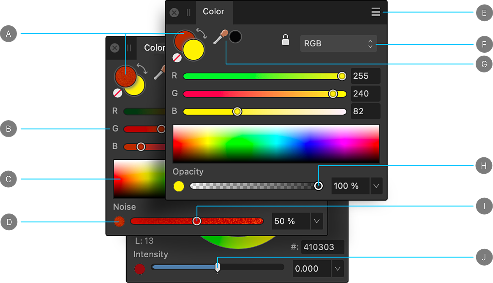

# Color panel (Photo Persona only)

The **Color** panel is used to choose color for various brush tools and to apply color to the stroke and fill of vector shapes, lines, and text.

> **Note:** A pop-up version of the Color panel may appear when choosing color from within other dialogs.

## About the Color panel

The **Color** panel can operate in several color modes—RGB, RGB Hex, HSL, CMYK, LAB and Grayscale—and has various ways of presenting color options—using sliders, a color wheel (HSL only), or color boxes. Color tints can also be applied from within the panel.

*Color panel (RGB sliders): (A) Set Foreground/Set Background color selectors with color 'none' swatch and 'swap' arrow, (B) RGB sliders, (C) RGB spectrum, (D) Opacity/Noise/Intensity toggle, (E) Panel Preferences, (F) Color model selection, (G) Color Picker and picked color swatch, (H) Opacity control, (I) Noise control, (J) Intensity control (32 bit documents only).*

The active color selector is shown at the front of the two color selectors. Choosing a new color will apply it to the active color selector.

For vector shapes, lines and text, the color selector is for stroke and fill color instead of Foreground and Background color, respectively.

> **Note:** You can set the Foreground and Background color selectors to white and black, respectively, by pressing the **D** .

> **Note:**  The **Gradient Tool** changes the appearance of the **Color** panel. Only one color selector swatch is shown to represent the color of the currently selected stop on the gradient.

## Using the Color panel

With the **Color** panel, colors can be set for use by a tool in just a few clicks. Opacity and noise are further color attributes which can be applied via slider. Additionally, for 32-bit unbounded HDR documents, an intensity attribute is available as a slider for creating unbounded color values.

**To set the color of a selector:**

1. Click the selector you want to apply the color to. It will show at the front of the two color selectors.
2. Do one of the following:
  - Choose a color from the color model's **Sliders**, **Wheel** (HSL only), or **Boxes**.
  - Click the picked color swatch.
  - Click the **None** swatch to make the color completely transparent (for the tool, fill or stroke).

**To switch colors between the selectors:**

- Click the double-headed arrow. The colors switch but the active swatch selector remains the same.

> **Note:** You can switch color selectors by pressing the **X** .

**To adjust opacity, noise or intensity setting:**

1. Select the Opacity/Noise/Intensity toggle button at the bottom-left of the panel.
2. Drag the slider to set the value.

## Color selection preferences and color models

 When choosing colors in the Color panel, you can choose from various selection preferences and color model values. The color selection preferences are changed in the Panel Preferences menu.

Depending on the color model selected, you can also choose to work in **8 bit**, **16 bit** or **Percentage** mode.

Some of the selection methods allow you to set color using values other than RGB. This doesn't change the working color profile of the document, but changes the input values for the colors.

> **Note:** You can specify color values for RGB, HSL, CMYK and Grayscale depending on the pop-up menu in the Color panel. This is not the same as the working color profile. For example, if your working profile is an RGB profile, choosing 100% K (black) from the CMYK color model doesn't convert your document to CMYK. Instead the color applied will be an RGB approximation of 100% K (black). However, if you convert or export the document to a CMYK profile, the 100% K (black) will be honored.

 The following color selection preferences are available from the Panel Preferences menu.

- **Wheel**—HSL Color Wheel
  - Drag on the outer ring to set the hue, and drag in the triangle to set saturation and lightness.
  - Click a swatch to the right of the wheel to select a recently used color.
  - Enter an RGB Hex value into the **#** setting.
- **Sliders**—RGB, HSL, CMYK, LAB, Grayscale
  1. Select the color mode from the pop-up menu.
  2. (Optional) From the Panel Preferences menu, select **8 bit**, **16 bit** or **Percentage**.
  3. Drag sliders or type directly into the value boxes to set the color values.
- **Boxes**—Hue, Saturation, Lightness only
  - **Hue**—Drag on the hue slider to set the hue, drag in the box to set the saturation and lightness.
  - **Saturation**—Drag on the saturation slider to set the saturation, drag in the box to set the hue and lightness.
  - **Lightness**—Drag on the lightness slider to set the lightness, drag in the box to set the saturation and hue.
- **Tint**
  - Drag the slider to the left or right to increase or decrease the color tint, respectively.

The HSL color wheel's Saturation/Lightness control can be changed from **Triangle** to **Square** via the Panel Preferences menu.

 For any selected object, the Color panel will remember the color mode that the object was created in. Instead, using **Sliders** you can lock the color mode (e.g., CMYK sliders) to prevent the mode from changing. This avoids inadvertently swapping to another mode after using swatches or selecting a different object created with a different color mode. This lock only works on the current session; subsequent sessions will use the HSL color wheel as default.

> **Tip:** On the **HSL Color Wheel**, -dragging the outer Hue ring will snap to 45° intervals.

> **Tip:** -dragging a **Color** panel slider will move all of the sliders at once (for RGB and CMYK color space only). This can be useful for deciding on a lighter or darker shade of the color in place.

## Using the Color Picker

The picker lets you sample colors within or outside Affinity Photo 2, then use them in your design.

**To use the Color Picker:**

1. (Optional) Select an object to adopt the picked color on picking.
2. Click the selector you want to apply the color to.
3. Drag the **Color Picker** to the color you want to sample.

## Saving chosen colors for later use

Once your color has been chosen and applied to a tool or content, there are several ways to preserve this color for later use.

 The following options are available from the Panel Preferences menu.

- **Copy Color to Clipboard as Hex**—this calculates the current color's Hex value and adds it to the clipboard. This is useful for web developers, to standardize on colors between graphics and HTML coding in a web environment.
- **Add Color to Swatch**—adds the current color to the currently loaded palette in the Swatches panel.
- **Add Chord to Swatch** pop-up menu—adds a chord of the current color to the currently loaded palette in the Swatches panel.

#### SEE ALSO:

- [Selecting colors](../12-color/06-selecting-colors.md)
- [Sampling (or picking) colors](../12-color/05-sampling-or-picking-colors.md)
- [Color chords](../12-color/07-color-chords.md)
- [Customizing the workspace](../31-workspace/04-customize/02-workspace.md)
- [32-bit HDR editing](../16-hdr/01-32-bit-hdr-editing.md)
