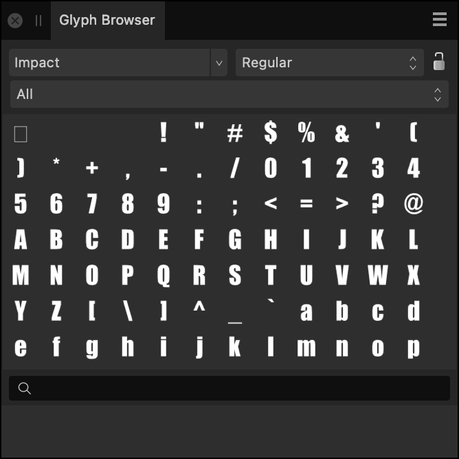

# Glyph Browser panel

In the context of typography, glyphs are graphical representations of a character within a typeface, such as Cyrillic or Latin.

## About the Glyph Browser panel

The **Glyph Browser** panel is available from the Photo Persona and can be switched on via **Window>Text**.

*The Glyph Browser panel.*

**To add a Glyph:**

1. On your document, use either the [Artistic Text Tool](../32-tools/09-text-tools/01-artistic-text-tool.md) or [Frame Text Tool](../32-tools/09-text-tools/02-frame-text-tool.md) to create a text layer and begin editing it.
2. From the **Glyph Browser** panel, double click the desired Glyph to add it into the text.

The following panel options are available:

- **Font**—The chosen font type (all valid installed fonts are listed).
- **Font Style**—Sets the font style, e.g., **Bold**.
-  **Lock Font and Traits**—When unlocked, the font shown in the panel changes with the selected text's font, making it easier to find glyphs from the currently selected font. When locked, the font shown in the panel doesn’t change with text selection. This makes it easier to repeatedly use glyphs from a particular font, typically a symbol font like FontAwesome.
- **Subset**—Sets the chosen font subset to display glyphs from, e.g., **Basic Latin**, **Arabic**, **Greek Extended**.
- **Search**—Enter a Glyph value or a Unicode value to locate a Glyph or Unicode character. For example, "G+0131", "U+00b0" or the phrase "degree" will all show the degree symbol, respectively.

**To set the panel preferences:**

- **Size**—Choose a display size for the glyphs; this benefits usability of the panel and does not affect the glyph output size.
- **Order**—Switches between font **Glyph** and **Unicode** order.
- **Clear Recently Used**—Glyphs you use are added to the bottom of the panel for re-use. This option clears that list.

#### SEE ALSO:

- [Opening documents and images](../03-get-started/01-open-documents-and-images.md)
- [Customizing the workspace](../31-workspace/04-customize/02-workspace.md)
