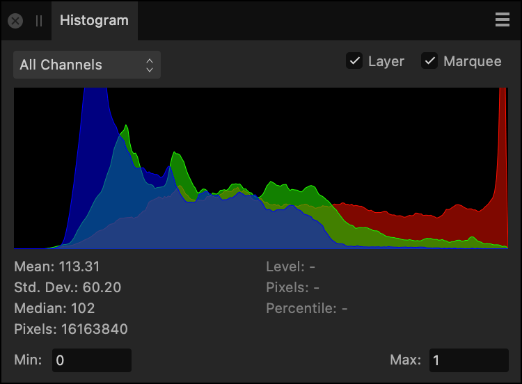

# Histogram panel

The **Histogram** panel shows the distribution of Red, Green and Blue values for the image, layer, or current selection.

## About histograms

The panel gives a valuable 'heads up' of the colors present in your image, which is useful for deciding if color or tonal correction is needed.

*The Histogram panel showing pixel distribution in an RGB image (showing advanced details).*

The light blue values indicate the overlap of the RGB channels (not the luminosity). Purple represents where the red and blue channel representations overlap.

In LAB or CMYK color modes, channels for that mode are displayed instead of Red, Green and Blue (RGB).

Color distribution statistics can optionally be presented at the bottom of the panel to provide further color information. Your cursor can be moved around the histogram, displaying the pixel count at the color level (0-255) your cursor is currently placed at.

**Min/Max** inputs can also be presented at the bottom of the panel to constrain or expand the tonal range the histogram represents. This is especially useful for unbounded 32-bit documents where you may want to either represent more out of range information or clip it further.

> **Note:** The yellow triangle on the histogram can be clicked to display color distribution levels in finer detail.

> **Note:** Luminosity is represented on the **Scope** panel (Intensity Waveform display)—an IRE readout and an abstract representation of your image is provided.

**To display specific channels:**

- Select the **All Channels** pop-up menu, and select a specific channel.

**To show the histogram for a selected layer or selection:**

1. Select a layer or make a selection.
2. Check **Layer** or **Marquee**, respectively.

**To display histogram statistics and min/max inputs:**

- (Optional) Click Panel Preferences and choose the **Advanced** option.

#### SEE ALSO:

- [Color models](../12-color/02-color-models.md)
- [Scope panel](21-scope-panel.md)
- [Customizing the workspace](../31-workspace/04-customize/02-workspace.md)
