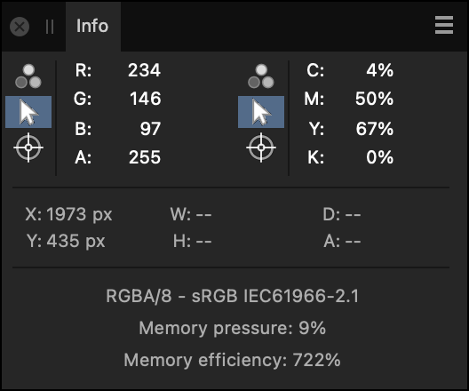

# Info panel

The **Info** panel provides continuous data readings using samplers. These can sample from the current position of the cursor or from a placed target position.

> **Note:** This panel is hidden by default. It can be switched on via the **Window** menu.

## About the Info panel

The type of data tracked includes:

- color values (based on a chosen model)
- total ink level
- horizontal and vertical position
- relative height, width, distance and angle
- document color format and ICC profile
- memory information

The panel allows you to sample from under the cursor or by dragging one or more targets to the page which lets you measure color at chosen positions. The latter is useful when comparing colors before and after applying image adjustments or filters.

*The Info panel.*

## About memory usage

**Memory efficiency** indicates how well Affinity Photo 2 is dealing with redundancy in its internal representation of open documents. A higher value is better, but methods for improving it are generally undesirable, such as sacrificing editability by merging layers.

**Memory pressure** indicates how open documents are consuming the memory (RAM) that is available to Affinity Photo 2. When it reaches 100%, not everything that is open can be held in memory and the app begins to use long-term storage – your hard disk or solid-state disk – to hold some data.

Storage is typically much slower than memory and so you may notice decreased performance in this situation. If encountered often, check the RAM Usage Limit option in Affinity Photo 2's Performance settings is set appropriately for your system and needs.

You can use Activity Monitor (Mac) or Resource Monitor (Windows) to check whether memory available to Affinity Photo 2 is constrained by other tasks running on your computer.

> **Note:** The Info panel is available from the Photo Persona and can be switched on via the **Window** menu.

The following panel options are available for each sampler:

- Color Model—Sets the color model, or total ink level, to be tracked. Select from the pop-up menu.
- Cursor—Samples data under the current cursor position.
- Target—Samples data under a placed target on the image.

**To set a target position:**

- On the **Info** panel, select, hold and drag the target icon onto the page to your desired location.

To reset the target position, drag a new target from the panel to replace the existing target.

**To add a new sampler:**

- Click the Panel Preferences menu, and select **Add New Sampler** from the menu.

**To remove a sampler:**

1. Click to select the sampler entry in the **Info** panel. The sampler will be highlighted in blue.
2. Click the Panel Preferences menu, and select **Remove Selected Sampler** from the menu.

#### SEE ALSO:

- [Color models](../12-color/02-color-models.md)
- [Settings (or Preferences)](../37-settings-preferences/01-settings-preferences.md)
- [Customizing the workspace](../31-workspace/04-customize/02-workspace.md)
