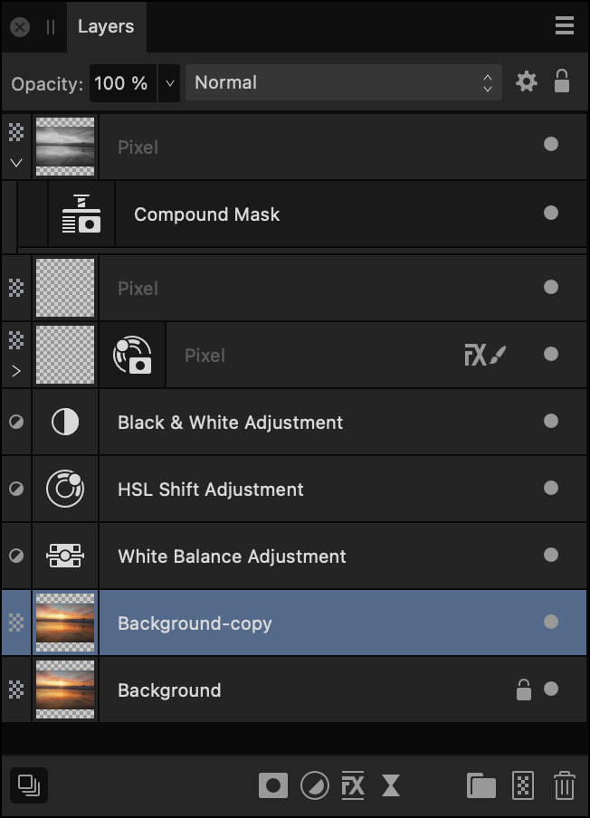
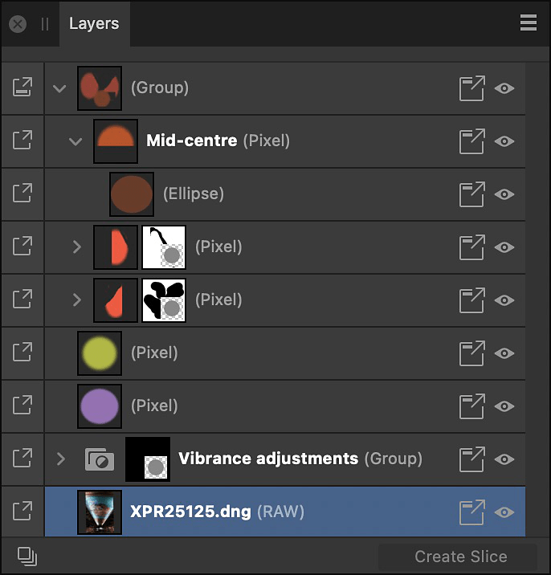
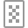

# Layers panel (Photo Persona)

The **Layers** panel lets you manage your design more easily by assembling layer content onto separate layers, each layer being independently controlled.

## About the Layers panel

Layers are composited together to form your complete design which shows up on your page.

The panel can be used to build up your design as multiple layers, with each layer devoted to a particular facet (e.g., brush strokes, images, adjustments, as well as vector shape, line and text).

### From the Layers panel you can:

- Create or delete layers and groups
- Select, reorder, show/hide and lock (layers and groups)
- Clip layers and groups
- Apply layer opacity
- Apply blend modes and blend ranges
- Create masks
- Add layer adjustments, effects, and filters

Layer management features let you optimize layer control, e.g.

- Reselect brushes previously applied to a layer
- Collapse/expand specific or all layers and groups
- Tag layers with a choice of colors
- Change the UI display color of all object's path, nodes and handles
- Exclude layer from being a snapping candidate (`Click`-click object only)
- Switch off Auto-scroll (panel scrolls to layer content when it is selected on the page)
- Display layer thumbnails with a solid or checkerboard background
- Determine the size of layer thumbnails

## About the Layers panel in Export Persona

The Layers panel in Export Persona looks similar to that in other Personas. The key difference is that it is not intended to help edit items on the page but instead to select layers to create exportable slices from.

*The Layers panel, in Photo Persona (left) and Export Persona (right), showing layers in the current document.*

The panel displays the following:

-  **Panel Preferences**—the menu offers :
  - **Auto-scroll**—when selected (default), the selected object's layer entry immediately comes into view in the **Layers** panel.
  - **Show Group Thumbnails**—when selected (default), each group layer’s thumbnail displays a preview of all the group’s contents. When deselected, a folder icon is shown instead.
  - **Show Object Type**—when selected (default), each layer entry displays an icon to identify its type. When deselected, icons are hidden.
  - **Thumbnail Background**—when selected, layer thumbnail backgrounds will display a checkerboard which can be darkened/lightened, or display automatically (default) according to **UI Style** (Settings (or Preferences)>User Interface).
  - **Small Thumbnails**—when selected (default), displays small thumbnails.
  - **Medium Thumbnails**—when selected, displays medium thumbnails.
  - **Large Thumbnails**—when selected, displays large thumbnails.
  - **Close**—hides the current panel.
  - **Close Panel Group**—hides the current panel and other panels in the panel group.
- **Opacity**—Adjusts opacity of the selected layer(s).
- **Blend Mode**—Changes how the applied pixels interact with existing pixels on the layer below. Choose mode type from a pop-up menu.
-  **Blend Options**—Click to access a dialog for setting the blend ranges, blend gamma and antialiasing settings for the selected layer.
-  **Lock/Unlock**—Click to lock or unlock selected items to prevent accidental selection and transformation.
- **Layer entry**—The layer for the created item, comprised of:
  - **macOS:**  **Expand/Collapse**—Click to expand/contract the item, revealing nested content. `Click`-click options let you affect a currently expanded parent layer(s) and group(s) using **Expand Selection**/**Collapse Selection** or affect all parents in the layer stack using **Collapse All Parents** (or **Layer > Collapse All in Layers Panel**). Alternatively, it is possible to expand or collapse layers in a stack or group by pressing the `Alt`  while clicking on the Expand/Collapse chevron.
  - **Windows:**  **Expand/Collapse**—Click to expand/contract the item, revealing nested content. `Click`-click options let you affect a currently expanded parent layer(s) and group(s) using **Expand Selection**/**Collapse Selection** or affect all parents in the layer stack using **Collapse All Parents** (or **Layer > Collapse All in Layers Panel**). Alternatively, it is possible to expand or collapse layers in a stack or group by pressing the `Alt`  while clicking on the Expand/Collapse chevron.
  - Layer type—The [layer's type](../06-layers/01-about-layers.md), identified by a unique symbol.
  - Layer thumbnail—Visual representation of the layer contents on a checkerboard transparent background.
  - Layer name/type description—Text description of the layer type if unnamed; a double-click will let you name the item (removing the layer type description). For text layers, the text used on the page will be shown, while placed documents will show their filenames.
  -  **Recent brushes**—For pixel layers with pixel brush strokes already applied, clicking the icon offers the previously used brushes on that layer for reselection and further painting. For the current session only.
  -  **Toggle Visibility**—Disable to hide the item; enable to make it visible again. `Click`-click to hide selected layers (**Hide**), hide all other unselected layers (**Hide Others**), show other hidden layers (**Show Others**) or color tag the layer for easy layer identification.
-  **Edit All Layers**—Allows selection and editing of layer contents across all layers (rather than the current layer).
-  **Mask Layer**—Creates a layer mask to reveal a portion of a layer while the rest of the layer remains hidden.
-  **Adjustments**—Adds a non-destructive adjustment layer for tonal and color correction. Each [adjustment type](../10-adjustments/01-applying-adjustments.md) has its own symbol to uniquely identify it from other adjustment types.
-  **Layer Effects**—Applies a layer effect to the currently selected layer.
-  **Live Filters**—Applies a non-destructive filter layer to add creative effects. Each [filter type](../06-layers/08-using-live-filters.md) has its own symbol to uniquely identify it from other filter types.
-  **Group Layers**—Groups the currently selected layers.
-  **Add Pixel Layer**—Creates an empty new pixel layer above the currently selected layer.
-  **Remove Layer**—Deletes the currently selected layer.

#### SEE ALSO:

- [About layers](../06-layers/01-about-layers.md)
- [Create layers](../06-layers/02-creating-layers.md)
- [Customizing the workspace](../31-workspace/04-customize/02-workspace.md)
- [Layers panel (Export Persona)](../28-export-persona/04-layers-panel.md)
- [Tagging layers](../07-layer-operations/20-tagging-layers.md)
