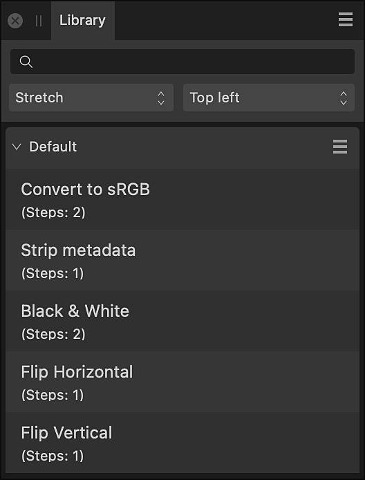

# Library panel

The **Library** panel stores macros and allows them to be applied to the current document via a single click. Both stock macros and custom saved or imported macros appear in this panel.

## About the Library panel

The **Library** panel is available from the Photo Persona; it can be switched on via the **Window** menu. It is also shown automatically when a macro is saved from the **Macro** panel.

*The Library panel.*

For more information on how to record, edit and use macros, see [Macros](../21-macros-and-batch-jobs/01-macros.md).

### Options

The following options are available in the panel:

- Search—allows you to narrow down the macros in the panel to those with names which conform to the search criteria. Type directly in the text box.
- Scaling—choose from **Stretch**, **Max fit**, **Min fit** or **No scale** (default). This controls how layer content (especially brush strokes) will be scaled when applying the macro to a document that has a different aspect ratio or page orientation. **Stretch** will contort the layer content, whereas **Max fit** or **Min fit** will scale content gracefully and maintain the aspect ratio.
- Alignment—change how the macro elements are aligned relative to the document's bounds. For example, if the macro places a watermark image, you could choose **Bottom right** to place it at the bottom right of the current document.
- Category—displays all macros in that category. Click a category's title to collapse or expand the category.

 The following options are available from panel preferences:

- **Create New Category**—adds a new, custom macros category to the panel.
- **[Import Macros](../29-add-ons/04-importing-add-ons.md)**—adds a new category to the panel pre-populated macros.

 The following options are available from the category option menus:

- **Rename**—allows you to rename the category.
- **Delete**—removes the category (and all its macros) from the panel.
- **Duplicate**—adds a second copy of the currently selected category to the panel.
- **Move Up**—repositions the category above the previous category so it is listed higher in the panel. If this option is grayed out, the category is at the top of the panel.
- **Move Down**—repositions the category below the next category so it is listed lower in the panel. If this option is grayed out, the category is at the bottom of the panel.
- **Export Macros**—exports all the macros stored in the current category as a single .afmacros file. On import, the macro category and individual macros are installed.

**To export a macro category:**

1. Click the options menu to the right of the category's name.
2. Select **Export Macros**.
3. Browse to the location where you want to save the .afmacros file.
4. Click **Save**.

#### SEE ALSO:

- [Macros](../21-macros-and-batch-jobs/01-macros.md)
- [Macro panel](16-macro-panel.md)
- [Importing add-ons](../29-add-ons/04-importing-add-ons.md)
- [Customizing the workspace](../31-workspace/04-customize/02-workspace.md)
