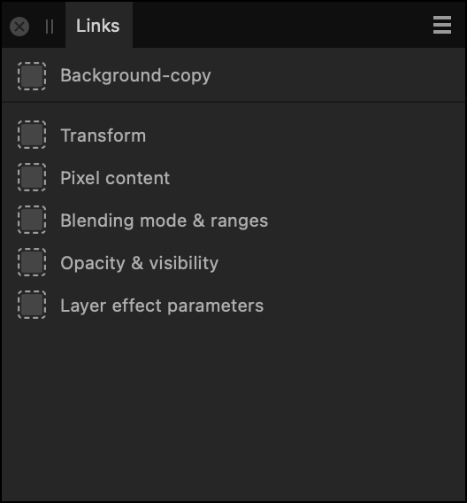
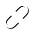

# Links panel

The **Links** panel shows the link attributes for a selected linked layer.

## About the Links panel

The panel displays linked layer attributes that differ according on the type of linked layer selected. Any layer type can be a linked layer.

 The **Links** panel is displayed by clicking the **Is Linked** icon on any linked layer in the **Layers** panel.

### Settings

The **Links** panel displays the following:

-  Link Drop—relinks the currently selected linked layer's attribute to another layer that is dragged over this target.
- Link attributes depending on layer type (see below).
-   **Select previous**/**Select next**—click to navigate between linked layers.
-  **Unlink**—click to remove the linked layer's attribute from layer linkage; edits to that attribute can then be made independently of other linked layers.

The attributes list is as follows:

| Attribute | For sharing | Example |
| --- | --- | --- |
| Transform* | The same moving, resizing, rotating and shearing operation between layer content simultaneously | Resizing linked shapes in proportion |
| Pixel content | The same pixels between layers that update simultaneously on editing | Making a mask share the same pixel content as another mask |
| Blending mode & ranges | The same blend mode and tonal blending | Swapping out a multiply blend mode for a soft light blend mode en masse amongst composite images |
| Opacity & visibility | The same opacity level and Show/Hide settings between layers | Making multiple semi-transparent text frames that update with opacity changes |
| Layer effect parameters | The same layer effect settings (shadow, bevel, color overlays) | Multiple text captions can use a common drop shadow appearance that update if the effect is modified. |
| Adjustment parameters | The same adjustment layer settings | Using the same white balance settings to uniformly 'warm' composited images |
| Live filter parameters | The same live filter layer settings | Sharing uniform blurs on multiple background composited images |
| Vector shape parameters | The shapes' appearances can be morphed | Rounded rectangles could update simultaneously if the corner roundness is to change |
| Vector fill | A solid or gradient fill | Consistent color-to-transparency 'tail-off' radial and linear gradients applied to composited images. |
| Vector line style | The stroke width, color and style | Dotted lines on a travel map could change their dot pattern simultaneously. |

> **Tip:** *Use Link Drop to assign the Transform attribute from already existing linked layer content to unlinked layer content.

#### SEE ALSO:

- [Linking](../07-layer-operations/12-linking.md)
- [Customizing the workspace](../31-workspace/04-customize/02-workspace.md)
