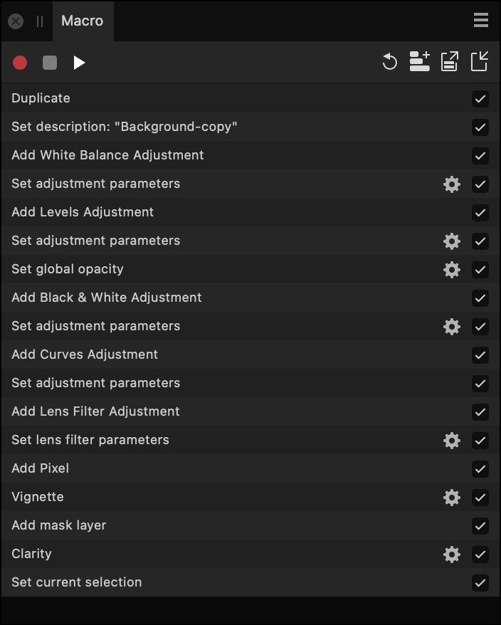

# Macro panel

The **Macro** panel provides a means of recording, saving, importing and exporting macros—a series of actions and operations that can be quickly reproduced and applied to speed up and aid workflows.

## About the Macro panel

The **Macro** panel is available from the Photo Persona; it can be switched on via the **Window** menu.

*The Macro panel showing a series of recorded actions.*

For more information on how to record, edit and use macros, see [Macros](../21-macros-and-batch-jobs/01-macros.md).

### Settings

The following options are displayed on the panel:

-  **Start recording**—click to record your actions and operations which are added to the panel as you record.
-  **Stop recording**—click to stop recording your macro.
-  **Play**—click to play back and preview your recorded macro.
-  **Reset**—click to clear the currently recorded macro operations and actions. Use to start recording from scratch again.
-  **Add to Library**—saves your recorded macro to the macro library. A macro needs to be saved or it will be lost on subsequent macro recording.
-  **Export**—exports your recorded macro to a .afmacro file which can be shared with other Affinity Photo 2 users or stored externally from the app.
-  **[Import](../29-add-ons/04-importing-add-ons.md)**—imports a previously exported .afmacro file.
-  **Settings**—click the cog icon to customize a specific operation's settings for the already recorded macro.
-  **Disable/Enable macro operation**—Uncheck to exclude the operation from playback; check to include it again.

#### SEE ALSO:

- [Macros](../21-macros-and-batch-jobs/01-macros.md)
- [Library panel](14-library-panel.md)
- [Customizing the workspace](../31-workspace/04-customize/02-workspace.md)
