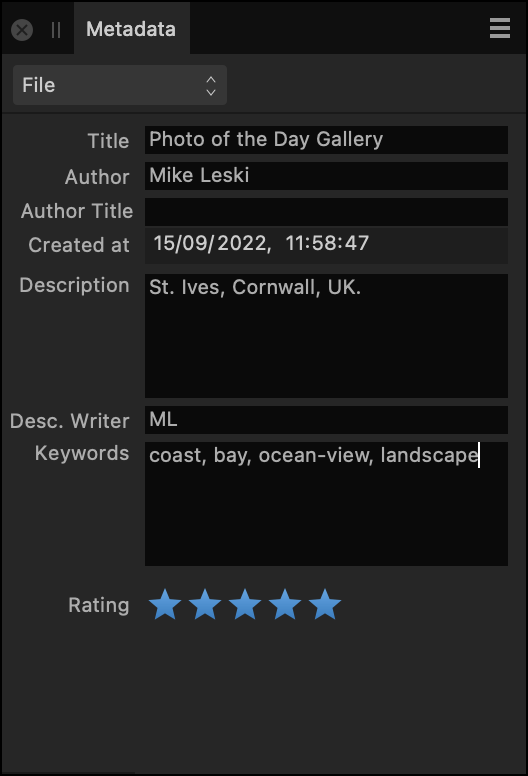
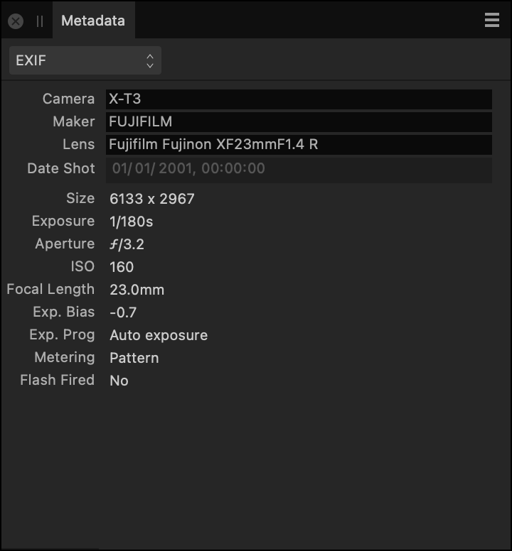
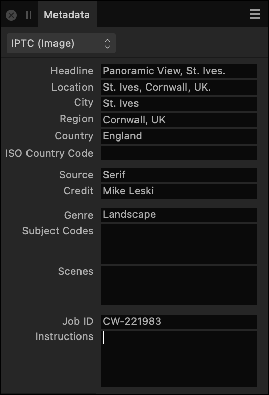
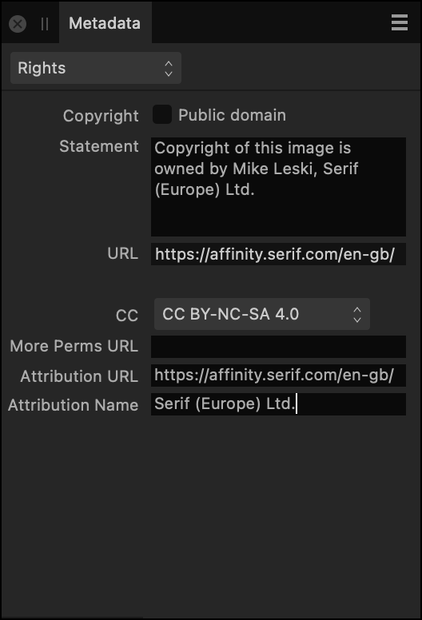

# Metadata panel

The **Metadata** panel enables you to inspect and enter information describing the content, copyright and usage rights of an image.

## About the Metadata panel

The **Metadata** panel is available in the **Photo**, **Develop** and **Export** Personas. To make it visible, select **Window>Metadata**.

You can use the panel to add new metadata to an image, edit existing metadata, and import metadata from/export metadata to an external file.

The contents of the panel's fields are saved as part of Affinity Photo 2 documents and optionally included when exporting to other image file formats.

Additionally, you can use the panel to inspect EXIF metadata that describes the hardware and shooting settings used to take a photo. Some EXIF metadata is editable in Affinity Photo 2, i.e. Camera, Make, Model, Date shot. All EXIF data can be removed in one operation.

*The Metadata panel showing the **File** and **EXIF** categories, left and right respectively.*

> **Note:** Items in the **Keywords** field can be single or compound terms. Often a comma or a semicolon is used to separate them. For example: *United States of America; USA; California; Golden Gate Bridge; architecture*. Check whether other tools in your workflow expect a specific character.

### Metadata categories

The panel's fields are organized into several categories. Use the pop-up menu (top left) to switch between them. The following categories are available:

- **File**—a summary of the image's contents and creator.
- **EXIF**—a summary of the digital camera hardware and settings used to capture the image, where applicable.
- **IPTC (Image)**—descriptions of the content and the location depicted, the image's source (owner), the credit line to display wherever the image is used, and a job ID to help track the image through a workflow. Often used by news organizations and photo agencies.
- **IPTC (Contact)**—the image creator's contact details, including postal and email addresses, telephone number and website. Often used by news organizations and photo agencies.
- **Rights**—image copyright details, any applicable Creative Commons license, and rights-related website addresses.

> **Note:** Use the freeform **Instructions** field in the **IPTC (Image)** category to mention any usage details that do not belong in other fields.

*The Metadata panel showing the **IPTC (Image)** and **Rights** categories, left and right respectively.*

For additional guidance about each field's expected contents, refer to the IPTC Photo Metadata User Guide's [Field Reference Table](https://affin.co/iptcfieldref). Many fields in the Metadata panel accept freeform text; the guide contains examples of common practice.

> **Note:** Images downloaded from stock photography sources may have had their metadata stripped out prior to delivery. Check the license agreement supplied by the image provider for complete usage terms.

### Choosing what metadata to record

Setting metadata is optional. The following properties are recommended as the minimum to be populated:

- **Description** in the **File** category.
- **Author**1 in the **File** category. (The same as the IPTC attribute *Creator*.)
- **Source** in the **IPTC (Image)** category. (The same as the IPTC attribute *Copyright Owner*.)
- **Statement**1 in the **Rights** category. (The same as the IPTC attribute *Copyright Notice*.)
- **Credit**1 in the **IPTC (Image)** category. (The same as the IPTC attribute *Credit line*.)

1 Image-based searches conducted using Google can display this metadata. Further details are available online at [this IPTC article](https://affin.co/iptcgoogle).

Ask your organization or client whether it has its own guidance on which metadata it requires to be recorded and how the data should be expressed.

### Metadata in exported images

To include metadata from all the panel's editable fields in an exported PNG, JPEG, TIFF, PSD or EPS file, click **More** in the **Export Settings** dialog and tick **Embed metadata**.

Most EXIF data will also be included; in particular, some lens information may be omitted.

Exported PDFs include the contents of the **Title**, **Author** and **Keywords** fields, which you can set in the **Metadata** panel's **File** category.

**To remove camera and GPS location metadata from an Affinity Photo 2 document:**

- Open the Panel Preferences menu and do one of the following:
  - Choose **Strip GPS Location** to remove precise location data.
  - Choose **Strip All EXIF** to remove info about camera hardware and shooting settings used in the image's creation.

> **Note:** A sidecar XMP file exported after choosing **Strip All EXIF** will not include data concerning your camera hardware and shooting settings. However, it will include data describing image dimensions, resolution and color space, values for which are calculated automatically by Affinity Photo 2.

**To export metadata to a sidecar XMP file:**

1. (Optional) Strip GPS location and/or EXIF metadata from your document.
2. From the Panel Preferences menu, select **Export to XMP** and then do one of the following:
  - Choose **All** to include all metadata in the resulting file.
  - Choose **EXIF** to include only metadata in the eponymous category in the resulting file.
  - Choose **File, IPTC and Rights** to export all metadata shown in those panel categories.
3. Set the filename and choose where to save the XMP file.
4. Click **Save**.

> **Note:** When using the **All** option, fields which are empty in the **Metadata** panel are not mentioned at all in the resulting XMP file.

**To import metadata manually from a sidecar XMP file:**

1. From the Panel Preferences menu, select **Import from XMP>File, IPTC and Rights**.
2. Browse to and select the sidecar XMP file.
3. Click **Open**.

> **Note:** Affinity Photo 2 can import metadata from an XMP sidecar file automatically when opening the corresponding image, provided they have the same base filename and the sidecar file has the .xmp file extension (in lower case). To enable this behavior, tick **Load metadata from XMP sidecars** in the app's General settings.

> **Note:** When importing metadata, only fields for which the XMP file contains data are overwritten; others are unchanged. So, you can create an XMP file that contains info that is common to all your photos, such as author name and a copyright statement, to avoid retyping it.

#### SEE ALSO:

- [Developing a raw image](../04-develop-persona-raw/01-developing-raw-images.md)
- [Color models](../12-color/02-color-models.md)
- [Customizing the workspace](../31-workspace/04-customize/02-workspace.md)
