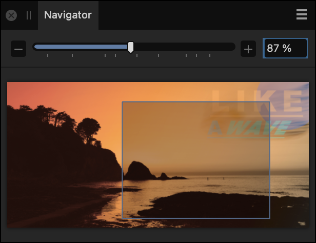

# Navigator panel

The **Navigator** panel lets you zoom into your design and pan around to view specific areas. You can also add, remove and switch between custom view points, which are saved zoom levels and positions.

*The Navigator panel with a custom zoom level and position.*

Depending on the zoom level, a view rectangle denotes the area currently visible in the document view.

**To zoom into/or out of your design:**

Do one of the following:

- Click  **Zoom In** or  **Zoom Out**.
- Drag the slider to change the zoom level.
- Click the numerical zoom level, type a new value, then press the `Return` .

**To pan around your design:**

- Drag the view rectangle around in the panel. The document view displays the area enclosed in the view rectangle.

**To save a view point:**

1. Set your desired zoom level and view position.
2.  From **Panel Preferences**, select **Save Current View Point**.

If the view point is the first one saved for the current document, a pop-up menu will appear on the panel.

**To remove a view point:**

1. From the pop-up menu, select a view point.
2.  From **Panel Preferences**, select **Remove Selected View Point**.

**To rename a view point:**

1. From the pop-up menu, select a view point.
2.  From **Panel Preferences**, select **Rename View Point**.
3. Type a new name for the view point, then click **OK**.

**To switch between view points:**

Do one of the following:

- From the pop-up menu, select the view point you wish to move to. The document view will automatically change.
- To move between view points sequentially, you can use **Move to Previous View Point** and **Move to Next View Point** from the **View** menu.

> **Note:** Commands for moving between view points are mappable to custom keyboard shortcuts; see [Customizing shortcuts](../31-workspace/04-customize/01-keyboard-shortcuts.md) for more information.

#### SEE ALSO:

- [Zooming](../03-get-started/08-zooming.md)
- [Customizing the workspace](../31-workspace/04-customize/02-workspace.md)
