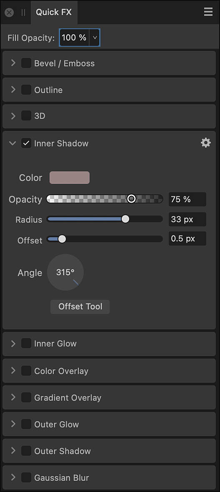

# Quick FX panel (Photo Persona only)

Apply layer effects directly to layer contents using the **Quick FX** panel.

> **Note:** This panel is hidden by default. It can be switched on via the **Window** menu.

## About the Quick FX panel

Layer effects can be applied to layer content. These effects are also non-destructive so you can change them at any time.

*The Quick FX panel.*

The following controls and effects are available in the panel:

- **Fill Opacity**—alters the opacity of layer contents, without altering the opacity of the applied layer effect(s).
- **Bevel/Emboss**—adds various combinations of highlights and shadows.
- **Outline**—adds an outline to the layer content.
- **3D**—adds lighting to give a 3D appearance.
- **Inner Shadow**—adds a shadow inside the layer content's edges.
- **Inner Glow**—adds a color glow that emanates from inside the layer content's edges.
- **Color Overlay**—applies a solid color to layer content.
- **Gradient Overlay**—applies a linear gradient to layer content.
- **Outer Glow**—adds a color glow that emanates from outside the layer content's edges.
- **Outer Shadow**—adds a shadow behind the layer content.
- **Gaussian Blur**—blurs the layer content.

> **Note:**  More advanced options for each layer effect are available via **Layer Effects** next to each effect in the **Quick FX** panel.

#### SEE ALSO:

- [Using layer effects](../24-layer-effects/01-using-layer-effects.md)
- [Styles](../25-lines-and-shapes/13-styles.md)
- [Customizing the workspace](../31-workspace/04-customize/02-workspace.md)
