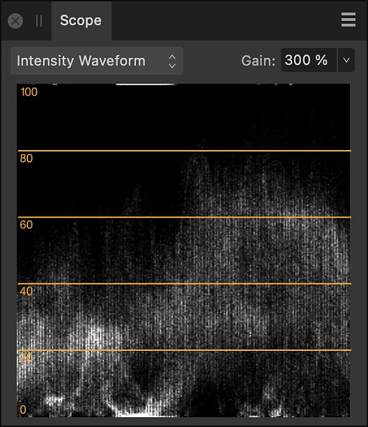
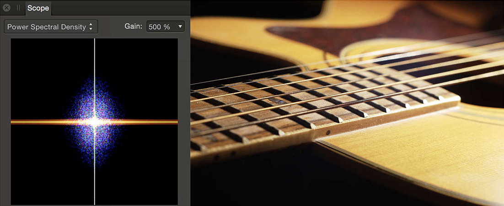

# Scope panel

The **Scope** panel provides a variety of charts which allow you to examine the distribution of luminance and chrominance in an image, allowing you to judge whether tonal or color correction is needed. It can be used as an alternative to, or in combination with, the [Histogram panel](10-histogram-panel.md).

## About the Scope panel

The charts available on the **Scope** panel allow you to analyze an image in order to identify areas which need correcting. Some of these issues may be subtle to the eye but may dramatically improve a photo once corrected. Example issues which may be identified using the Scope panel include tonal problems or color casts.

The **Scope** panel is available from the Photo and Develop Personas; for the former, it can be switched on via the **Window** menu; for the latter, it can be expanded into view by clicking 'Scope' at the top right of your workspace.

*The Scope panel displaying the Intensity Waveform.*

### Available charts

- **Intensity Waveform**—displays a scatter plot of the luminance values of pixels in an image. The X axis gives the horizontal location of the pixel while the Y axis provides its luminance value.
- **RGB Waveform**—as with Intensity Waveform, but displays RGB rather than luminance values.
- **RGB Parade**—as with Intensity Waveform, but separated into RGB components.
- **Power Spectral Density**—represents the image in the frequency domain. Low frequencies are represented as solid lines. High frequencies can be seen as speckles. The color of the frequency plot indicates the dominant color tone in the image.

*Power Spectral Density: the solid orange line represents the blurrier, low frequency tones of the image. The speckled areas represent the high frequencies. The blue and purple color of the high frequencies suggests the presence of chrominance noise.*

- **Vectorscope**—displays a circular chart which monitors an image's color information. Saturation is measured from the center outwards from desaturation to full saturation. The direction of the pattern indicates the image's hue.

### Settings

The following settings are available in the panel:

- Chart—sets the chart currently displayed in the panel. Select from the pop-up menu.
- **Gain**—sets the brightness of the points on the waveform displayed in the panel. This does not affect pixels in the image.

#### SEE ALSO:

- [Using a vectorscope chart](../30-design-aids/02-using-vectorscope.md)
- [Developing a raw image](../04-develop-persona-raw/01-developing-raw-images.md)
- [Histogram panel](10-histogram-panel.md)
- [Customizing the workspace](../31-workspace/04-customize/02-workspace.md)
