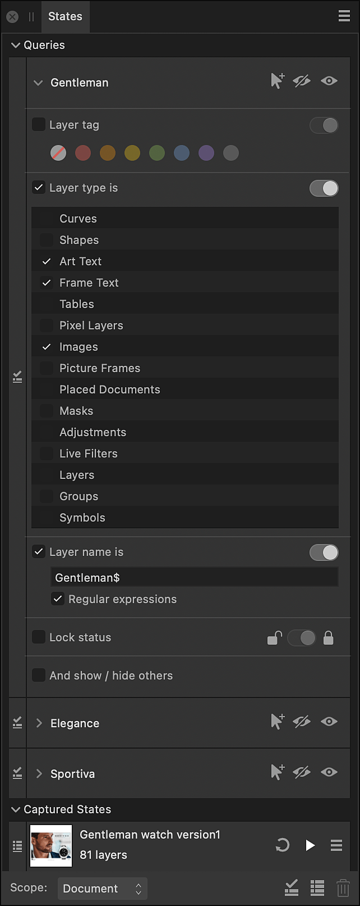

# States panel

The **States** panel allows you to capture the current configuration of layer visibilities and effects as layer states (or simply states) and create queries that affect layers' visibility based on their tag color, type, name and lock status.

Any state or query can be instantly applied to all or some of your document's layers, allowing you to easily compare different directions for your work. To learn more about the application of states and queries, view the [Layer states](../07-layer-operations/21-layer-states.md) topic.

*Affinity Photo 2 States panel.*

> **Note:** The **States** panel is hidden by default. It can be switched on via the **Window** menu when working in Photo Persona.

> **Tip:** It is helpful to add a state that represents the starting configuration of your document's layers before adding or applying other states, so you can easily return to it.

> **Warning:** Updating or deleting a state is not recorded in your document's History, i.e. you cannot simply undo or redo these actions.

### Options

The following options are available on the panel:

- **Scope**—Determines whether adding, updating or applying a state captures/affects the visibility of layers throughout the whole **Document**, only the current **Selection** on the **Layers** panel, or (for specific document types such as .afpub) only layers on the current **Spread**.
-  **Add new query**—Creates a new query, with your choice of name, that can be configured to affect layers' visibility according to their tag color, type, name and lock status.
-  **Add new captured state**—Creates a new state, with your choice of name, that captures the current visibilities of and effects applied to layers in the selected **Scope**.
-  **Delete state**—Deletes the selected state.

The following options are available on a state's entry on the panel:

-  **Update**—Updates the state with current information about layers that were in scope when it was originally added and which are currently in scope. (Other layers that are currently in scope are ignored.)
-  **Apply**—The visibilities of layers are set to the values captured in the state. Affects only layers and layer effects captured in the state and which are in the selected **Scope**, and depending on your choices on the state's options menu.

 The following options are available from the **State Options** menu:

- **Visibility changes**—When selected, the state is allowed to affect layer visibilities when it is applied. When unselected, the state will not affect layer visibilities when it is applied.
- **Effects changes**—When selected, the state is allowed to affect layer effect visibilities when it is applied. When unselected, the state will not affect layer effect visibilities when it is applied.

The following options are available from a query's entry on the panel:

-  **Select**—When clicked, relevant layers are selected according to the visible query.
-  **Hide**—When clicked, layers within the selected **Scope** that meet the query's criteria are hidden.
-  **Show**—When clicked, layers within the selected **Scope** that meet the query's criteria are shown.
- Criteria—Describes attributes that layers must match for their visibility to be affected when Hide or Show is clicked. Unselected attributes are ignored. All selected attributes must be matched.
  - **Layer tag**—Select one or more tag colors (including no color). For example, layers with a red tag color, or layers with either a red tag color *or* an orange tag color. Turn on the switch to match layers whose tag color **is** one of your selection, or turn it off to match layers whose tag color **is not** one of your selection.
  - **Layer type**—Select one or more layer types. For example, only adjustment layers, or adjustment layers *and* live filter layers. Turn on the switch to match layers whose type **is** one of your selection, or turn it off to match layers whose type **is not** one of your selection.
  - **Layer name**—Enter a layer name that layers must match exactly, or, with **Regular expressions** selected, a pattern for matching layer names, then press the  . Turn on the switch to match layers whose name **is** as specified, or turn it off to match layers whose tag color **is not** as specified.
  - **Lock status**—Turn on the switch to match only locked layers. Turn it off to match only unlocked layers.
- **And show / hide others**—When selected, layers in the selected **Scope** and which do not meet the criteria are set to the opposite visibility when you click Hide or Show.

#### SEE ALSO:

- [Layer states](../07-layer-operations/21-layer-states.md)
- [About layers](../06-layers/01-about-layers.md)
- [Viewing](../07-layer-operations/01-viewing.md)
- [Layers panel](13-layers-panel.md)
