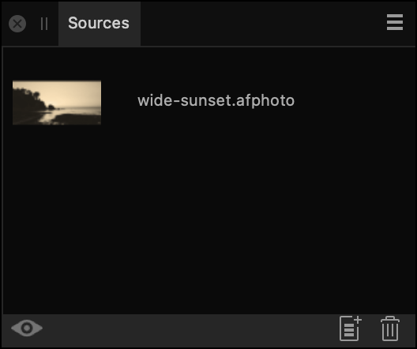

# Sources panel

The **Sources** panel provides a means of storing multiple clone sources that you can use in conjunction with the **Clone Brush** and **Healing Brush** tools.

## About the Sources panel

The **Sources** panel is available from the Photo Persona; it can be switched on via the **Window** menu.

The panel lets you set up multiple global sources and define the "pickup" area for each source, in advance of (or during) cloning, healing, or patching. After a [Focus Merge](../19-focus-merging/01-focus-merging-images.md) or [HDR Merge](../16-hdr/02-merging-to-32-bit-hdr.md), the panel will also automatically appear.

*The Sources panel.*

**To add a global clone source and define its clone area:**

1. Open an image, then from the **Sources** panel, click **Add Global Source**.
2. Double-click on the newly created source entry, then hover over the area of your document you wish to set as a clone source and click once.

> **Note:** Global sources can also be added to the panel when using the **Clone Brush**, **Healing Brush** or **Patch** Tools by clicking **Add Global Source** on the tool's context toolbar.

**To clone from a clone source:**

1. Ensure you have either the **Clone Brush Tool** or **Healing Brush Tool** selected.
2. On the **Sources** panel, make sure the **Toggle Source Preview** option is disabled. Your current document that you wish to edit should be displayed.
3. Select a source from the **Sources** panel list.
4. Hover over your document; you should see a preview of the clone source area. Simply click once or click-drag to begin cloning or healing.

### Settings

The following settings are available in the **Sources** panel:

- **Toggle source preview**—when enabled, allows you to cycle through and preview each source. Disable to return to editing your current document.
- **Add Global Source**—Makes the currently active document a global source, which gets added to the bottom of the panel. When the source entry is selected and preview is enabled, you need to define a source area for that source before it can be used to clone from.
- **Delete Global Source**—deletes the currently selected global source.

#### SEE ALSO:

- [Clone Brush Tool](../32-tools/07-retouch-tools/04-clone-brush-tool.md)
- [Healing Brush Tool](../32-tools/07-retouch-tools/10-healing-brush-tool.md)
- [Patch Tool](../32-tools/07-retouch-tools/11-patch-tool.md)
- [Customizing the workspace](../31-workspace/04-customize/02-workspace.md)
