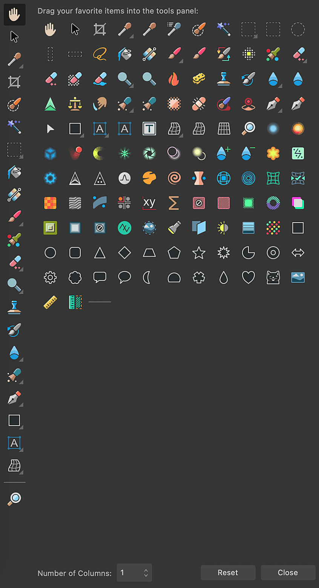

# Tools panel

The **Tools** panel contains the tools available in the active Persona, and is presented vertically to the left of your workspace.

*The Tools panel displaying customization window.*

The panel can be customized to add or remove tools to suit your way of working.

In the **Photo Persona**, stroke and fill color selectors are available below the tools, along with an arrow that swaps their colors.

**To customize the tools:**

1. Click on **View** on the top Menu.
2. Select **Customize Tools**

Here, you can change the number of columns the tools appear in, add or remove tools from view, as well as **Reset** it to its default state.

#### SEE ALSO:

- [Customizing the Tools panel](../31-workspace/04-customize/03-tools-panel.md)
- [Customizing the workspace](../31-workspace/04-customize/02-workspace.md)
