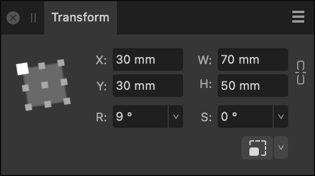

# Transform panel

When selected, layer content can be easily moved, resized and sheared by adjusting the values in the **Transform** panel.

## About the Transform panel

The **Transform** panel repositions, sizes, rotates, or shears layer content precisely. All transforms are carried out in relation to a defined anchor point—corner, edge midpoint or center—allowing the selected transform to be adjusted.

If an object has a custom transform origin applied, it can be resized, rotated or sheared about that center using the options on the panel.

*The Transform panel showing settings applied to layer content.*

The following controls are found on the **Transform** panel:

- Anchor point selector—transforms are carried out from the selected anchor point. Click on an anchor point to select. If the layer content has a custom transform origin, it will be ignored if this selector is then used.
- **X**—Horizontal position. Increasing the value moves the layer content to the right.
- **Y**—Vertical position. Increasing the value moves the layer content down the page.
- **W**—Width. Adjusts the layer content's width in relation to the selected anchor point.
- **H**—Height. Adjusts the layer content's height in relation to the selected anchor point.
-   Link—When enabled, width and height are adjusted in proportion to each other, maintaining the current aspect ratio. When deselected, they can be adjusted independently.
- **R**—Rotation. Rotates the layer content by a specified number of degrees in relation to the selected anchor point.
- **S**—Shear. Shears the layer content by a specified number of degrees in relation to the selected anchor point.
- **L**—Length. Replaces Shear (S) when a straight line is selected using the **Move Tool**. Allows you to precisely adjust the line's length. The Anchor point selector changes its appearance for straight lines.
-  **Scale Override**—when enabled, the option forces the scaling of stroke width, layer effect radii, shape tools' corner radii and text frame content on vector content when it is resized. Click the down arrow to control which object properties will be exempt from scaling.

> **Note:** All transform measurements are in relation to the ruler's zero point, and display in the currently set measurement units.
>
> **macOS:**
>
> The number of decimal places allowed can be set via **Affinity Photo 2>Settings** (or **>Preferences**) (**User Interface**).
>
> **Windows:**
>
> The number of decimal places allowed can be set via **Edit>Settings** (**User Interface**).

> **Note:** Instead of adding absolute input values you can enter expressions instead.

#### SEE ALSO:

- [Rulers](../30-design-aids/07-rulers.md)
- [Transforming](../05-sizing-cropping-and-warping/05-transforming.md)
- [Rotating and shearing](../07-layer-operations/03-rotating-and-shearing.md)
- [Expressions for field input](../38-expressions-for-field-input/01-expressions-for-field-input.md)
- [Customizing the workspace](../31-workspace/04-customize/02-workspace.md)
