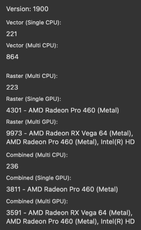

# Benchmark

Affinity Photo 2 includes a benchmark to test your device's vector and raster performance.

The benchmark assesses the capability of your device's CPU to perform vector operations, its CPU and GPU to perform raster operations, and combined results for situations where vector and raster content is used together.

*The benchmark reports several scores.*

## Comparing results

Results from different devices, whether Mac, PC or iPad, can be compared only for the same benchmark version. The version number is displayed at the top-left corner of the **Benchmark** window.

The numeric results reported by the benchmark are linearly comparable, i.e. double the score means twice as fast.

Each test is performed twice and the second pass's result is displayed. The first pass enables resources used in testing to be cached by the app, enabling the second pass to provide an accurate representation of processing capability.

To obtain averaged results, run the benchmark multiple times and make a note of each test's result on each occasion, then use your notes to calculate the average for each test.

**To perform the benchmark:**

1. Ensure no other apps are running in the background. This includes services that sync cloud storage, so disconnect from the Internet to ensure this does not happen while performing the benchmark.
2. In Affinity Photo 2, close all document windows.
3. Select **Help>Benchmark**.
4. Select **Run Benchmark**.

#### SEE ALSO:

- [Performance settings](../../37-settings-preferences/01-settings-preferences.md)
- [Hardware acceleration](01-hardware-acceleration.md)
