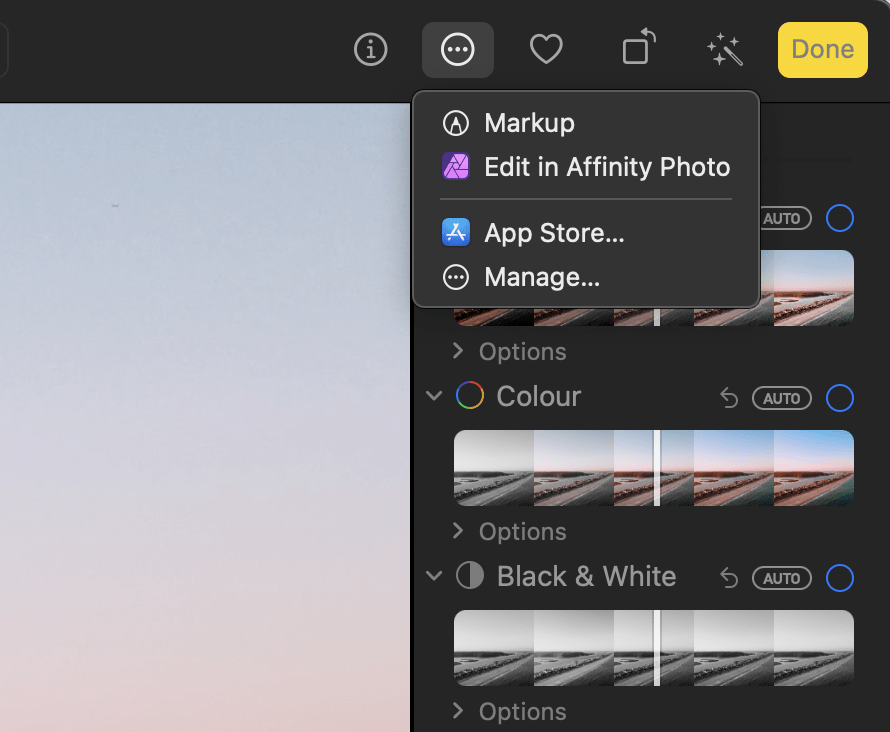

# Integrating Affinity Photo 2 into Apple Photos

**macOS:**

Integrating Affinity Photo 2 into Apple Photos Affinity Photo 2's features can be accessed from Apple Photos to edit library items.

Available extensions The Affinity Liquify, Miniature, Monochrome, Haze Removal, Develop and Retouch extensions can be applied to an image without leaving Apple Photos. Alternatively, you can send an image to Affinity Photo 2 to use the app’s full toolset, and then save the result back to your Apple Photos library.   Affinity Photo 2's extension is available from Apple Photos' Extensions button. Click **Manage** if they are not listed here.   Edits made using the extensions are not permanent. To roll back to the original version of a library item in Apple Photos, `Ctrl`-click the image and select **Revert to Original**.  When not to use the extensions Complex edits involving advanced features, such as layers, masks and live filters, for which you require multiple editing sessions are best conducted by exporting to an external file, loading that file into Affinity Photo 2, saving your work in the.afphoto format. When editing is complete, export the final version for publication or (optionally) for importing into your Apple Photos library.

To enable Affinity Photo 2 extensions for Apple Photos:  Open System Settings (or Preferences) and click **Extensions**. Select **Photos Editing**. Put a tick next to the Affinity Photo 2 extensions you want to use.    To edit an item from Apple Photos using Affinity Photo 2’s full toolset:  Click **Edit** on Apple Photos’ toolbar. Click the **Extensions** button—an ellipsis in a circle—on the toolbar. Select **Edit in Affinity Photo 2**. Edit the image using Affinity Photo 2's full toolset. Select **File>Save**. Select **File>Close**. In Apple Photos, click **Save Changes**.

**To export an item from Apple Photos to an external file:**

- Drag the item from Apple Photos and drop it in a folder. The resulting file will contain any existing edits you have made.
- Select the item and do one of the following:
  - Select **File>Export>Export 1 item**. The file will contain any existing edits you have made.
  - Select **File>Export>Export Unmodified Original For 1 Photo**. The file will be the version originally imported into Apple Photos.

SEE ALSO:  [Basic panel (Develop Persona)](../../04-develop-persona-raw/03-basic-panel.md) [Haze Removal](../../11-filters-and-effects/11-haze-removal.md) [Warping using Liquify Persona](../../22-liquify-persona/01-warping-using-liquify-persona.md) [Depth of Field Blur](../../11-filters-and-effects/02-blur-filters/01-filter-dofblur.md) [Color adjustments](../../10-adjustments/03-color-adjustments.md) [Retouching](../../09-retouching/02-retouching.md) [Exporting using Export Persona](../../28-export-persona/01-exporting-using-export-persona.md)
