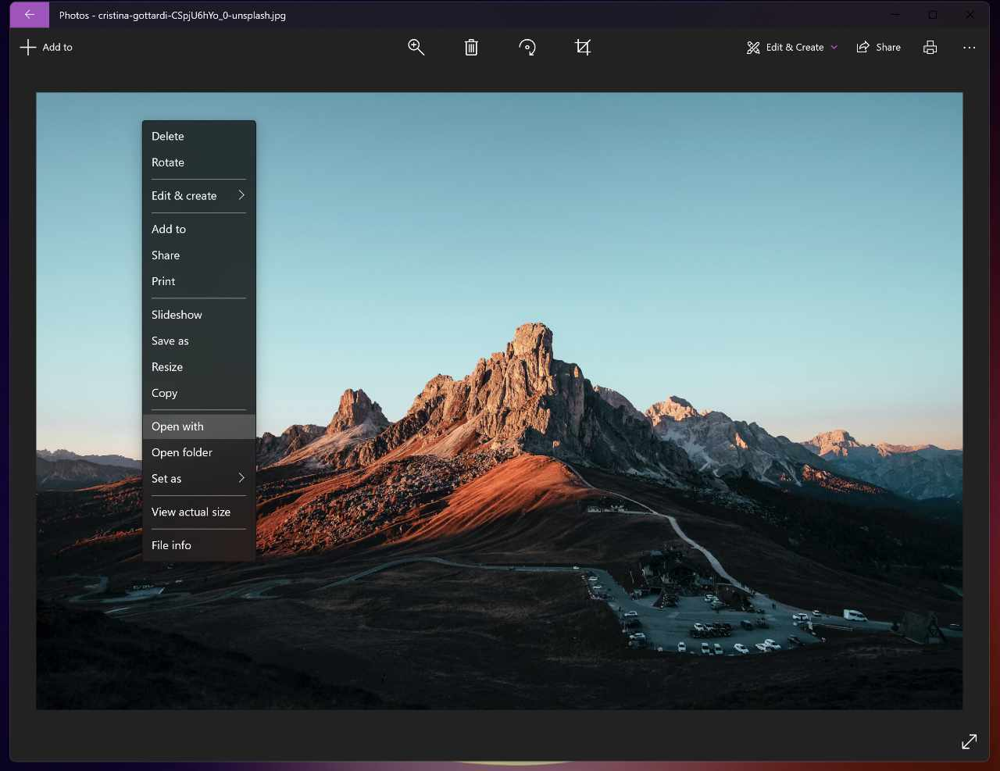

# Integrating Affinity Photo 2 into Windows Photos

**Windows:**

Integrating Affinity Photo 2 into Windows Photos Affinity Photo 2's features can be accessed from the native Windows Photos app to edit library items.   Inside Windows Photos app showing the **Open with** option.

> **Note:** The Windows version and its Photos app features described below relate to the most up-to-date Windows 11 OS. It is therefore recommended to use the same system version for optimal results.

About integrating Affinity Photo 2 into Windows Photos For users of Windows operating system, it is now possible to integrate the native Windows Photos app with Affinity Photo 2 into the editing workflow, which for many may be the preferred method of completing extended power-edits and managing files. When not to use the extension Complex edits involving advanced features, such as layers, masks and live filters, for which you require multiple editing sessions are best conducted by exporting to an external file, loading that file into Affinity Photo 2, saving your work in the .afphoto format.

To start integrating Affinity Photo 2 with Windows Photos:  Click once on the image you would like to open in Affinity Photo 2. Use the See More (three dots) menu located in the top right of the window and select “Open with”. When clicked, a list of available and installed apps will be visible, from where you can select Affinity Photo 2.   Alternatively, you can right-click anywhere on the image, select “Open with” and follow the last step above.

> **Note:** Edits made using the functionality are not reflected in Windows Photos app library until exported to a specified folder.

**To export an item from Windows Photos:**

Do one of the following:

- Click on **File>Export** and specify your file format, settings and location as required.
- Use the **Export Persona** and specify your exporting parameters.

SEE ALSO:  [Basic panel (Develop Persona)](../../04-develop-persona-raw/03-basic-panel.md) [Color adjustments](../../10-adjustments/03-color-adjustments.md) [Retouching](../../09-retouching/02-retouching.md) [Exporting using Export Persona](../../28-export-persona/01-exporting-using-export-persona.md)
