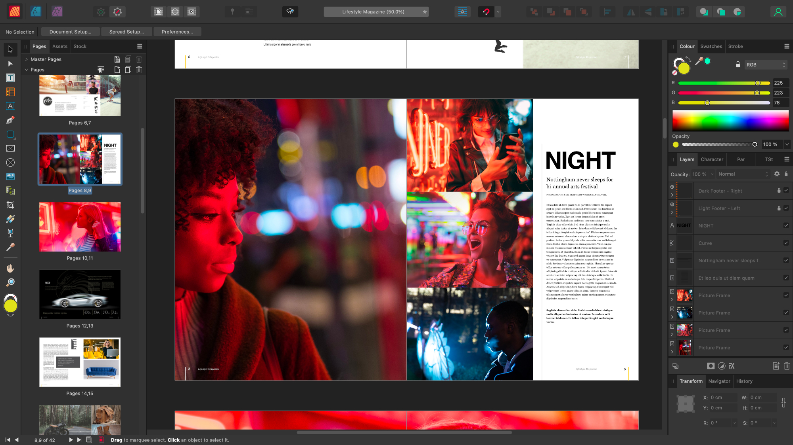

# What is Affinity Publisher 2?

Affinity Publisher 2 is a powerful Desktop Publishing app (DTP) that lets you create, publish and share electronic or print-ready publications.

### About Affinity Publisher 2

The product possesses an impressive selection of pro-level concepts and features aimed at pushing the boundaries of your DTP experience.

#### Key concepts

- Revolutionary StudioLink workflow to seamlessly access extra Vector and Photo disciplines*
- Beautifully designed professional-level features
- Lightning fast performance
- Master pages (edit content or master object on publication page)
- Pro-level text with advanced typography
- Baseline grids
- Text wrapping
- Pinned (anchored) objects
- Adjustments
- Indexes and TOCs
- Ultimate flexibility
- Precision page layout
- Pro-level desktop or CMYK printing

*Requires Affinity Designer 2 and Affinity Photo 2 to be installed, respectively.

Why not review the product's [key features](02-features.md) in detail?

### System requirements

Please see [this link](https://affinity.serif.com/publisher/full-feature-list/) for up-to-date system requirements.

#### SEE ALSO:

- [Key features](02-features.md)
- [Personas](../03-personas/01-about-personas.md)
