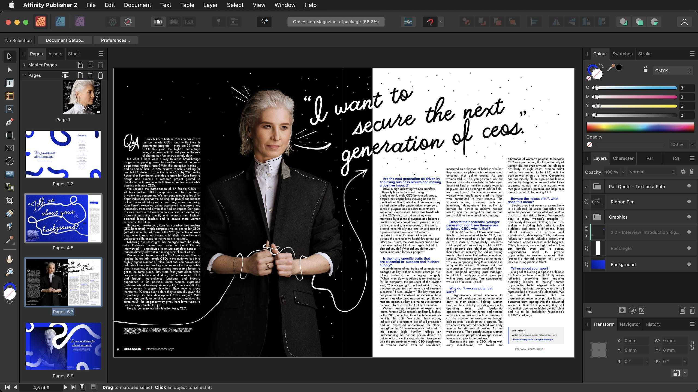

# Interface Visual Reference

Hover over any highlighted area to display a tooltip and identify it.

Publisher

Designer

Photo

## Persona Toolbar

#### Allows you to switch between Personas: different workspaces for various tasks. The active Persona's icon appears with saturated colors.

## Toolbar

#### This contains commonly used functions. Its contents change depending on the active Persona and are customizable.

## Context Toolbar

#### This presents options for the currently selected tool.

## Tools Panel

#### Gives access to various tools for editing. The tools change based on the Persona that is selected. The panel's contents can be customized.

## Right Studio

#### Various panels providing essential functionality for controlling settings. Panels may differ between Personas. Additional panels can be toggled via the Window menu.

## Pages Panel

#### Controls pages and master pages in your document.

## Status bar

#### Highlights available keyboard modifiers for the selected tool. In Publisher, also allows quick navigation between pages.

## Document view

#### The area that displays your current document.

## Menu bar

#### The menu bar shows commands appropriate to the selected Persona, organized by task or category.

## Persona Toolbar

#### Allows you to switch between Personas: different workspaces for various tasks.

## Toolbar

#### Contains commonly used functions. Options change depending on the active Persona.

## Context Toolbar

#### Presents options for the currently selected tool.

## Tools Panel

#### Gives access to various tools for editing.

## Right Studio

#### Various panels providing essential functionality. Additional panels can be toggled via the Window menu.

## Status bar

#### Highlights available keyboard modifiers for the selected tool. In Publisher, also allows quick navigation between pages.

## Document view

#### The area that displays your current document.

## Menu bar

#### The menu bar shows commands appropriate to the selected Persona, organized by task or category.

## Persona Toolbar

#### Allows you to switch between Personas: different workspaces for various tasks.

## Toolbar

#### Contains commonly used functions. Options change depending on the active Persona.

## Tools Panel

#### Gives access to various tools for editing.

## Right Studio

#### Various panels providing essential functionality. Additional panels can be toggled via the Window menu.

## Status bar

#### Highlights available keyboard modifiers for the selected tool. In Publisher, also allows quick navigation between pages.

## Document view

#### The area that displays your current document.

## Menu bar

#### The menu bar shows commands appropriate to the selected Persona, organized by task or category.

On Windows and earlier versions of macOS, Affinity's toolbar and title bar are presented as separate elements but otherwise function the same.

#### SEE ALSO:

- [Toolbar](02-toolbar.md)
- [Persona toolbar](03-persona-toolbar.md)
- [Context toolbar](04-context-toolbar.md)
