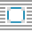
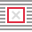

# Toolbar

The Toolbar hosts commonly used tools and functions to keep them at your fingertips. Options are placed in logical groups to improve ease of use.

### Settings (or Preferences)

The following options are available from the Toolbar.

#### Personas:

-  **Publisher Persona**—Accesses DTP features and layout tools.
-  **Designer Persona**—This is the primary Persona of Affinity Designer, offering additional vector drawing features and tools.
-  **Photo Persona**—This is the primary Persona of Affinity Photov2, offering photo editing features and tools.

#### Defaults:

-  **Synchronize defaults from selection**—the default settings are updated to those of the currently selected object.
-  **Revert defaults**—synchronized defaults are reverted to saved defaults. If an object is currently selected, its attributes revert to the default settings.

#### Wrapping:

-  **Show Text Wrap Settings**—click to display a Text Wrap dialog that controls how text wraps around a currently selected object which overlaps a text frame.
-  **Edit Wrap Outline**—click to edit the object's overlapping outline using the Node Tool.
-  **Reset Wrap Outline**—click to reset the wrap outline back to its original shape and position.

#### Pinning:

-  **Float With Text**—click to pin the selected object (e.g., image, table or text) to adjacent text in a text frame. The object will then flow with reflowing frame text.
-  **Inline in Text**—click to pin the object inline (as a character) into text in your text frame.

#### Preview:

-  **Toggle Preview Mode**—previews the publication without any visible design aids.

#### Baseline Grids:

-  **Show Baseline Grid**—Click to show/hide the manager which controls document-wide baseline grid alignment.

#### Snapping:

-  **Snapping**—when enabled, selected objects will obey the snapping rules defined by the current snapping options. If this option is off, snapping is disabled.
- Snapping options—customize settings from the pop-up menu.

#### Order:

-  **Move to Back**—repositions the selected object(s) at the bottom of the layer. Alternatively, repositions the selected layer(s) at the bottom of the Layers panel.
-  **Back One**—moves the selected object(s) down one position in the layer. Alternatively, moves the selected layer(s) down one position in the Layers panel.
-  **Forward One**—moves the selected object(s) up one position in the layer. Alternatively, moves the selected layer(s) up one position in the Layers panel.
-  **Move to Front**—repositions the selected object(s) at the top of the layer. Alternatively, repositions the selected layer(s) at the top of the Layers panel.

#### Align:

-  **Alignment**—displays a pop-up dialog allowing you to align and distribute selected object(s).

#### Transforms:

-  **Flip Horizontal**—flips the selected object(s) left to right.
-  **Flip Vertical**—flips the selected object(s) top to bottom.
-  **Rotate Anti-clockwise**—rotates the selected object(s) to the left by one 90° increment.
-  **Rotate Clockwise**—rotates the selected object(s) to the right by one 90° increment.

#### Insert Target:

-  **Insert behind the selection**—when selected, new objects are added below the currently selected object(s).
-  **Insert at the top of the layer**—when selected, new objects are added at the top of the layer.
-  **Insert inside the selection**—when selected, new objects are added inside the current selection.

> **Note:** If all target options are off (default), new objects are added above the currently selected object(s).

#### Account:

-   **Account**—registers your app, accesses your Affinity account and synchronizes with purchased content. The icon will show green when signed into your account.

#### SEE ALSO:

- [Customizing the Toolbar](../19-workspace/04-customize/04-toolbar.md)
- [Object defaults](../09-object-control/22-object-defaults.md)
- [Ordering objects](../09-object-control/09-ordering-objects.md)
- [Transforming objects](../09-object-control/13-transforming-objects.md)
- [Aligning objects](../09-object-control/05-aligning-objects.md)
- [Distributing objects](../09-object-control/08-distributing-and-spacing-objects.md)
- [Text wrapping](../10-text/07-text-frames/07-text-wrapping.md)
- [Pinning objects](../09-object-control/15-pinning-objects.md)
- [Snapping](../16-design-aids/12-snapping.md)
- [Targeting objects](../09-object-control/10-targeting-objects.md)
- [Preview mode](../16-design-aids/11-preview-mode.md)
