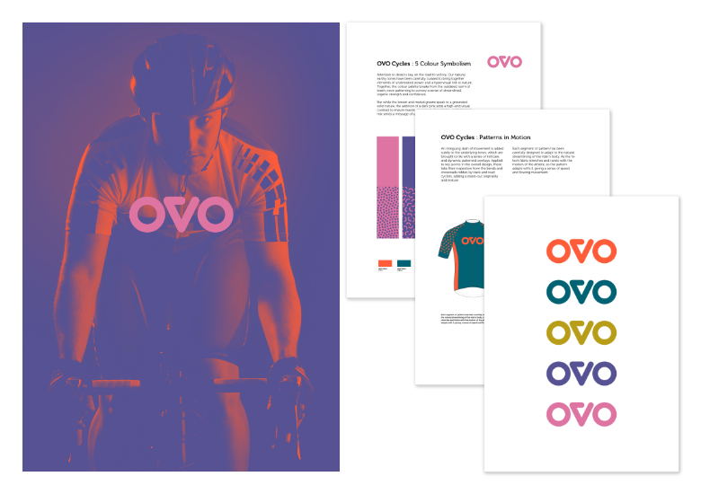
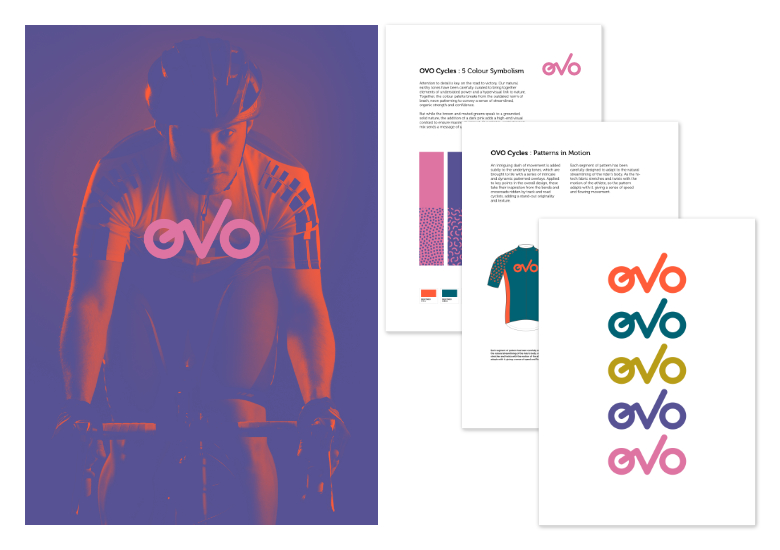
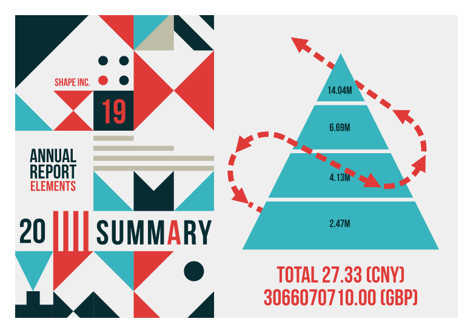
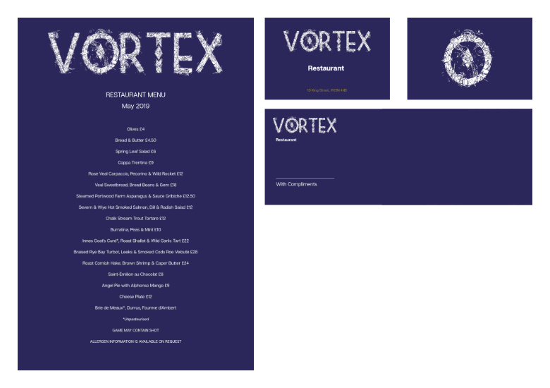
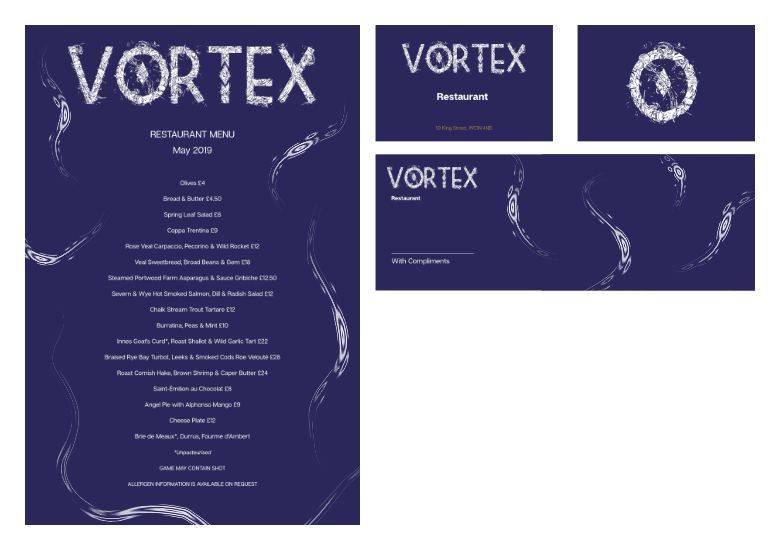
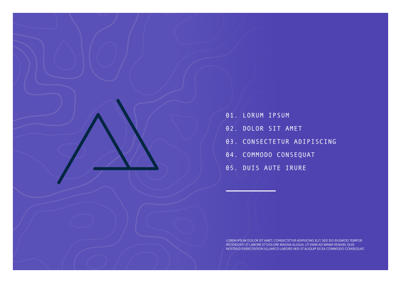
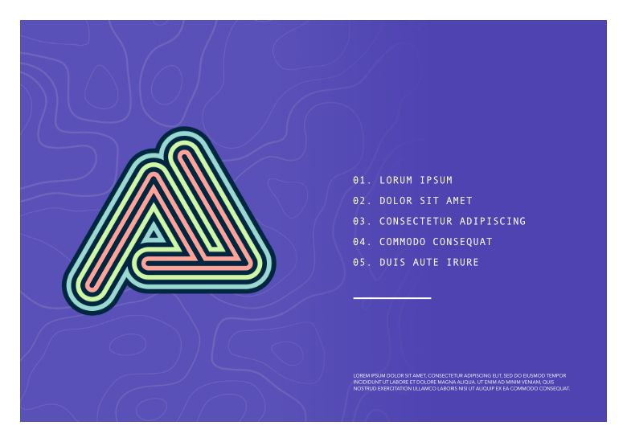

# StudioLink to Designer Persona

A simple switch from Publisher Persona to Designer Persona opens up new graphic design opportunities which can prove useful in a DTP context.

Here's a quick overview of some ideas you could adopt uniquely with Designer Persona. You'll need to have the same version of Affinity Designer as Publisher for this Persona to become active.

## Symbolized logo designs or picture frames

Symbols let you simultaneously update all instances of a 'copied' design in your publication by editing any single instance—you have the option to exclude any object from automatically updating by desynchronizing it.

Example 1 (below): A logo created in Designer Persona can be symbolized with the main logo kept on the first page and a untitled variant used on other pages. As the logo design changes, all symbol instances update automatically across all pages.

Example 2: Create a bordered picture frame, then symbolize it. Create symbol instances of that picture frame, then place them throughout your publication. All future frame edits will be made both globally and automatically.

## Corner Tool

Vector objects possessing sharp corners can have them rounded off to create more visual appeal.

Example: If you have a shape or picture frame you can drag the sharp corner inwards to round the corner by an amount you choose.

## Vector Brush and Pencil Tool

Vector brushwork and pencil strokes can add a little extra creativity to your publication, especially when taking advantage of stroke smoothing using Stroke stabilizer and pressure-sensitive graphics tablets.

Example: Adding decorative strokes to enhance more decorative spreads such as menus.

## Multi-stroke/multi-fill effects

An object typically has a single stroke and fill. Using the Designer Persona's **Appearance** panel, any object can possess multiple strokes and fills arranged in z-order, each being a solid or gradient color with their own blend modes and properties.

Example: Geometric or abstract shapes with interesting outlines can add interest to an otherwise uninspiring shape. Book titles and section headings made with artistic text, once converted to curves, can take multi-stroke and fill properties too.

## Easy isometric drawing

Using the Designer Persona's **Isometric** panel, you can draw and edit objects across three planes on an isometric grid, make '2D' objects fit to plane and transform planar objects between planes.

Example: Building layouts for UI/game design, digital design models, mock ups or designs which benefit from this style.

#### SEE ALSO:

- [Personas](01-about-personas.md)
- [Switching Personas](01-about-personas/01-switchingpersonas.md)
- [StudioLink to Photo Persona](03-photo-persona.md)
