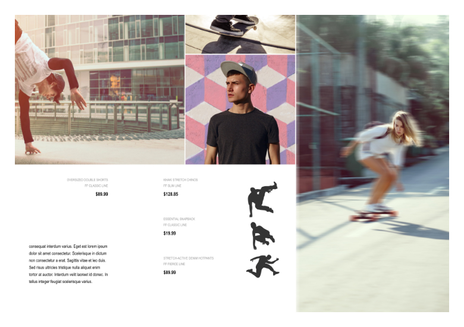

# StudioLink to Photo Persona

If you switch from Publisher Persona to Photo Persona you can take advantage of powerful photo editing tools and techniques to correct or enhance the image content in your publication.

Here's a quick overview of some ideas you could adopt uniquely with Photo Persona. You'll need to have the same version of Affinity Photo 2 as Publisher 2 for this Persona to become active.

## Pixel brush textures

Photo Persona offers a professional Paint Brush Tool backed up with a range of pixel brushes.

Example: Instead of adding a uniformly colored page background you could apply a brushed texture to your foreword page or section start master page.

## Image cutouts

Making brush-based pixel selections on an image lets you cut out subject matter from the image background perfectly.

Example: For magazine work, you can cut out your front cover image's main subject while discarding its background.

## Applying live filters to images

For correcting or creatively enhancing images you can access Photo Persona's live filters; as they're non-destructive you can adjust filter settings at any later date.

Example (corrective): As a finishing touch, add an extra level of image sharpening to your image by applying an Unsharp Mask live filter.

Example (creative): You can make an image stand out from the page more by applying a Gaussian Blur live filter selectively to the image's background.

#### SEE ALSO:

- [Personas](01-about-personas.md)
- [Switching Personas](01-about-personas/01-switchingpersonas.md)
- [StudioLink to Designer Persona](02-designer-persona.md)
