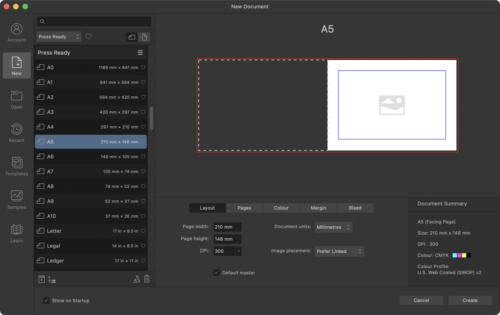

# Create new documents

New documents can be created from presets or customized to meet your specific needs. Presets are organized into categories which indicate the type of deliverable and the correct settings for that deliverable. For example, presets for desktop printing (in the Print category) use an RGB color space, while presets for professional offset printing (Press-Ready category) use a CMYK color space.

*The New Document dialog.*

## Main Options

These iconified options offer a wide range of starting points. Your selection here affects what will appear in all other areas of the dialog.

-  **Account**—registers your app, accesses your Affinity account and synchronizes with purchased content.
-  **New**—(default) creates new documents based on a supplied preset or a customized preset. The main area of the dialog displays a range of presets, depending on the Preset category chosen.
-  **Open**—use to locate and open previously created documents.
-  **Recent**—shows recently opened documents, which can be pinned to make them permanently available.
-  **Templates**—sets a folder for your templates, and imports additional templates.
-  **Samples**—shows sample documents created with the Affinity app.

## New Document Presets list

- Search box—filters the presets to those with names which conform to the search criteria.
- **Category**—displays preset categories to set the aim and deliverable for your project. As well as Print (RGB desktop printing) and Press Ready (CMYK professional printing), you can work to specific Photo print sizes, specific Web screen resolutions, Architectural drawing sizes, and with the Devices option, design to iPad, iPhone, Apple Watch, and Nexus document specifications. Your selected category will determine the presets that appear in the main area of the dialog.
- **Show favorites**—enable to limit restrict the presets list to just those presets tagged as favorites.
-   **Landscape** / **Portrait**—select whether to display your document in a landscape or portrait orientation.
-  **Category options**—lets you rename or delete the associated category.
- **Preset entry**—a selectable preset showing thumbnail, page size and page dimensions.
-  **Save Preset As**—saves a new custom preset to a category.
-  **New Category**—creates a new custom preset category.
-  **Rename Preset**—renames the currently selected preset.
-  **Remove Preset**—deletes the currently selected preset.

## Document settings

The **New Document** dialog also presents separate tabs which allow you to customize your current preset's settings.

- Layout:
  - **Page width** / **Page height**—change these values to make a custom page size.
  - **DPI**—sets the resolution of your document. For example, for professional print quality, set your resolution to 300 dpi.
  - **Document units**—displays your rulers and object dimensions in pixels, points, picas or using physical measurement units.
  - **Image placement**—determines whether placed images or documents are to be embedded or linked in the document by default.
  - **Default master**—when this checkbox is ticked (default), a blank master page (Master A) is automatically created and assigned to all created pages.
- Pages:
  - **Facing pages**—check the option to enable facing page spreads in your publication. A spread presents a left (verso) and right (recto) page together in the document view.
  - **Arrange**—specify whether the document pages should be arranged horizontally or vertically.
  - **Start on**—specify where the document pages should start.
  - **Number of pages**—sets the number of pages the document has. Use the stepper controls to increment one page at a time; press the `Shift`  to increment 10 pages at a time.
- Color (management):
  - **Color format**—sets the color mode to RGB (8, 16 or 32 bit HDR), Grey (8 or 16 bit), CMYK (8 bit), or Lab (16 bit).
  - **Color profile**—sets the color gamut for the previously chosen color format.
  - **Transparent background**—check to set your page background to be transparent.
- Margin:
  - **Include margins**—check to configure page margins, which will be switched off by default. Make visible via **View>Show Margins**.
  - **Left, Right, Top, Bottom**—sets the printer margins, showing as non-printable blue lines. For facing-page documents, the **Left** and **Right** options are replaced with **Inner** and **Outer**, respectively.
  -   For the same margin value: Enable the Link symbol, and set any margin value; all other values will update to this.
- Bleed:
  - **Left**, **Right**, **Top**, and **Bottom**—sets the bleed values for the edges of the page.
  -   For the same bleed value: Enable the Link symbol, and set any bleed value; all other values will update to this. For facing-page documents, the **Left** and **Right** options are replaced with **Inner** and **Outer**, respectively.

## Document summary

The permanently displayed pane offers a summary based on the settings currently configured from the tab settings.

**To create a new document from a preset:**

1. From the **File** menu, click **New**.
2. From the dialog, choose a preset category (e.g. Print, Press Ready, etc.), followed by the page orientation (**Landscape**/**Portrait**) and a page size preset (A4 , Letter, etc.).
3. Click **Create**.

> **Tip:** When creating a new document, the Document Units define the exact size of your document on screen. For example, if you chose 'pixels', your document will display at its exact pixel size when exported and viewed on screen at 100%. Similarly, for physical Document Units (e.g., millimeters) you'll get the exact print size at 50% zoom (due to Retina screen).

**macOS:**

**To create a new document from the last used preset:**

- With the **File** menu open, press the `Alt`  and select **New from Last Preset**.

This method bypasses the New Document dialog.

**Windows:**

**To create a new document from the last used preset:**

- On the **File** menu, select **New from Last Preset**.

This method bypasses the New Document dialog.

## Customizing document presets

Any document preset can be customized. Typically, customizing just the page size may be needed with the remaining preset settings kept unchanged.

**To customize a preset:**

1. From the dialog, choose a category, followed by the page orientation (**Landscape**/**Portrait**) and a page size preset.
2. Adjust the document's settings using the **Layout**, **Color**, **Margins** and **Bleed** tabs. The preset name above the preview window displays an asterisk (*) to indicate the preset has been customized.

The settings will be remembered for future sessions, although you can save the preset to a memorable name for future use.

**To create a new preset category:**

- Click **New Category** under the presets list.

**To save a custom preset:**

- Click **Save Preset As** adjacent to the preset name, then save the preset to a name and preset category; use an appropriate icon for the type of preset created.

**To overwrite an existing custom preset:**

1. Adjust the preset's settings.
2. Click **Save and Overwrite Current Preset** adjacent to the preset name.

**To rename or delete a selected preset:**

Do one of the following:

- Click **Rename Preset** or **Remove Preset** under the presets list.
- `Click`-click on a custom preset and choose **Rename** or **Delete**.

If renaming, enter a new name for your preset and click **OK**.

## Document templates

[Document templates](10-document-templates.md) can be set up to contain reusable text styles, graphics, and layouts, giving you a file that's ready to go from the moment you open it. From the **New Document** dialog, you can set up your 'target' template folders to save templates to (**File>Export as Template**), as well as browse, preview and search for existing document templates.

## Document from assets

You can create a separate document from an asset in the Assets panel by dragging one onto the Affinity title bar.

#### SEE ALSO:

- [Document setup](../05-pages-spreads-and-sections/06-document-setup.md)
- [Embedding vs linking](../12-placing-external-content/01-embedding-vs-linking.md)
- [Open documents](02-open-documents.md)
- [Document templates](10-document-templates.md)
- [Color models](../07-color/02-color-models.md)
- [Setting bleed](../14-publishing-and-sharing/06-pdf-publishing/02-setting-bleed.md)
- [Keyboard shortcuts for file/document management](../24-keyboard-shortcuts/01-keyboard-shortcuts.md)
- [About books](../13-references/09-books/01-about-books.md)
