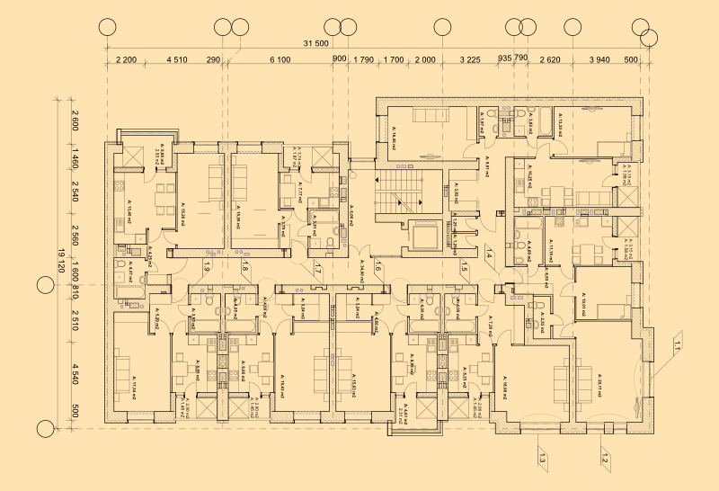

# Importing CAD documents

Affinity imports CAD documents from Autodesk® AutoCAD® apps and other CAD-based apps that output DWG or DXF files.

The importing of CAD documents is a one-way process. You cannot overwrite the original file once it has been imported, instead saving it as an Affinity document. However, you can edit the CAD content and then export the file as a PDF document.

The DWG file format is the proprietary vector-based format for Autodesk® AutoCAD® apps. CAD apps can save to the DXF interchange file format, allowing easier importing of AutoCAD designs into a wider range of third-party apps.

Any drawing scale used in the CAD document is automatically applied to the new document (shown in **File>Document Setup** and when using the **Measure Tool**).

> **Note:** DWG or DXF files can be easily placed into an existing document using **File>Place**.

**To import CAD documents (DWG/DXF):**

1. Do one of the following:
  - From the **File** menu, click **Open**.
  - Double-click anywhere in the empty view. (Only available when no other documents are open.)
2. Select the file you want and click **Open**.
3. On the Import Options dialog, you can choose:
  - **Selection**—chooses the CAD layout(s) or the model to import.
    - **All Pages**—imports one or more Paper Space layouts if present, excluding the Model space. Each layout becomes a separate artboard.
    - **Single Page**—imports an individual Paper Space layout if present; you can choose the specific layout from an additional **Selected Page** option.
    - **Model**—imports just the Model space (with margins and offsets) without Paper Space layouts.
  - **Insertion units**—sets the document units for the document when **Model** is chosen.
  - **DPI**—sets the resolution for the document.
  - **Background color**—adds a background color of your choice to the artboard or page (as a colored rectangle).
  - **Color override**—this changes the color of all strokes in the document. Gradient fills use the color with adjusted luminosities for gradient colors.
  - **Remove hidden items**—if checked, hidden or frozen layers are excluded on import.
  - **Display entity handles**—when enabled, each imported named entity is given a handle suffix, e.g. HATCH - 0x19C2 instead of HATCH. Use for troubleshooting problems with individual entities.
  - **Override line weights**—when **Selection** is set to Model, all line weights will be set to 0.1 pt with this option enabled.
  - **Sanitize model**—when **Selection** is set to Model, this removes any objects in the model that appear physically distant from the main model; these objects can be introduced by CAD plug-ins. This would otherwise affect Affinity's ability to scale the model to fit the page.

**macOS:**

**To import a CAD document (via Finder):**

- Open Finder and drag the DWG/DXF file to an off-page area of your workspace.

**Windows:**

**To import a CAD document (via Explorer):**

- Open Explorer and drag the DWG/DXF file to an off-page area of your workspace.

#### SEE ALSO:

- [Open documents](02-open-documents.md)
- [Importing PDF documents](04-importing-pdf-documents.md)
- [Importing other Adobe documents](05-importing-other-adobe-documents.md)
- [Placing content](../12-placing-external-content/02-placing-content.md)
- [Measuring](../16-design-aids/09-measuring.md)
- [Color management](../07-color/04-color-management.md)
- [Supported file formats](../22-appendix/01-supported-file-formats.md)
