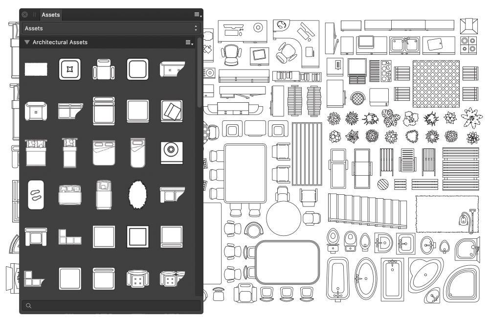

# Using assets

Assets are stored design elements which can be accessed from any document you have open.

## Working with assets

Assets are created from objects or groups of objects. Once selected on the page, these objects and groups can be added to a subcategory (in the displayed category) within the [Assets panel](../21-panels/02-assets-panel.md). When a new assets category is created, this creates a subcategory for you, ready to drag objects to.

An asset can be quickly added to a document by simply dragging its thumbnail from the **Assets** panel onto the page.

> **Note:** Dragging an asset from the panel onto the title bar opens it as a separate document.

## Organizing assets

Categories can be created at any time to help you organize your assets. They are then listed in the pop-up menu at the top of the Assets panel. Each category can accommodate an unlimited number of subcategories.

Subcategories and assets by default are sorted by the time they were added. They can both be sorted by name however, if preferred.

> **Warning:** Assets cannot exist directly in categories, they must reside in subcategories.

## Sharing assets with collaborators

You can share assets with collaborators who are using Affinity Publisher by exporting and importing asset categories.

**To create a new assets category:**

1. On the **Assets** panel, click Panel Preferences and choose **Create New Category**.
2. On the dialog, give the category a name, e.g. MyAssets.

> **Note:** From Panel Preferences, you can also delete and rename the selected category.

**To create a new assets subcategory:**

- On the **Assets** panel, click Panel Preferences and choose **Create Subcategory**.

> **Note:** From the subcategory's options menu, you can rename and delete the selected subcategory.

**To reorder a subcategory:**

Do one of the following:

- On the **Assets** panel, click Panel Preferences and choose **Move Up**/ **Move Up** depending on where you wish your subcategory to appear.
- Drag a subcategory name and place it where required vs other entries in the list.

**To create an asset:**

1. Select one or more objects or groups on the page.
2. Do one of the following:
  - Drag the selection into the **Assets** panel (the cursor will change to show a plus icon) and release when you see a vertical insertion point or highlight.
  - On the **Assets** panel, click a subcategory's options menu and select **Add from Selection**.

Each item (object or group) in the selection is converted to a separate asset and placed in the subcategory with a default name.

> **Tip:** If you want a selection of objects to be added as a single asset, they must be grouped first.

**To add an asset to the page:**

- Do one of the following, from the **Assets** panel:
  - Drag an asset's thumbnail directly onto the page or an artboard.
  - Double-clicking on an asset's thumbnail will load the assets for placement by dragging out across the page.

> **Note:** If an asset has constraint properties and you wish to activate these properties on placement, hold down the `Cmd`  when you drag out the asset.

**To rename an asset:**

1. On the **Assets** panel, `Click`-click an asset thumbnail and select **Rename Asset**.
2. In the dialog, type a new name for the asset and click **OK**.

**To delete an asset from the Assets panel:**

- On the **Assets** panel, `Click`-click an asset thumbnail and select **Delete Asset**.

#### SEE ALSO:

- [Assets panel](../21-panels/02-assets-panel.md)
- [About add-ons](../15-add-ons/01-about-add-ons.md)
