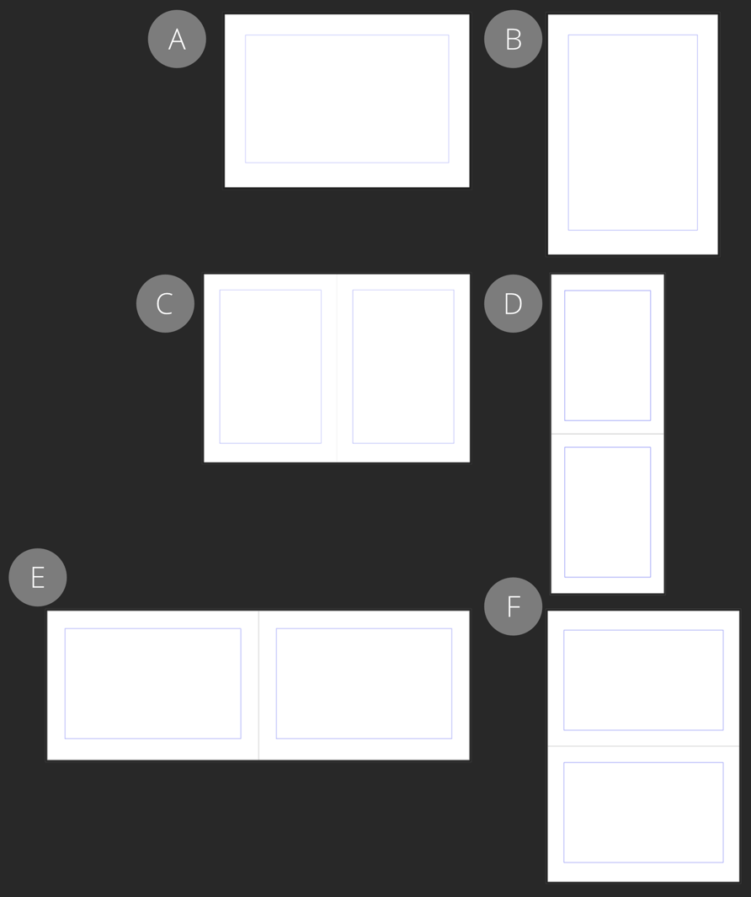

# About pages and spreads

The terms page and spread are fairly interchangeable in Affinity. If you're working with single pages rather than facing pages, the terms are interchangeable. However, for facing pages, the term *spread* becomes more significant.

*Single pages: (A) landscape page, (B) portrait page.  
Facing pages: (C) portrait pages in a horizontal spread, (D) portrait pages in a vertical spread, (E) landscape pages in a horizontal spread, (F) landscape pages in a vertical spread.*

## Pages and spreads

At document setup, you can create pages for your document. Pages can use a portrait or landscape orientation.

Pages can be presented individually or, by enabling the **Facing pages** option, arranged into spreads.

> **Note:** Individual pages are also referred to as single or ambidextrous pages to differentiate them from spreads that contain two (or more) facing pages.

Using facing pages means you'll be working with left (verso) and right (recto) pages displayed at the same time, e.g. a gatefold center spread of a magazine.

Facing pages can be arranged vertically or horizontally.

> **Note:** If you set facing pages to start on the right, your first and last spreads will be single pages. If set to start on the left, you'll be working only with two-page spreads.

**To use spreads in your publication:**

1. On the **File** menu, select **Document Setup**.
2. On the dialog that appears:
  1. Select **Model**.
  2. Check **Facing pages**.
  3. Select **OK**.

> **Note:** To start with a verso (back) page on two-page spreads without an initial single page, on the **New Document** dialog, enable **Facing pages** and set **Arrange** to *Horizontally* and **Start on** to *Left*.

**To alter the orientation of pages:**

- When creating a document: Above the list of presets on the **New Document** dialog, select **Portrait** or **Landscape**. Page widths and heights of presets and the document update accordingly.
- In an existing document: On the **File** menu, select **Document Setup**. On the dialog that appears, select **Dimensions** and then select **Portrait** or **Landscape** orientation.

**To edit spread properties:**

1. On the **File** menu, select **Document Setup**.
2. On the dialog that appears, specify:
  - which spreads you wish to edit (**Whole Document**, **Selected Masters**, or **Selected Spreads**).
  - the width and height of pages (in the **Dimensions** section) and how existing content is positioned upon resizing (in the **Scaling** section).
  - the positions of visual guides for ensuring distance between main content and page edges (in the **Margins** section).

**To alter the arrangement of pages in spreads:**

1. On the **File** menu, select **Document Setup**.
2. On the dialog that appears:
  1. Select **Model**.
  2. Set **Arrange** to **Horizontally** or **Vertically**.

#### SEE ALSO:

- [Create new documents](../04-get-started/01-create-new-documents.md)
- [Document setup](06-document-setup.md)
- [About master pages](12-master-pages/01-about-master-pages.md)
- [Pages panel](../21-panels/17-pages-panel.md)
