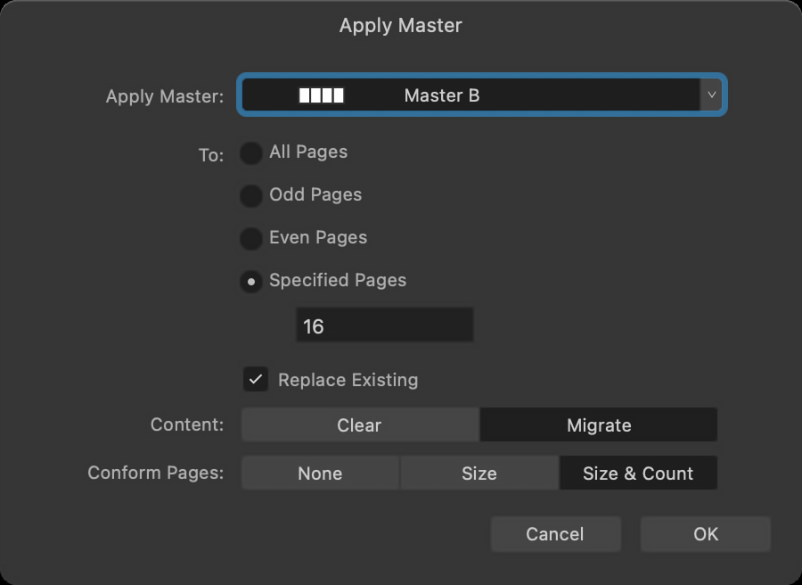

# About ghost pages

Some page operations may leave behind a 'ghost' page—a faint outline of a page—within a publication spread.

Ghost pages indicate that a spread has fewer pages than Affinity expects.

For example, you create a spread based on a two-page master. Later, you turn off the Pages panel's **Reflow Pages** setting to avoid left and right pages swapping sides.

*Ghost pages appear with a fainter outline than actual pages.*

> **Note:** In a document with facing pages that starts with a right page, you'll see a ghost page to its left, and another opposite the single page at the document's end. These are intentionally present in this document setup and do not need to be resolved.

## Resolving ghost pages

Depending on your document's content, re-enabling the Reflow Pages setting might be enough to automatically return to a logical flow.

Alternatively, with Reflow Pages still disabled, you can manually add a new page or drag a page into a ghost page's position to fill it.

A ghost page can also occur when you delete a page from a multi-page spread. In situations like this, apply a suitable master with the required number of pages, and tell Affinity to conform the spread's page count and size to match it.

**To conform an existing spread to a master:**

1. On the **Pages** panel, -click the spread's thumbnail and select **Apply Master**.
2. On the dialog that appears:
  1. Select the required master that has the desired page count.
  2. Specify whether to **Clear** or **Migrate** content from any already applied master.
  3. Set **Conform Pages** to **Size & Count**.
  4. Select **OK**.

Any ghost pages in the spread are removed. If the spread still contains more pages than the newly applied master, the additional pages are moved to new spreads, which also conform to the master.

#### SEE ALSO:

- [Add and remove pages](02-add-and-remove-pages.md)
- [Arrange pages](03-arrange-pages.md)
- [Copy and duplicate pages](04-copy-and-duplicate-pages.md)
- [About pages and spreads](01-about-pages-and-spreads.md)
