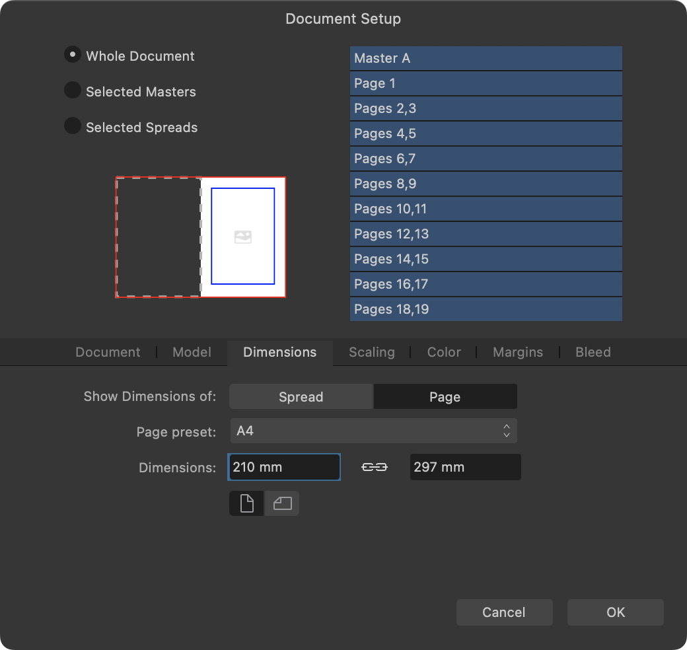

# Document setup

You can modify your document's setup at any time. This setup will have been chosen previously when creating the document.

You can change the setup of your whole document or the properties of a selection of spreads or master pages. This allows some pages to have different dimensions (with control of object scaling), orientations and margins.

> **Note:** The Spread Properties dialog contains a subset of the settings available on the Document Setup dialog. It omits settings that are irrelevant to the context of a single spread or master page.

*Document setup*

> **Note:** When you resize a master page, you'll be asked whether to also resize pages to which it is applied or leave them as they are.

### Settings

The following settings can be adjusted.

When using the **Document Setup** dialog, choose a scope to determine which of your document's pages will be affected:

- **Whole Document**—applies the setup to all spreads within the document.
- **Selected Masters**—applies the setup to selected master spreads within the document. Select the master spreads you would like to include from the adjacent box.
- **Selected Spreads**—applies the setup to selected spreads (not master pages) within the document. Select the spreads you would like to include from the adjacent box.

The following settings are available on the **Document Setup** and **Spread Properties** dialogs as indicated.

- **Document** (Document Setup dialog, Whole Document scope):
  - **Document units**—Displays your rulers and object dimensions in pixels, points, picas or using physical measurement units.
  - **DPI**—Sets the resolution of your document. For example, for professional print quality, set your resolution to 300 dpi or above.
  - **Image placement**—Determines whether placed images will be embedded in or linked to the document by default.
- **Model** (Document Setup dialog, Whole Document scope):
  - **Facing pages**—Check to arrange the document pages in spreads.
  - **Arrange**—Specify whether the spread's pages should be arranged horizontally or vertically. For facing-page spreads only.
  - **Start on**—Specify where the spread should start. For facing-page spreads only.
  - **Reflow Pages**—Specify whether Affinity is permitted to automatically reflow your document's pages to the document model. (This setting is equivalent to **Move Page Options>Reflow Pages** on the **Pages** panel's preferences menu.
- **Label** (Spread Properties dialog, or Document Setup dialog with Selected Masters scope and one master page selected):
  - **Name**—Enter the name you wish to assign to the master page.
  - **Tag**—Optionally select a color tag for the selected masters that will be displayed above the thumbnails of pages to which they are applied.

  > **Tip:** A master page can also be renamed by selecting it on the **Pages** panel and then clicking its name.
- **Dimensions** (both dialogs, any scope):
  - **Show Dimensions of**—Specify the part of the spread you would like to set the dimensions of. **Spread** encompasses both sides of a facing-page spread.
  - **Page preset**—offers preset spread sizes to select from, e.g. A4.
  - **Dimensions**—change these values to make a custom spread size. (An alternative to selecting a Page preset size above.)
  - Orientation—Select the landscape or portrait icon. Changing this setting swaps the width and height values.
  - **Resize Linked Pages**—(Selected Masters scope only) Specify whether dimensions of pages to which the masters are applied also receive the masters' new dimensions. When **Matching** is selected, only pages with dimensions the same as the masters' old dimensions will be changed.
  - **Reflow Through Spread**—(Selected Spreads scope only) Specify whether the selected spreads' pages are included when automatically reflowing your document's pages (if **Page Move Options>Reflow Pages** is enabled on the **Pages** panel's preferences menu). If unchecked, the spreads are excluded from reflow, and their thumbnails will be surrounded by square brackets to indicate this.
- **Scaling** (both dialogs, any scope):
  - **Position**—when changing page size, you can anchor the existing page content to the page or spread (they remain the same size) or rescale it in relation to the new page size.
  - **Anchor**—sets the anchor point to which existing page content will be anchored to upon page resize.
  - **Resample**—when **Rescale** is selected, lets you control how objects are resampled.
- **Color** (Document Setup dialog, Whole Document scope):
  - **Color Format**—Sets the color mode to RGB or Grey (8 or 16 bit or, for RGB only, 32-bit HDR), CMYK (8 bit), or Lab (16 bit).
  - **Color Profile**—Sets the color gamut for the previously chosen color format.
  - When applying a different color profile, **Assign** adopts the new profile but leaves the values of the colors/pixels as is. **Convert** converts each color from the old profile to the new one—color/pixel values may change as a result.
  - **Transparent background**—Check to set your page background to be transparent.
- **Margins** (both dialogs, any scope):
  - **Use master's margin values**—(Selected Spreads scope and only for page/spread with a master page applied.) When selected, pages/spreads inherit margin values from the masters applied to them. When deselected, your values for the following settings are applied to the pages/spreads.
  - **Include margins**—check to switch on page margins.
  - **Left**, **Right**, **Top**, **Bottom**—sets the positions of page margins, showing as non-printing colored lines. Left and Right margins are replaced by **Inner** and **Outer** for facing-page spreads.
  - **Color**—Sets the margin color. Select from the pop-up menu.
  - Click **Retrieve margin from printer** to use your default printer's settings.
- **Bleed** (Document Setup dialog, Whole Document scope):
  - **Left**, **Right**, **Top**, **Bottom**—For professional printing, bleed extends the printable area beyond the page edge to allow artwork to be trimmed. Left and Right bleeds are replaced by **Inner** and **Outer** for facing-page spreads.
  - **Color**—Sets the bleed color. Select from the pop-up menu.

**To modify your document setup:**

1. On the **File** menu, select **Document Setup**.
2. On the dialog that appears, set page/spread properties as required.
3. Select **OK**.

**To modify properties of selected spreads/master pages:**

1. On the **Pages** panel, select the thumbnails of the spreads/master pages you wish to modify.
2. From one of the selected items, `Click`-click and select **Spread Properties**.
3. A dialog will appear. If you selected:
  - more than one spread/master page, it will be the **Document Setup** dialog.
  - a single spread/master page, it will be the **Spread Properties** dialog.
4. Set page/spread properties as required.
5. Select **OK**.

#### SEE ALSO:

- [Create new documents](../04-get-started/01-create-new-documents.md)
- [Document units](../04-get-started/07-document-units.md)
- [Setting bleed](../14-publishing-and-sharing/06-pdf-publishing/02-setting-bleed.md)
- [Margins](../16-design-aids/07-margins.md)
- [Add and remove pages](02-add-and-remove-pages.md)
- [Keyboard shortcuts for file/document management](../24-keyboard-shortcuts/01-keyboard-shortcuts.md)
