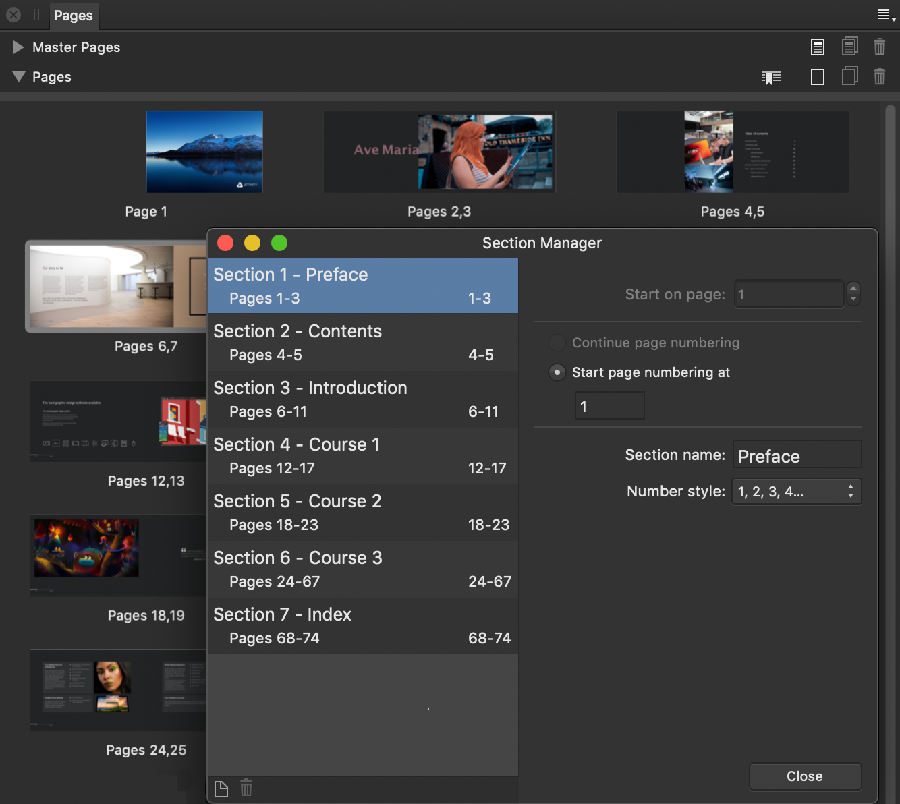

# Adding sections

Sections are used to split publications into related groups of pages, e.g. Preface, Contents, Introduction, Chapter 1, Chapter 2, etc. The main purpose is to assign different page numbering styles and section names to each section. This lets you delimit your publication logically by content type or subject matter.

Sections also allow you to control the value at which each section's page numbering starts.

Every document possesses at least one page. This initial page belongs to the first section.

Sections are numbered but can also be named. The name of a page's section can be automatically displayed on the page by inserting fields—for example, into a master page's footer and applying the master page to publication pages.

## Section page numbering and the Pages panel

When a section's starting page number is customized, related thumbnails on the Pages panel are labeled with two groups of numbers, e.g. *Page 1 (33)* or *Pages 16,17 (20, 21)*.

Numbers outside brackets are document page numbers, i.e. they represent page numbers within your Affinity document. They always start at 1.

Numbers inside brackets are publication page numbers. They are calculated from the starting page number of their section, and replace Page Number fields when your document is exported or printed.

## Sections and hyperlinks

Hyperlinks in PDF publications help the reader to navigate to specific content. A hyperlink can take the reader to a page number, a section's starting page, or an anchor attached to an object.

When linking to the first of a group of related pages, it is best practice to create a section that begins on that page and set the hyperlink's type to **Section**. If you add or delete pages, Affinity Publisher automatically updates hyperlinks of this type to reflect pagination changes and their impact on section starting pages.

In contrast, hyperlinks whose type is **Page** are static references; each one's target page number is unaltered by pagination changes and needs to be manually updated.

### Exporting and printing sections

Normally, every section is included when your document is exported or printed.

You can manually exclude any section. For example, you may not want a publication's cover or a draft section to be shared with a specific recipient.

Any chapter that will be used as a book chapter and contains endnotes positioned at **End of Book** contains those notes’ bodies in a *#Booknotes* section at the end of its document. When outputting a book, the content of such sections is consolidated at the end of your book. The *#Booknotes* sections are excluded from the output to avoid the bodies appearing twice within your book.

When outputting a chapter's document individually, its *#Booknotes* section can be included in the output by temporarily changing a setting for the section.

> **Tip:** You'll need to create a range of pages in advance before you can begin creating sections.

**To create a section at a chosen page:**

1. On the **Pages** panel, `Click`-click a page thumbnail and select **Start New Section**.
2. (Optional) On the **Section Manager**, choose to **Restart page numbering** for the section, add a **Section name** for insertion of section name as a field into title and header/footer text or swap **Number style**.
3. Click **Close**.

> **Note:** You can also access **Section Manager** from the **Window** menu.

**To create sections using the Section Manager:**

1. On the **Pages** panel, select **Section Manager** above the Pages window.
2. Select the section containing the pages you wish to be in a new section.
3. Click **Add Section** at the bottom left of the dialog. The new section is automatically selected.
4. Change the **Start on page** value to the page number you want the new section to start from.

**To edit a section's properties:**

On the **Pages** panel, do one of the following:

- Click **Section Manager**, select a section in the list, then modify the section's settings.
- To edit a page's section, `Click`-click a page thumbnail and select **Edit Section**, then edit the section's settings.

**To restart numbering for a section:**

1. On the **Section Manager**, select a section.
2. Enable **Restart page numbering at** and enter a page number to start from. By default, sections allow page number continuation using the **Continue page numbering** setting.

> **Tip:** If your document is part of a book you can restart the first section's page number to the expected page number of your chapter.

> **Note:** You can add section names to pages automatically by inserting the corresponding [field](../13-references/04-fields.md) into your document, usually on a master page.

**To continue page numbering across multiple merged documents:**

1. On the **Section Manager**, use the `Shift` or `Cmd` keys to select multiple sections at once.
2. Choose **Continue page numbering** for the selected sections.
3. Click **Close**.

**To exclude/include a section from export/print output:**

1. On the **Section Manager**, select the section.
2. Set **Include on Export** as required.

#### SEE ALSO:

- [Add and remove pages](02-add-and-remove-pages.md)
- [Pages panel](../21-panels/17-pages-panel.md)
- [Fields](../13-references/04-fields.md)
- [Merge documents](../13-references/10-merge-documents.md)
- [Hyperlinks](../13-references/05-hyperlinks.md)
