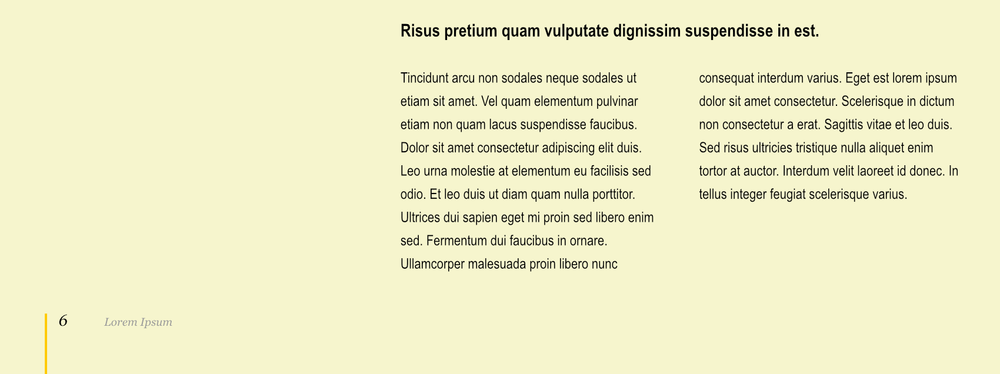

# Page headers and footers

Typically, most pages of a publication will include a page number in their header or footer. They might also include mention of the section or chapter name, for example, to which they belong.

These details are typically added as fields (placeholders) to the header or footer on a master page. On pages to which that master page is applied, the fields automatically report the correct value.

*Page numbering and naming on a publication verso page.*

## Numbering pages

You can format the page number and set the numbering style using the **Section Manager**. This manager also lets you create multiple sections (e.g. Preface, Table of contents, Index, etc.) which can be named and have different starting page numbers and numbering styles.

> **Note:** You can add a page number field to a single page or both facing pages of a spread—or any pages you wish in a multi-page spread.

Page numbers are inserted as fields (via the **Fields** panel or **Text>Insert>Fields>Page Number**), which dynamically update.

To suppress page numbering on initial sections of a publication (e.g. Contents or Preface), don't assign a master page that contains page number fields to their pages.

## Naming pages

Names that identify a page's place in a publication are inserted as fields. At their simplest, you might use a field that displays the section name to which a page belongs. You can specify section names for page ranges in the **Section Manager**.

Alternatively, you can use a running header, which displays text that appears on the same or an earlier page and which is formatted with a specific paragraph or character style. A running header's text 'runs' for multiple pages—i.e. does not change—until another application of the text style is encountered.

The following source options are available to specify the source of a running header's text:

- **Style**—specify the text style applied to the document text you want the field to display.
- **Use**—when the text style is applied multiple times on a page, specify whether the running header displays the text of the **First on page** or the **Last on page**.

> **Note:** When a running header is set to **Last on page**, the field will not display a value on pages that do not contain any text formatted using the field's designated text style.

### Formatting a running header

The **Running Header** field's formatting options allow you to limit the amount of text displayed by the field. This might be due to the source text being too long to display in full, or for other aesthetic reasons.

Running headers can transform their text's capitalization, or to simply repeat their source's capitalization.

The following formatting options are available for running headers:

- **Include Paragraph Numbering**—when the text style is applied to numbered lists, turn on to include list item numbers in the running header or turn off to exclude them.
- **Apply Limits**—turn on to make the following options available to limit the running header's length:
  - **End on**—specify which characters will automatically end the running header, if the text style is also applied immediately after them.
  - **Include End Character**—specify whether to include or exclude the terminating end character in the running header.
  - **Max Word Count**—specify the maximum number of words to be displayed by the running header.
  - **Use Ellipsis**—specify whether an ellipsis should be displayed at the end of a running header whose length has been limited.
- **Case Change**—specify the text transformation to apply to the displayed text: **None**, **Upper**, **Lower**, **Title** or **Sentence**.

**To add page numbering or naming:**

1. On the **Pages** panel, double-click a master page on the **Master Pages** window.
2. On the master page, create a text frame to contain your page number/name field and optionally extra header/footer text.
3. On the **Fields** panel, in the **Document Sections** group, do one of the following:
  - To add page numbering, double-click **Page Number**.
  - To add page naming based on section names, double-click **Name**.
  - To add page naming based on an applied text style, double-click **Running Header**.

On the master page, page numbers are represented by the hash symbol (#) and page naming is represented by placeholder text: *<Section Name>* or *<Running Header>*. These will be replaced by actual numbers and names on publication pages to which the master page is applied.

**To change a section's page numbering style:**

1. On the **Pages** panel, select **Section Manager**.
2. On the **Number style** pop-up menu, choose from various standard numbering schemes such as Arabic numerals (1, 2, 3), upper/lowercase Roman (I, II, III, i, ii, iii), alphabetic letters (A, B, C, a, b, c) and more.

**To change a running header's source and formatting options:**

Do one of the following:

- Before adding the running header to a page, on the **Fields** panel's **Document Sections** group, click **Default format** next to **Running Header**.
-  After adding the running header to a page, -click the field in document text and select **Edit Field**.

#### SEE ALSO:

- [About master pages](12-master-pages/01-about-master-pages.md)
- [Frame text](../10-text/03-frame-text.md)
- [Fields](../13-references/04-fields.md)
- [Adding sections](09-adding-sections.md)
