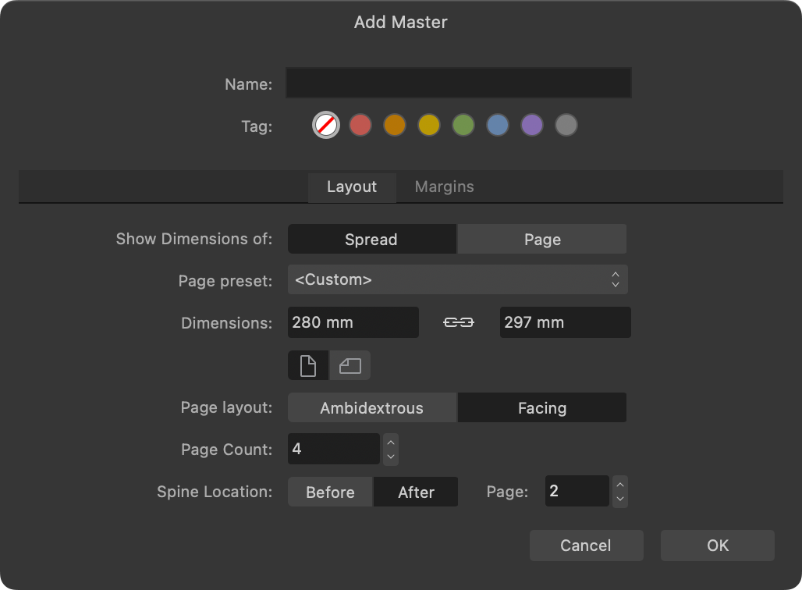
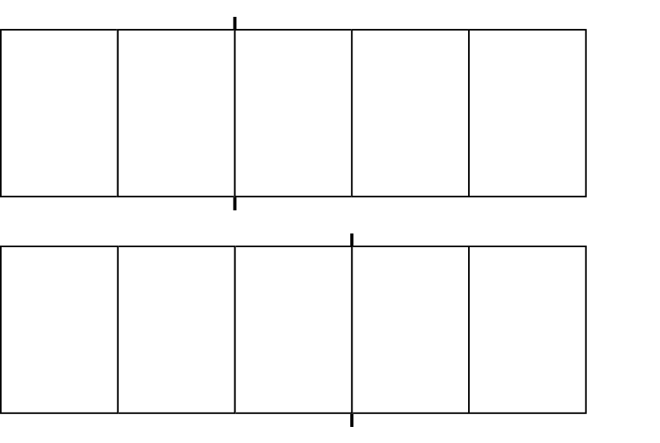
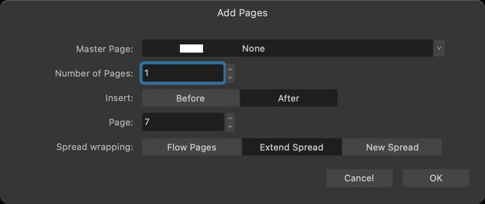
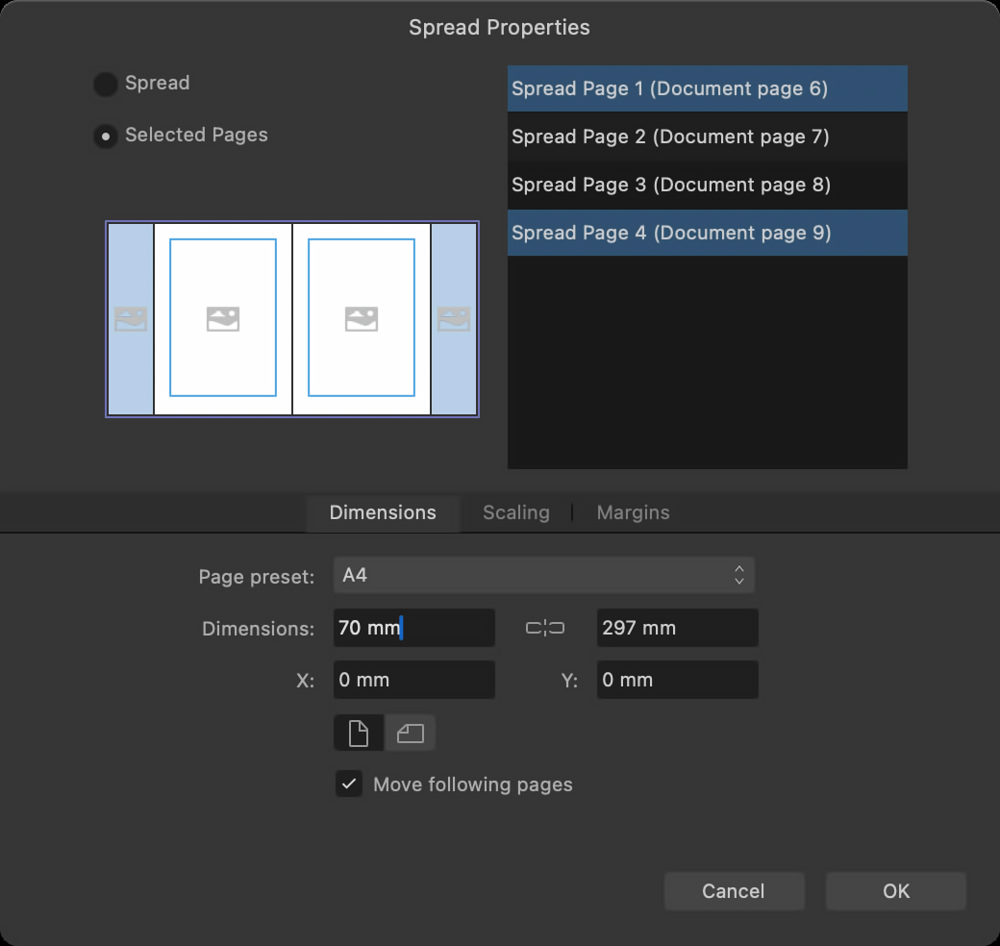

# Multiple-page spreads

You can create spreads that contain more than two pages. This allows you to easily design trifold and gatefold spreads and documents such as accordion-fold brochures, for example.

Multi-page spreads can be created in two ways:

- As a master page, which can be used to create new publication pages with the same page count, page dimensions, and spine location as the master.
- By extending an existing spread with new publication pages, either by:
  - adding new pages at the required positions within the spread.
  - moving existing pages by disabling **Reflow Pages** and then dragging and dropping existing pages into the required positions.

> **Tip:** If you need a particular multi-page spread setup as the starting point for multiple documents, create an appropriate document and save it as a [template](../04-get-started/10-document-templates.md).

## Creating a multi-page master

Using master pages to create multi-page spreads is advised for the 'cleanest' results.

For any spread you create from a master, Affinity knows how many pages the spread should contain. 'Ghost' pages are displayed if the spread contains fewer pages than expected.

*Creating a four-page master with spine located at its center.*

After creating a master, its spine location can't be edited.

If you're designing for the front and back of a multi-page spread with an off-center spine, create two masters with mirrored spine locations.

## Extending an existing spread

For quickness, existing spreads can be extended with new pages. You might prefer this over starting with a multi-page master if your document's pages will be only one multi-page spread. For example, when you're designing:

- A book's dust jacket.
- A magazine cover with a front cover flap.
- A publication containing just one gatefold spread, such as a magazine.

## Changing individual pages' dimensions

Depending on the type of folding spread or document you're designing, you may need to edit the dimensions of certain pages.

In **Spread Properties**, you can select individual pages whose dimensions you wish to edit.

## Exporting and professional printing

A press-ready PDF of a multi-page spread that is exported with **Include printers marks** and **Include crop marks** enabled will also include fold marks.

Before designing a multi-page spread's content, it is important to discuss your publication's requirements with your print provider.

For example, one panel of a trifold brochure needs to be narrower than the other two, but by how much depends on your chosen paper stock. Your print provider is best placed to provide the necessary advice.

**To add a multi-page master:**

1. On the **Pages** panel, select **Add Master**.
2. On the dialog that appears:
  1. Set the master's **Page Count**.
  2. Set the **Spine Location** by specifying a **Page** number and whether the spine should be located **Before** or **After** it.
  3. Set other options as required.
  4. Select **OK**.

**To add a multi-page spread from a master (using drag and drop):**

On the **Pages** panel:

1. Drag a master page from the **Master Pages** window.
2. Hover to the left or right of an existing spread in the **Pages** window and drop.

A new spread with the same number of pages as the master is inserted, and the master is applied to all its pages.

**To add a new multi-page spread:**

1. On the **Pages** panel, select **Add Pages**.
2. On the dialog that appears:
  1. Set **Spread Wrapping** to **New Spread**.
  2. Set the spread's **Number of Pages**.
  3. Set the page number at which to insert the spread and whether to insert before or after it.
  4. Select **OK**.

**To extend a spread with new pages:**

1. On the **Pages** panel, select **Add Pages**.
2. On the dialog that appears:
  1. Set **Spread wrapping** to **Extend Spread**.
  2. Set the **Number of Pages** to insert.
  3. Set the **Page** at which to insert and whether to insert **Before** or **After** it.
  4. Select **OK**.

**To extend a spread by moving existing pages:**

On the **Pages** panel:

1. On the panel's preferences menu, disable **Page Move Options>Reflow Pages**.
2. Select the page(s) to use to extend an existing spread.
3. Drag and drop the selection to the required position in the destination spread.

#### SEE ALSO:

- [About ghost pages](05-about-ghost-pages.md)
- [About master pages](12-master-pages/01-about-master-pages.md)
