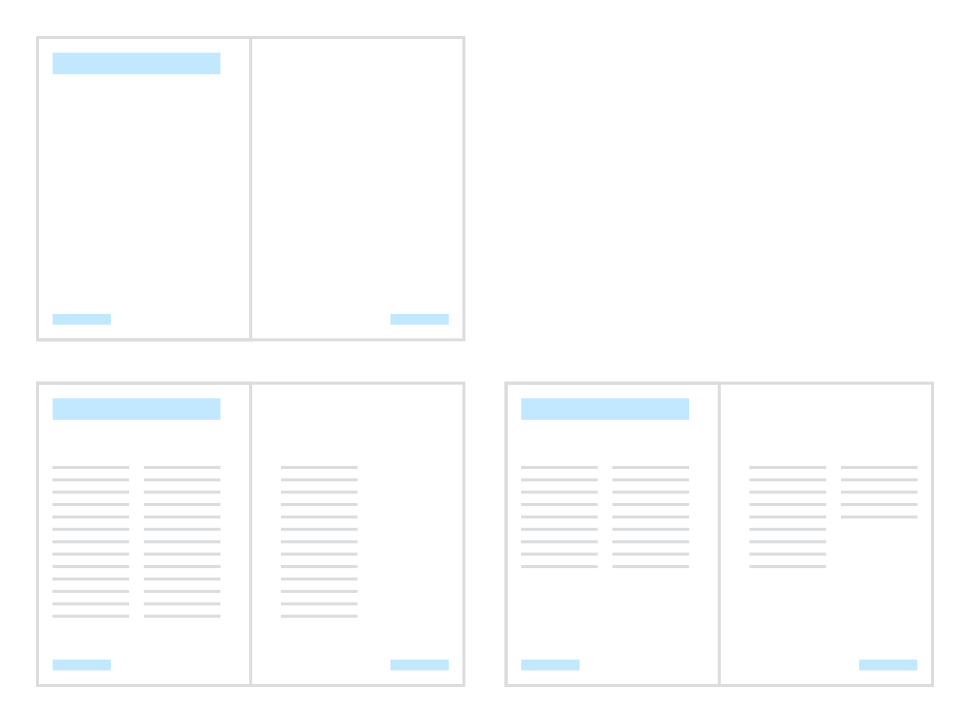

# About master pages

Master pages provide a flexible way to store page elements that you'd like to appear on more than one page. Page elements could be a logo, background, picture frames or text frames, as well as shapes and page numbering.

*Master page (top) applied to multiple publication pages (bottom).*

## Understanding master pages

A master page is typically shared by multiple pages. By placing a design element on a master page and then applying that master page to other pages, you ensure that all the pages incorporate that element. Of course, each individual page can have its own independent 'foreground' elements. If you edit any master page element, all associated pages will update to incorporate the new master page design.

Master pages can be used in any publication, but in a simple publication (e.g. a single-page flyer) you may not need to use any master pages—or you may need only one master page.

When you create a new document, if you choose to create a **default master**, it is automatically applied to your initial publication pages.

Just like publication pages, master pages can be a single page or two-page spread equally, and can be applied to equivalent publication pages or spreads.

Master pages can also be used as templates for multi-page spreads, by allowing you to specify the number of pages and each one's dimensions and relative position in any spread you create from the master.

#### SEE ALSO:

- [Add and remove pages](../02-add-and-remove-pages.md)
- [Multi-page spreads](../11-multiple-page-spreads.md)
- [Create new documents](../../04-get-started/01-create-new-documents.md)
- [Creating master pages](02-creating-master-pages.md)
- [Editing master pages](03-editing-master-pages.md)
- [Applying master pages](04-applying-master-pages.md)
- [Editing master page content](05-editing-master-page-content.md)
- [Detaching and linking master pages](06-detaching-and-linking-master-pages.md)
- [Migrating edited master page content](07-migrating-edited-master-page-content.md)
- [Pages panel](../../21-panels/17-pages-panel.md)
