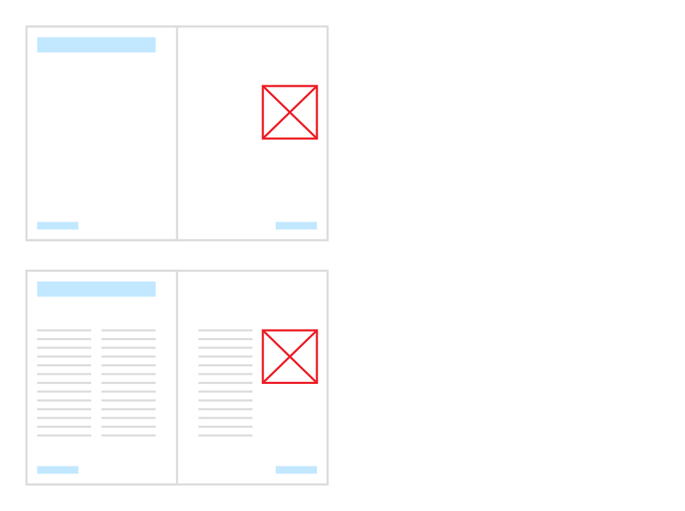

# Editing master pages

If you edit a master page, all associated pages will update to incorporate the new master page design. Master pages can be edited like any other page in your publication.

*Master page (top) with introduced placeholder picture frame (red) showing automatically on publication page (bottom).*

## Editing multi-page masters

A master page's page count and spine location cannot be changed. For each variation of a master page design that's needed for your publication, create a separate master page.

**To edit a master page's content:**

1. On the **Pages** panel, double-click a master page thumbnail in the **Master Pages** window.
2. In the document view, add or edit content on the master page as you would for a publication page.

**To edit a master page's properties:**

1. On the **Pages** panel, `Click`-click a master page thumbnail in the **Master Pages** window, then select **Spread Properties**.
2. On the dialog that appears:
  1. Edit the master's name, dimensions and scaling settings as needed.
  2. Select **OK**.

**To rename a master page:**

On the **Pages** panel:

1. Select the master page's thumbnail in the **Master Pages** window.
2. Click the master page's name (e.g. Master A), type a new name, then press the `Return` .

**To duplicate master pages:**

1. On the **Pages** panel, select the master page's thumbnail in the **Master Pages** window.
2. Select **Duplicate**. The duplicate page is added immediately after the original page.

**To remove a master page:**

1. On the **Pages** panel, select a master page thumbnail in the **Master Pages** window.
2. Click **Delete Selected Master**.

#### SEE ALSO:

- [About master pages](01-about-master-pages.md)
- [Creating master pages](02-creating-master-pages.md)
- [Applying master pages](04-applying-master-pages.md)
- [Editing master page content](05-editing-master-page-content.md)
- [Pages panel](../../21-panels/17-pages-panel.md)
