# Applying master pages

Just like publication pages, a master page can be a single page or a spread with two or more pages. A master can be applied to all or some of another spread's pages.

## Initial master page

When creating a new document, a default master can be created and applied to all publication pages created at this time. After this, you can apply any new master at any time using the **Pages** panel.

## Using multiple hierarchical masters

Masters can be applied to other masters in more complex documents.

For example, a 'parent' master containing just page numbering could be applied to multiple 'child' masters colored separately for each of your publication's sections. This means that to change your page numbering style, you only need to do so on the parent master.

Also, as you create new publication pages, applying a child master to them adds the section coloring and automatically inherits page numbering from its parent.

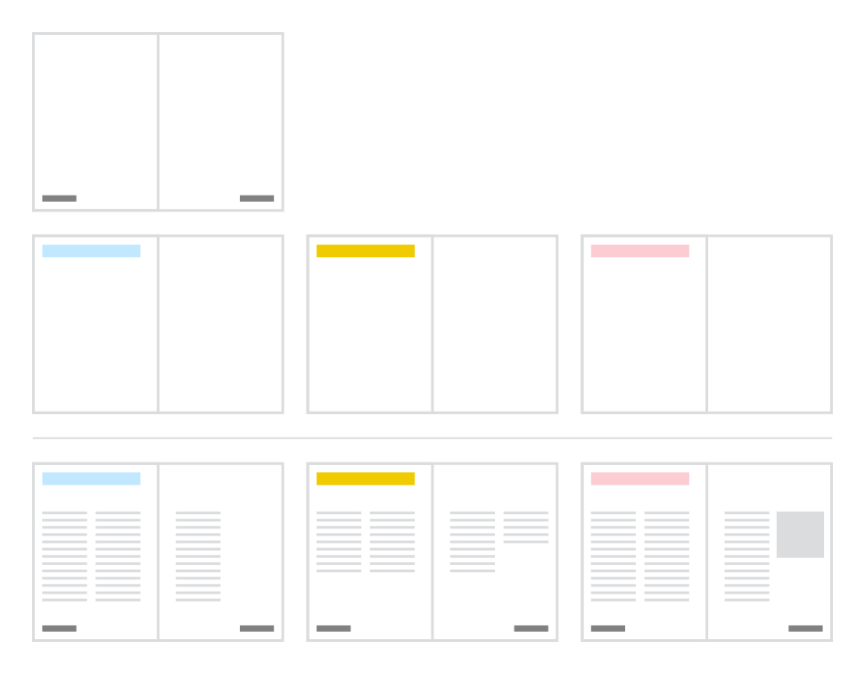
*Parent Masters (top) with footer information and child masters (middle) with multi-color headers and their combined effect on publication pages (bottom).*

## Applying masters using drag and drop

Masters can be dragged and dropped at the following positions to apply the master to existing publication pages, or to create new pages with the master automatically applied to them.

| Positions and cursors | Action |
| --- | --- |
| 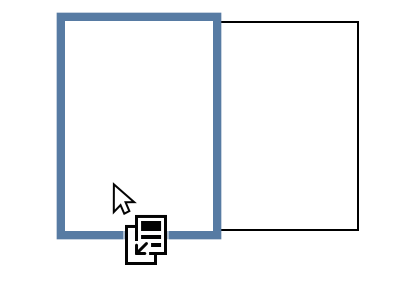 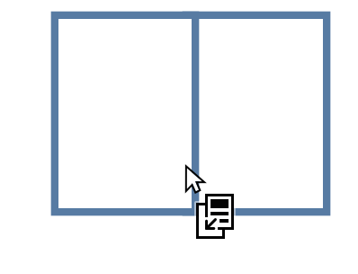 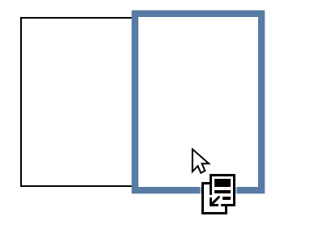 | Applies the master to the targeted pages, replacing any masters already applied to them. |
| 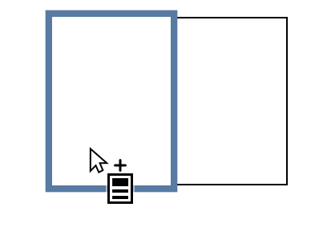 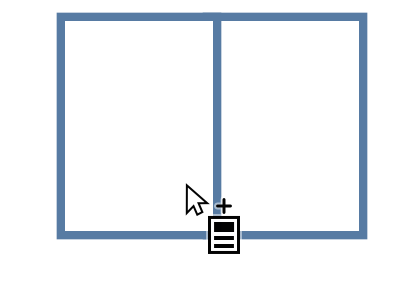 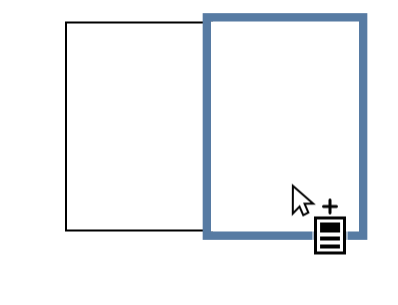 | With the `Alt`  held, applies the master to the targeted pages in addition to any masters already applied to them. With the `Cmd`  held, applies the master to the targeted pages in addition to any masters already applied to them. |
| 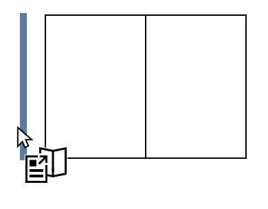 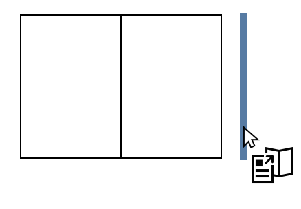 | Creates a new spread at the targeted position with the same page count as the master, and applies the master to the spread's pages. |

## Identifying applied masters

You can identify the masters applied to a page by hovering over the page's thumbnail on the **Pages** panel.

In documents with facing pages, the tooltip indicates which master pages are each page.

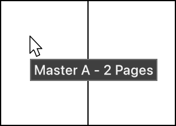
*A two-page spread with the same master applied to both pages.*

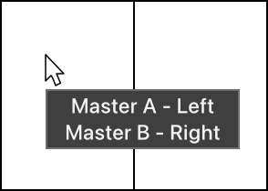
*A two-page spread with different masters applied to each page.*

Optionally, any master can be tagged with a color, which is indicated at the corner of the master's thumbnail.

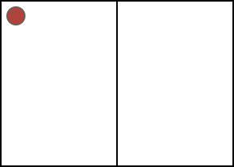
*A two-page master that has been tagged red.*

### Tag color

A master's tag color can be set when the master is created, or later via the master's thumbnail.

The tag color is shown above the thumbnails of pages to which the master is applied.

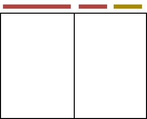
*A spread with different numbers of tagged masters applied to its pages.*

### Masters as layers

An applied master is actually a layer, which shows on the **Layers** panel as a vertical solid turquoise marker prefixing the thumbnail on the layer entry.

The layer can be expanded to expose the elements inherited from the master, which display vertical solid turquoise markers on their entries.

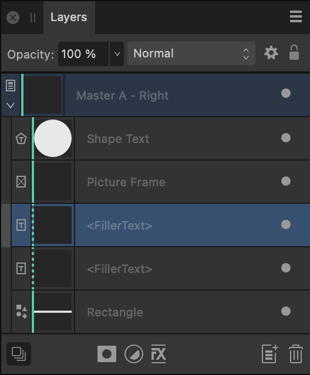
*Expanded master page entry on the Layers panel, showing unedited and edited master content (indicated with solid and dotted vertical turquoise markers, respectively).*

When an element of a master page is edited on a page where it's applied, that page's layer entries for the element and its master page display *dotted* turquoise markers.

By dragging a master's layer to the top of the layer stack, you can present the master's items in front of all other items on the page.

By selecting the master page's layer entry, the inherited content can be collectively transformed. Individual objects can only be transformed by detaching the master page. The content of text objects and picture frames can be edited, though.

To prevent inadvertent transformation or editing of inherited content (other than text/picture frame content), select and then lock the master layer on the Layers panel.

### Master placement

You can manage how a master is applied using the **Master Properties** dialog, where you can specify:

- which pages of the master are applied (**Master Start Page** and **Page Count**).
- from which of the spread's publication pages to apply the master's pages (**First Applied Page**).
- the scaling behavior that is applied to the master's content, where page dimensions are different, whether line styles scale accordingly, and the position at which the master is anchored to destination page.

The following scaling behaviors are available:

- **None**—places the master at its original size.
- **Stretch**—stretches the master to fill the destination exactly. It may be noticeably distorted, depending on its relative proportions and those of the destination.
- **Uniform to Fit**—scales the master uniformly to be completely visible within the page. There may be empty areas down the left and right or across the top and bottom of the page.
- **Uniform to Fill**—scales the master uniformly to fill the entire page without distorting it. Some of its contents may be cropped.

**To apply a master:**

On the **Pages** panel, do one of the following:

- To a *single* page: Drag a master thumbnail from the Master Pages window on top of a chosen publication page thumbnail in the lower Pages window and release. This replaces any existing master on that page.
- To a *whole* spread: Drag and release the master onto a spread in the main document view or the **Pages** panel.
- To *multiple* pages: `Click`-click each required page to select it, then drag and release the master onto any selected page's thumbnail.
- To a *choice* of pages: `Click`-click a chosen page's thumbnail and select **Apply Master**. You can apply to the current spread, all, odd, even or specified pages (by page number).
- To a *master* page: Drag a master's thumbnail from the Master Pages window on top of a destination master's thumbnail and release to link the two masters. Alternatively, `Click`-click a chosen page's thumbnail and select **Apply Master**, then select the master you would like to apply.

The newly applied master replaces any existing master that's applied to the target.

**To apply an additional master:**

Do one of the following:

- **macOS:** With the `Alt`  pressed, drag a master's thumbnail from the Master Pages window on top of a chosen publication page's thumbnail (that has a master attached) in the lower Pages window and release.
- **Windows:** With the `Cmd`  pressed, drag a master's thumbnail from the Master Pages window on top of a chosen publication page thumbnail (to which a master is applied) in the lower Pages window and release.
- `Click`-click the destination page's thumbnail and select **Apply Master**, then select the master you would like to apply. Ensure **Replace Existing** is unchecked on the dialog, and then select **OK**.

> **Note:**  Objects from masters can't be transformed or formatted—except for the *contents* of picture frames and text objects—unless you select the master's entry on the **Layers** panel and then, on the **Move Tool**'s context toolbar, set **Edit** setting to **Detached**. To protect objects again, select the **Lock** option.

**To edit an applied master's properties:**

1. On the **Layers** panel, `Click`-click the master's layer entry and select **Properties**.
2. On the **Master Properties** dialog that appears:
  1. Edit the properties as required.
  2. Select **Close**.

**To remove a master from a page:**

Do one of the following:

- To remove all masters from an entire spread: On the Pages panel, click the spread's page numbers, then -click its thumbnail and select Clear Masters.
- To remove all masters from specific pages: On the Pages panel, select the relevant pages, then -click a thumbnail of one of those pages and select Clear Masters.
- To remove a specific master from an entire spread: On the Layers panel, select the unwanted master's entry, then select **Remove**.
- To remove a specific master from specific pages: Remove it from the entire spread, then reapply it to specific pages of the spread.

#### SEE ALSO:

- [About master pages](01-about-master-pages.md)
- [Editing master page content](05-editing-master-page-content.md)
- [Detaching and linking master pages](06-detaching-and-linking-master-pages.md)
- [Layers panel](../../21-panels/14-layers-panel.md)
- [Pages panel](../../21-panels/17-pages-panel.md)
