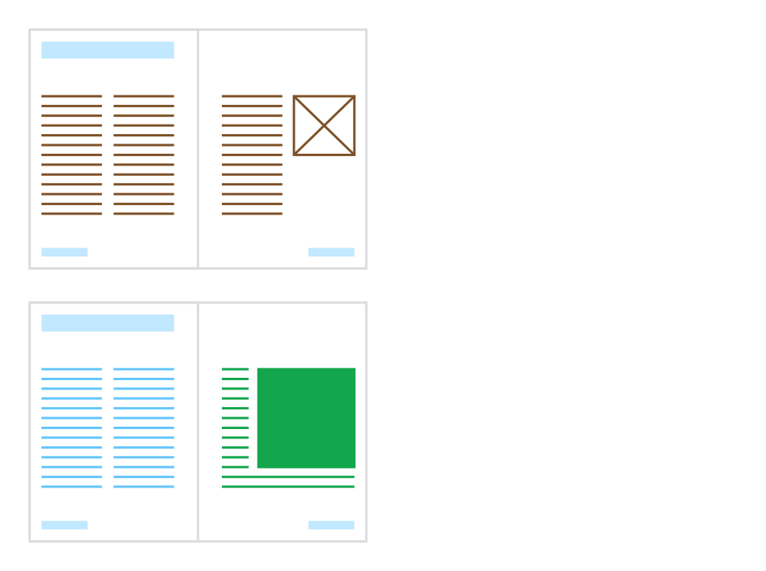

# Detaching and linking master pages

Where a master page is applied, normally only the contents of its picture frames and text objects on the target page can be edited. Other operations, such as transforming inherited objects, are restricted unless you choose to detach or link the master page.

Detaching breaks the connection between the master page and its elements, so you can transform frames and other objects, and alter frame properties (change the number of columns, add a frame stroke, etc).

Linking lets you edit the master page directly from a page to which it is applied. This updates the master page and other pages to which it is applied.

Alternatively, an applied master page can be **locked** to prevent its objects on the target page from being edited at all.

*Master page (top) with placeholder frames (brown). Publication page (bottom) shows frames detached (green) to allow resizing and frame property adjustment and text frame (blue) with edited content.*

**To detach or link a master page:**

1. On the **Layers** panel, select the master page's entry (e.g. 'Master A - 2 Pages').
2. With the **Move Tool** selected, choose an **Edit** option on the context toolbar:
  - **Detached**—changes to inherited content will affect only the current page/spread. The master page and other pages to which it's applied are unaffected.
  - **Linked**—changes to inherited content will also affect the master page and other pages to which it is applied.
3. Select **Finish** on the bar across the top of the document view to commit your edit. The applied master page returns to the default 'Edit Frame Content' behavior.

> **Tip:**
>
> **macOS:** The Edit options are also available by `Ctrl`-clicking the master page's layer entry, and via **Layer>Master Page**.
>
> **Windows:** The Edit options are also available by `Click`-clicking the master page's layer entry, and via **Layer>Master Page**.

**To lock an applied master page:**

On the **Layers** panel, do one of the following:

- Select the master page's entry and then select **Lock/Unlock**.
- `Ctrl`-click the master page's entry and select **Lock**. `Cmd`-click the master page's entry and select **Lock**.

#### SEE ALSO:

- [About master pages](01-about-master-pages.md)
- [Applying master pages](04-applying-master-pages.md)
- [Editing master page content](05-editing-master-page-content.md)
- [Migrating edited master page content](07-migrating-edited-master-page-content.md)
- [Layers panel](../../21-panels/14-layers-panel.md)
- [Pages panel](../../21-panels/17-pages-panel.md)
