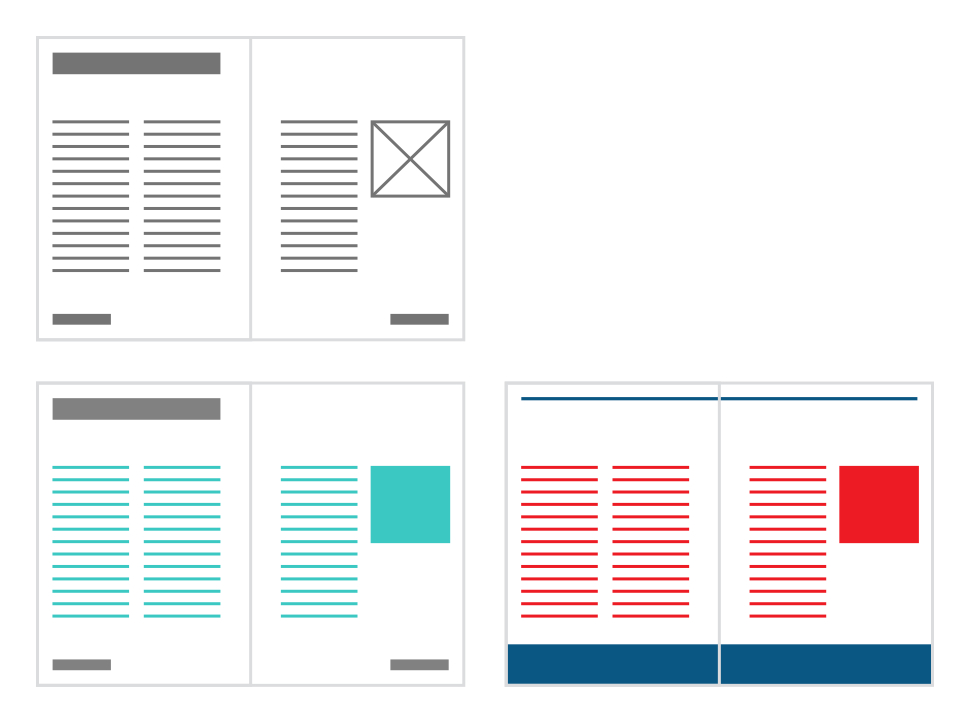
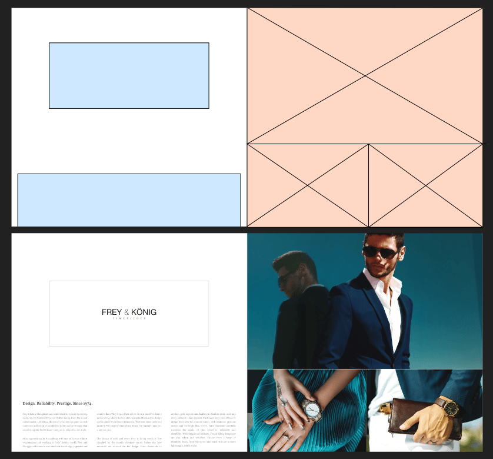
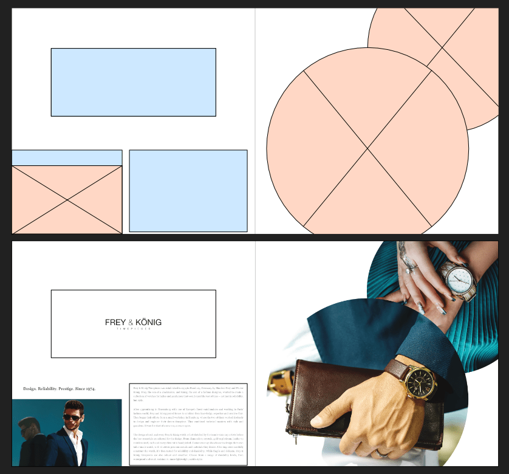

# Migrating edited master page content

If you've added content to text or picture frames that are master page objects, this edited content will be migrated by default when replacing your master page(s) with a new master page.

These master pages are considered 'smart' as they allow you to retain valuable copy when replacing master pages—for example, in the case of an underlying creative master page rework that should not affect content.

*Top: Master page with placeholder content  
Bottom Left: Publication page showing edited master page frame content (turquoise) and static master page content (dark gray)  
Bottom right: New master page's objects (blue) have replaced old master page objects (gray); edited master page frame content is migrated and retained (red).*

Smart master page layouts affect where and how images and text are arranged on a page or spread. Master page objects can be arranged to fit a new layout when master page content is migrated, as shown below.

*Master page layouts (shown above) can completely change how master page content (shown below) is arranged on migration, allowing you to easily revamp the look of your pages and spreads while retaining all of your valuable content.*

> **Note:** Empty or unedited master page frames will not be migrated.

## How content is migrated

When a new master page replaces an already applied master page, and content has been added to picture frames and text frames inherited from the existing master, Affinity determines the best destination for each piece of content according to the following rules.

- To determine the best match between frames, it considers these attributes in order:
  - A frame from the same master. (This happens if you have nested masters.)
  - A frame whose layer has the same name.
  - The frame that is closest in size and position.
- It ignores frames whose layers are locked or have a parent layer that is locked. So, if you have fixed text in a logo or footer, it's recommended to lock the corresponding layers to prevent them being considered.
- It also skips pairings where both frames' layers are named but the names don't match.
- If there aren't enough frames on the new master to transfer everything, any frames from the old master that can't be matched are converted to page content.

## Page Move Options for Masters

When performing an action that will move pages, you can choose one of several options to determine how applied master pages and content migration are affected.

For example, you might insert a new single page into a document with facing pages, causing later left pages to become right pages and vice versa.

> **Warning:** Some edits you perform will affect all pages after the pages being moved. You can avoid unwanted consequences, such as losing detached edits, by disabling **Reflow Pages**.

The relevant options are on the Pages panel's preferences menu, under **Page Move Options**:

### Split Masters

Any publication page that is moved retains the specific page of its master for its previous position within a spread.

For example, a left page that becomes a right page will continue to have its master's left page applied to it, and vice versa.

This option is helpful when you will be performing several actions that may temporarily result in pages changing position within spreads.

### Move Master Content

Any publication page that is moved has the page of its master for its new position within a spread applied to it.

Affinity will try to preserve content but you may end up with clashes, such as when you have detached the master to make local edits to an object's attributes.

Inherited objects which were modified, e.g. a frame that has been populated, along with content not from the master are moved with the page. Inherited objects which weren't modified are replaced with the 'correct' master page content for the spread page they end up on.

For example, after a page is moved, it may contain a copy of an inherited text frame with content that was edited at the page's previous position, and a copy of the unmodified text frame from its applied master. In such situations, you'll need to manually remove the one you don't want.

This option matches Affinity's behavior in old versions.

### Reapply Masters

Any publication page that is moved has the master page that corresponds to its new position within a spread applied to it.

Local edits to text and framed pictures are always retained but edits to object attributes, such as strokes, may be lost.

This option works best with masters that contain alternative layouts for the same content on each of their pages.

### Anchor Toward Spine

This complementary option controls the positioning of objects when a page moves from one side of the spine to the other. The option is located alongside the migration behaviors on the Page Move Options menu.

When enabled, objects maintain their distance from the spine. When disabled, objects maintain their absolute position on the page.

> **Tip:** If margins are symmetrical about the spine but different for Inner and Outer, Anchor Towards Spine is likely to keep things glued to the margins.
>
> If objects aligned to an outer page edge unexpectedly move to align to the opposite edge, pin the object to maintain the required alignment.

**To select a master migration behavior:**

1. On the Pages panel's preferences menu, hover over **Page Move Options**.
2. On the menu that appears, choose options that best fit your needs, based on the page operation you will perform and your document content:
  - Select the required master migration behavior: **Split Masters**, **Move Master Content**, or **Reapply Masters**.
  - (Optional but recommended) Disable **Reflow Pages** to protect spreads, such as to prevent the loss of any detached edits you've made to applied masters.
  - (Optional) If the page operation you perform will cause objects to move to the other side of the spine, enable **Anchor Toward Spine** to maintain their distance from the spine, or disable it to maintain their absolute positions.

**To migrate frame contents when replacing masters:**

1. On the **Pages** panel, `Click`-click a publication page and choose **Apply Master**.
2. On the dialog that appears:
  1. Select the master page to apply and the pages to apply it to.
  2. Enable **Replace Existing**.
  3. Set **Content** to **Migrate**.
  4. Select **OK**.

> **Note:** Drag and drop of a replacement master page will always migrate edited frame content if present.

> **Note:** For frames of the same type that will overlap, the position and size of the new master page frames are used, but the edited frame content is retained and will populate these new frames.

**To prevent migration when replacing masters:**

1. On the **Pages** panel, `Click`-click a publication page and select **Apply Master**.
2. On the dialog that appears:
  1. Select the master page to apply and the pages to apply it to.
  2. Enable **Replace Existing**.
  3. Set **Content** to **Clear**.
  4. Select **OK**.

#### SEE ALSO:

- [About master pages](01-about-master-pages.md)
- [Applying master pages](04-applying-master-pages.md)
- [Detaching and linking master pages](06-detaching-and-linking-master-pages.md)
- [Pages panel](../../21-panels/17-pages-panel.md)
- [Locking layers](../../08-layers/06-arrange-manage-layers.md)
