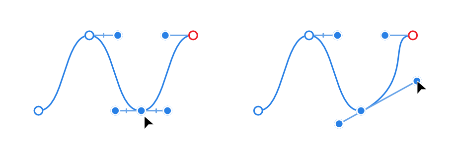
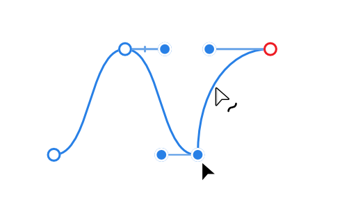

# Edit curves and shapes

Curves and shapes are easily edited using either:

- The `Cmd`  as you draw your curve or shape with the **Pen Tool**.
- The  **Node Tool**.

Use the former for fine tuning and curve adjustment as you draw, the latter for more prolonged editing operations.

You can quickly change between the **Move Tool** and the **Node Tool** to speed up your workflow. With the Move Tool active, double-clicking on a shape will enable the Node Tool, which can be then used to edit that shape. Double-click on the shape again to reactivate the Move Tool. Similarly, while editing open-filled curves with the Node Tool, you can double-click a fill to activate the Move Tool.

**To edit curves as you draw:**

- With the **Pen Tool** active, press the `Cmd`  to move nodes and adjust control handles when fine tuning of your curve is needed.

> **Note:** With `Cmd`  pressed, you can edit other segments in the same way by clicking them.

**To change curvature of a segment:**

Do one of the following:

- Select the node and then drag the control handles.

  
- Drag on the line directly to pull it into position.

  
- `Alt`-click a segment to straighten it.
- **macOS:** `Ctrl`-click a segment to delete it, creating two separate curves within one curve object.
- **Windows:** `Cmd`-click a segment to delete it, creating two separate curves within one curve object.

> **Note — Modifier keys:** When using the Node Tool, the following modifier keys can be used to speed up the workflow:
>
> - The `Shift`  constrains node movement and control handle positioning to 45° intervals. It also extends a dragged control handle while keeping the control handle directions locked.
> - The `Alt`  changes the node type to a sharp node to create a cusp in the line.
> - **macOS:** The `Ctrl`  keeps both control handles locked in position while moving a node.
> - **Windows:** Pressing left- and right-mouse buttons keeps both control handles locked in position while moving the node.
>
> When using the Move Tool, Pen Tool or Node Tool, the following keys can be used to speed up the workflow:
>
> - To decrease or increase stroke width by percentage, use the [ or ] s, respectively. For smaller absolute increments instead, use an additional `Shift`  modifier.

> **Tip:** The Node Tool can be used in conjunction with the **Transform** panel to reposition individual nodes; you can also reposition, scale or rotate multiple selected nodes relatively and precisely.

**To add nodes:**

- With the curve selected, click at the point where you want the node to be added.

**To split curves with a new node:**

Do one of the following:

- `Click`-click the node before the adjoining curve segment you want to add a midpoint node to and select **Split Curve After Node**.
-  Select a node, then click the same option on the context toolbar.

Which segment is split depends on the current curve orientation (indicated by a red-line indicator). Use **Reverse Curve** to change this curve orientation or reselect an adjacent node to split from.

**To delete nodes:**

Do one of the following:

- To *retain the curve's original geometry* after deletion: with the **Node Tool** active, select the node and press the `Backspace`  or right-click the node and choose **Delete Node** from the pop-up menu. This doesn't affect the remaining curve's nodes and control handle positions.
- For a *'best-fitting' reshaped curve* after deletion: with the **Node Tool** active, right-click the node and choose **Fit To Curve Delete Node** from the pop-up menu. This is useful if you want to retain the smoothness of a stabilized curve, perhaps drawn with the **Pencil Tool**.

**To close curves:**

Do one of the following:

- With the **Node Tool** active, right-click the end node and select **Close Curve**.
-  With the **Node Tool** active, select the curve and click **Close Curve** on the context toolbar.
- With the **Node Tool** active, drag the end node and drop on top of start node when the pointer changes.
- With the **Pen Tool** active, hold down the `Cmd` , right-click the end node and select **Close Curve**.

**To break curves:**

Do one of the following:

- With the **Node Tool** active, right-click the node at the point at which you want the curve to break and select **Break Curve**.
-  With the **Node Tool** active, select a curve and one of its nodes, then click **Break Curve** on the context toolbar.
- With the **Pen Tool** active, hold down the `Cmd` , then right-click the node and select **Break Curve**.

**To join curves:**

1. With the Node Tool (hold down the `Cmd`  if using the Pen Tool), hold down with the `Shift`  and select both curves.
2. Click **Join Curves** on the context toolbar.

**To reverse curves:**

Do one of the following:

- With the **Node Tool** active, right-click any node and select **Reverse Curve**.
-  With the **Node Tool** active, select any node and then **Reverse Curve** on the context toolbar.
- With the **Pen Tool** active, hold down the `Cmd` , then right-click the node and select **Reverse Curve**.

The start node will be toggled from clockwise to anticlockwise. With a closed curve selected, this direction can be viewed when **Show Orientation** (on the context toolbar) is toggled on (default). With an open curve selected, the direction of the curve is swapped, ready for further drawing from the opposite end of the curve.

**To convert nodes to a different type:**

Do one of the following:

- With the **Node Tool** active, right-click the selected node(s) and select **Convert to Sharp**, **Convert to Smooth** or **Convert to Smart**.
-    With the **Node Tool** active, select the node(s) and click an equivalent **Convert** option on the context toolbar.
- With the **Pen Tool** active, hold down the `Cmd` , right-click the selected node(s) and select **Convert to Sharp**, **Convert to Smooth** or **Convert to Smart**.
- Hold the `Alt`  and click on the node to convert it to a **Sharp** node.

**To copy control handle length/direction from another curve's node:**

- Drag a node from one curve directly over another on a second selected curve until the cursor changes to two overlapping squares, then wait until the node's handles adjust to their new positions.

**To change a curve or shape's stroke width:**

Do one of the following:

- On the **Stroke** panel, adjust the **Width** via slider or input absolute values, expressions and formulas (percentages).
- Use the [ or ] s (decrease or increase width, respectively).

#### SEE ALSO:

- [Draw curves and shapes](02-draw-curves-and-shapes.md)
- [Draw and edit shapes](05-draw-and-edit-shapes.md)
- [Node Tool](../20-tools/01-layout-tools/02-node-tool.md)
- [Expressions for field input](../26-expressions-for-field-input/01-expressions-for-field-input.md)
- [Keyboard shortcuts for curve drawing operations](../24-keyboard-shortcuts/01-keyboard-shortcuts.md)
