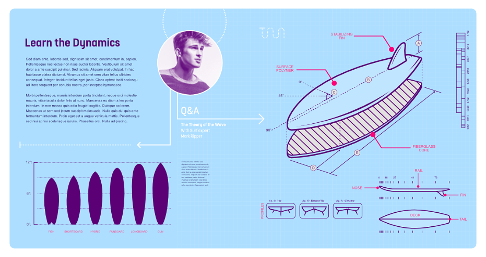

# Arrowheads

You can add arrowheads to your lines while working with the **Pen Tool** and shapes.

*Arrowheads added to strokes.*

## About arrowheads

Strokes and lines can be modified in a number of ways with both arrowheads and optionally tails. Some applications of these include:

- Change the style of the arrowhead and/or tail.
- Scale the arrowhead and tail in relation to the stroke, either simultaneously or independently.
- Control the arrowhead/tail position in relation to the line end.

**To add arrowheads to a stroke:**

1. With a line or curve selected, navigate to the **Stroke** panel or click the **Stroke properties** setting from the context toolbar.
2. Select an arrowhead style from the **Start** and/or **End** pop-up menus.
3. Choose where to position the start and end styles from **Place arrow within the line** and **Place arrow at the end of the line**.
4. With arrowhead styles selected, you can then enter a percentage to the **Start** and **End** styles to adjust the size of your selected arrowheads in proportion with the stroke width.

 To swap the Start and End points click **Swap arrowhead with tail**.

 Click **Clear arrowhead** to clear arrowhead settings if needed.

#### SEE ALSO:

- [Pen Tool](../20-tools/01-layout-tools/03-pen-tool.md)
- [Node Tool](../20-tools/01-layout-tools/02-node-tool.md)
- [Pressure sensitivity](11-pressure-sensitivity.md)
- [Keyboard shortcuts for vectors](../24-keyboard-shortcuts/01-keyboard-shortcuts.md)
