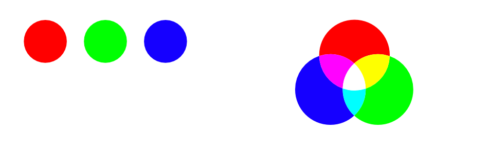
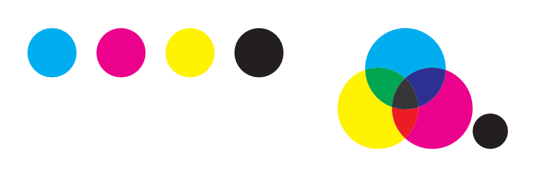
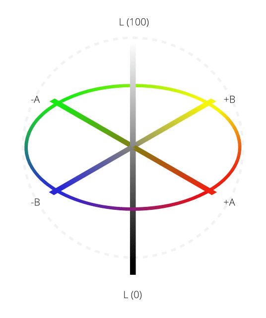

# Color models

A screen uses varying amounts of light to create the colors that you see. In the physical world, inks are used to create the color on the page. Color is stored by turning colors into numbers. A color model is used to describe the numerical system used.

As not all devices have the same ability to display color, a color space is used to define the gamut (available range) of color. By working within a color space suitable for the intended output device, you can be confident that your colors will be able to be displayed as intended.

You can use an RGB workflow or take advantage of an end-to-end CMYK or Lab color-managed workflow as you create a new document instead.

## About color models

Different color models represent color as numbers in different ways. You can choose one of four color models.

### RGB model

The RGB model is an additive color model. The primary colors of light, Red, Green and Blue, are combined in various degrees to make other colors in the spectrum.

*A representation of the RGB color model. This model is universal within digital cameras and electronic displays.*

### CMYK model

The CMYK model is a subtractive model. Cyan, Magenta and Yellow are combined to make each color. A fourth ink, Black, is also used for extra control and can be used either on its own for a true black, or combined with the other inks for a rich black.

*A representation of the CMYK color model. When the three colors combined they make black. Black is also added as a separate color for extra tonal control.*

> **Note:** The way that the color model is implemented is defined by the [color space](03-color-spaces.md) that is chosen; this is possible by selecting a color profile.

### Lab

Lab color represents the theoretical range of human vision using three channels: Lightness (L), and two color channels of opposing values of 'red - green' (a) and 'yellow - blue' (b). It can be very useful when used creatively, especially as Lightness can be adjusted without any change to hue or saturation.

*A representation of the Lab color opposition model. Lightness (L) is controlled separately to the two color channels (a, b).*

**To select a new document's color space:**

- As you create a [new document](../04-get-started/01-create-new-documents.md), select a color format and profile from the **Color** tab.

> **Note:** The **Color Format** of a document is a combination of a color model and a bit depth setting (8 or 16).

**To change your document's color model at any time:**

1. From the **File** menu, select **Document Setup**.
2. From the **Color Format** pop-up menu, select any of the available models as described above. Publisher converts each color from the old format to the new one—color/pixel values may change as a result.

#### SEE ALSO:

- [About color spaces](03-color-spaces.md)
- [Color management](04-color-management.md)
