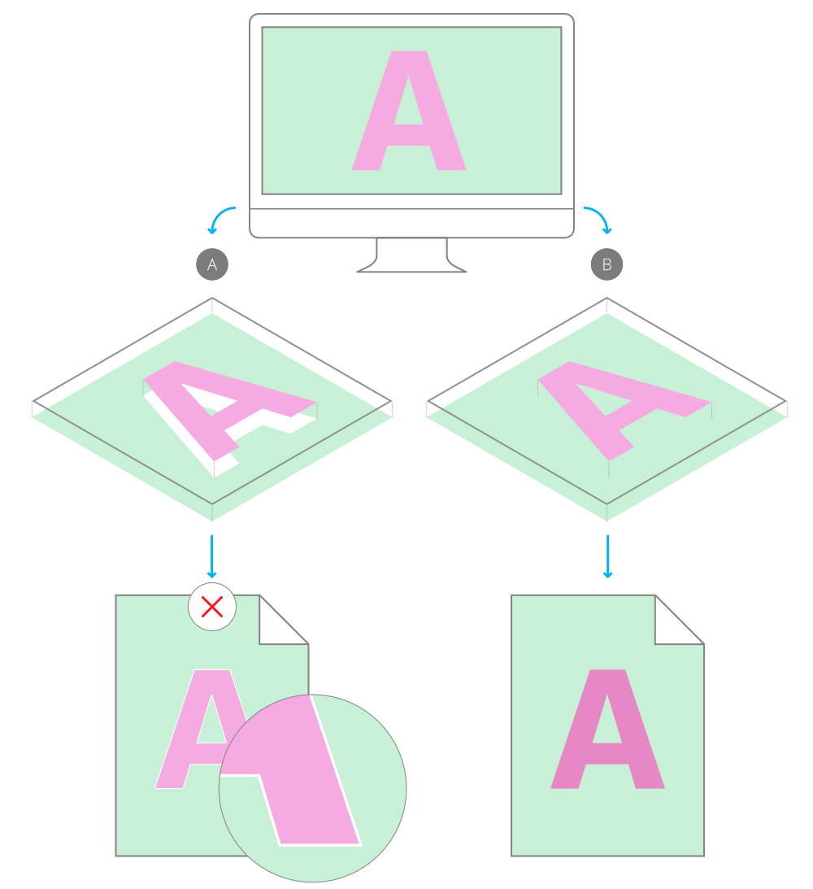

# Overprinting

For professional printing, [global colors](08-global-colors.md) can be made to overprint. By applying an overprint color to objects selectively you can control overprinting.

## About overprinting

Overprinting means that you can print one ink color on top of another instead of, by default, the underlying color being 'knocked out' (removed). This prevents unwanted fringing being left around objects, e.g. text.

*(A) Unwanted knockout behavior (default) showing white fringing vs. (B) overprinting.*

As a professional printing feature, overprint works when publishing PDFs using a CMYK color space and PDF/X compatibility.

You don't need to explicitly make an overprint for black, for black text or black graphics, as this is set by default. On PDF publishing, you can control black overprinting using the **Overprint black** option in the Export Settings dialog (**File>Export>PDF>More**).

> **Note:**  An overprint color swatch is indicated by a curved tab in the top-right corner of its color swatch.

> **Tip:** You can check if an overprint color has been assigned to an object's stroke or fill by using the Color panel.

> **Tip:** Overprinting it will cause colors to appear darker due to the opacity of inks used in professional printing. Some PDF viewers can simulate how this would appear, but always consult with your print provider for advice on its use.

**To create an overprint color from scratch:**

1. On the **Swatches** panel, select a Document palette from the palette pop-up menu. If no Document palette exists you can create one from the panel's Panel Preferences menu.
2. From **Panel Preferences**, select **Add Global Color**.
3. Adjust the settings in the dialog.
4. Select the **Overprint** option.
5. Click **Add**.

**To make an existing global color overprint:**

- On the **Swatches** panel, `Click`-click the global color swatch's thumbnail, then select **Overprint**.

#### SEE ALSO:

- [Global colors](08-global-colors.md)
- [Spot colors](09-spot-colors.md)
- [Publishing PDF files](../14-publishing-and-sharing/06-pdf-publishing/01-publishing-pdf-files.md)
