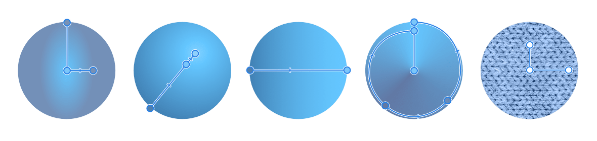
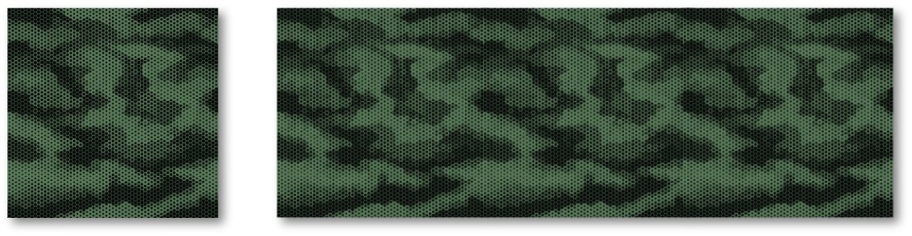
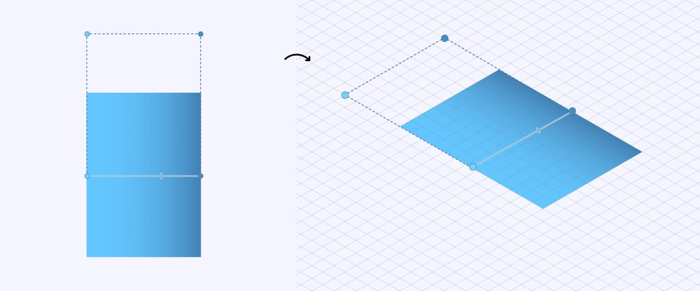
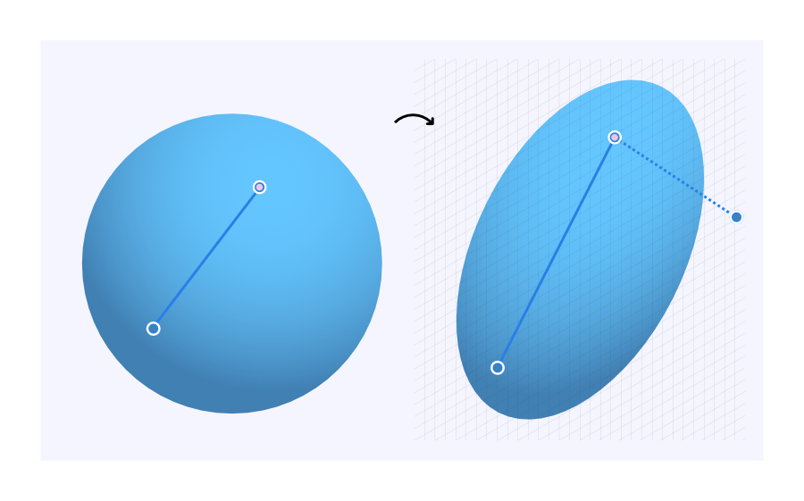

# Gradient and bitmap fills

The [Gradient Tool](../20-tools/01-layout-tools/09-gradient-tool.md) lets you draw a simple color gradient, solid or bitmap fill across your object. The created fill path can be edited directly on the object to introduce more than two colors along the gradient path, introduce opacity, reposition added colors or control color transitions. You can also apply a more complex gradient via a Gradient Editor.

> **Note:** If needed, you can precisely define the fill path via the color swatch on the tool's context toolbar. This should be done with no handles selected.

*(From left to right) Elliptical, Radial, Linear, Conical, and Bitmap fill types applied to a basic shape.*

> **Note:** You can also apply a gradient to pixel layers, adjustment layers and layer masks using the Gradient Tool.

**To apply a gradient:**

1. Select an object.
2. Select the **Gradient Tool** from the Tools panel.
3. From the context toolbar, select either 'Stroke' or 'Fill' from the **Context** pop-up menu.
4. From the context toolbar, select a fill type from the **Type** pop-up menu.
5. Drag the cursor across the object's stroke or fill depending on what you selected previously.

> **Tip:** Select and drag an end stop on the path to change the length and direction of the path. End stops can be recolored and be given reduced opacity from the **Color** panel.

> **Tip:** Create your own gradient fills by clicking the color swatch, adjacent to the Type pop-up menu, on the context toolbar.

> **Note:** You can pick up color as you design by holding the `Alt`  and dragging.

**To create a bitmap fill:**

1. Use the **Move Tool** to select an object.
2. Select the **Gradient Tool**.
3. Do one of the following:
  - **macOS:** From your Finder window, drag the file of choice and drop it onto either the **Swatches** panel, **Color** panel or the Foreground/Background color selector.
  - **Windows:** From your Explorer window, drag the file of choice and drop it onto either the **Swatches** panel, **Co lour** panel or the Foreground/Background color selector.
  - From the **Assets** panel, click an asset, e.g. a texture, shape or other.
  - From the **Stock** panel, click one of the photos from your search results.
4. Use the context toolbar settings and the tool's nodes to modify the fill as required.

> **Note:** Alternatively, with the **Gradient Tool**, you can select **Bitmap** from the **Type** pop-up menu on the context toolbar, then navigate to the image you will use to fill.

> **Note:**
>
> **macOS:** Instead of using the **Gradient Tool**, you can also create a bitmap fill using the **Move Tool**. To do so, drag the file of choice from your Finder window and drop it onto the areas suggested above.
>
> **Windows:** Instead of using the **Gradient Tool**, you can also create a bitmap fill using the **Move Tool**. To do so, drag the file of choice from your Explorer window and drop it onto the areas suggested above.

**To modify a bitmap fill:**

1. With the **Gradient Tool** active, make a selection.
2. On the context toolbar, click **Rotate gradient** to change the orientation of the fill at 90° clockwise intervals.
3. Enable **Maintain aspect ratio** to ensure the bitmap fill is not stretched or squashed when edited.
4. Set the **Extend** and **Quality** options as desired. The former option controls how the tile that makes up the bitmap is presented; the latter how the bitmap fill is resampled on object resize.
5. Check **Scale with object** to allow for stretching or shrinking of the bitmap fill while resizing. Leave it unchecked to ensure stretching or shrinking isn't taking place thus preserving the texture of the image.

**To modify a gradient (directly on an object):**

With the **Gradient Tool** selected, click an object with a gradient fill applied and then do any of the following:

- Click on the gradient path to add a stop.
- Click a stop to select it. Selected stops display larger than other stops.
- Drag a stop to reposition it along the gradient path. End stops can be repositioned (by dragging) to extend or contract the gradient's length; the angle of the gradient can also be changed by dragging.
- Drag a midpoint marker to adjust the spread of colors between two color stops.
- Apply a color (or opacity or noise value) to a selected stop from the **Color** panel.
- Delete a selected stop by pressing `Backspace` .

> **Note:** When you scale or shear an object with a linear or radial gradient applied, the gradient will intelligently reapply itself to fit the modified object's new proportions.

**To modify a gradient (via the tool's context toolbar):**

1. With the **Gradient Tool** selected, click an object.
2. Deselect any selected stops.
3. From the context toolbar, select the color swatch.
4. Click the **Gradient** option which lets you modify your gradient using the following settings:
  - **Type**—determines the gradient type (linear, elliptical, etc.) via a pop-up menu.
  - **Position**—controls the position of the stop along the gradient from left (0%) to right (100%), with 50% representing the central point.
  - **Mid Point**—adjusts the spread of colors between the selected color stop and the stop to its right.
  - **Color**—click the color swatch to display a pop-up panel where you can modify the selected stop's color (including noise value).
  - **Opacity**—controls how see-through the stop is. 100% represents fully opaque, 0% represents fully transparent.
  - **Insert**—adds a new stop between a selected stop and the stop to its right. The stop adopts the color at its new position.
  - **Copy**—duplicates the selected stop, positioning it between the selected stop and the stop to its right.
  - **Delete**—removes the selected stop from the gradient.
  - **Reverse**—the gradient is reversed, i.e. like a mirror image.

## Scaling

### Scaling bitmap fills

It is possible to rescale a bitmap fill by either restricting or allowing for the bitmap fill to grow or shrink when transforming, depending on the desired effect. One benefit here is that it is possible to leave the bitmap image and its texture unaffected by shrinking or stretching.

*A bitmap fill's texture unaffected by stretching a square object.*

> **Note:** With an object selected when creating a bitmap fill, the image will be placed as a tiled or repeating pattern in the object.

### Transforming objects with linear or radial gradient fills

When you scale or shear an object with a linear, radial or conical gradient applied, the gradient will automatically reapply itself to fit the modified object's new shape. For shearing, dashed correction paths are applied to the gradient to indicate the gradient transformation.

The paths can be edited to control the shear and scale on the fill if needed—the path and stop can also be removed to ignore the gradient transform if needed.

*Unsheared and sheared rectangle (the latter shown with and without correction paths)*

This is also important when transforming two-dimensional objects onto an isometric grid plane as the gradient also needs to be intelligently transformed onto the plane, along with the shape's outline. On the transformed object, a dashed correction path is automatically applied as before.

*Circle with radial fill transformed onto an isometric plane (Front Plane), showing a single correction path.*

**To convert the transformed fill to a conventional gradient fill:**

- Double-click the correction end stop to remove the correction path.

> **Note — Modifier keys:** When using the tool, the following modifiers can be used:
>
> - Double-click a stop to reset the fill back to be true linear, radial, elliptical or conical.
> - **macOS:** Double-click and `Ctrl`  to reset the fill scale.
> - `Shift`  aligns the path to an axis.
> - `Cmd`  reposition the gradient without affecting its length or direction. Use the `Shift`  additionally to constrain along an axis.
> - **macOS:** `Ctrl` + `Cmd`  moves the path independently of the other path.
> - **macOS:** `Ctrl`  constrains the path.
> - **Windows:** Additional press of right-hand mouse button constrains the path.

#### SEE ALSO:

- [Selecting colors](06-selecting-colors.md)
- [Transparency](13-transparency.md)
