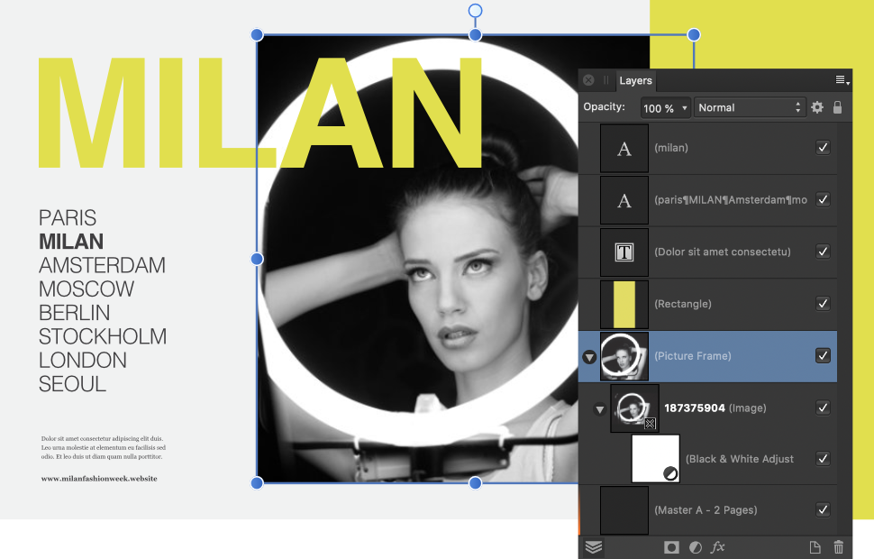

# About layers

Layers let you organize the contents of your design into a logical tiered structure for better creative composition and object management.

## What are layers?

You can think of each layer as being like an individual drawer in a clothes chest of drawers. Within that drawer you place shirts or blouses that are stacked on top of each other. In layer management, these clothes items are our individual vector objects, sometimes overlapped, sometimes not. Using our analogy, if your chest of drawers was see-through and you looked directly down from above it, you would see you the topmost drawer contents in the foreground, the bottom contents in the background, and all other contents ordered in between.

All layer management is carried out from the Layers panel.

Here are some important points regarding layers:

- The order of your layers is important. A layer at the *top* of the panel is shown in the *foreground* of your document view, with the lowest layer in the background.
- Layers belong to the publication page and are not global.
- Any selected layer(s) are highlighted, so that you can always see what layer you are working on.
- You can create child layers, which are nested under a parent layer. Child layers are perfect for use as an extra level of object organization in more complex documents.
- Any layer can be hidden, to exclude its layer objects from displaying in your design.

## Layer types

There are several types of layers that can be created; these are identified in the Layers panel with a unique icon, shown at the beginning of the layer entry.

| Panel icon | Description |
| --- | --- |
|  | Master page—a layer for the assigned master page and its objects. |
|  | Vector—used for placing vector objects into. |
|  | Shape—for geometric shapes created with shape tools. |
|  | Curve—for open curves and closed shapes drawn with Pen Tool or Pencil Tool. |
|  | Artistic Text—for scalable text. |
|  | Frame Text—for story text contained within a frame. |
|  | Path Text—for text that follows an open curve or a shape's outline. |
|  | Shape Text—for text contained within a shape. |
|  | Table—for presenting data in tabular form. |
|  | Empty group—an empty group container for containing multiple objects as a single object. |
|  | [Mask](12-layer-masking.md)—defines what content is hidden to reveal layers beneath. |
|  | [Image](10-image-layers.md)—self-contained placed images that retain the original image data including the color profile. |
|  | [Picture frame](10-image-layers.md)—a picture frame that could be a placeholder or populated with a placed image or document. |
|  | Linked/Embedded document—placed non-native documents (such as PDF, PSD, SVG, EPS) and native Affinity documents (afphoto, afdesign and afpub) files. |
|  | [Adjustment](13-using-adjustment-layers.md)—used to correct or enhance a specific object, group, layer or the whole layer stack non-destructively. |
|  | [Data merge](13-using-adjustment-layers.md)—a grid-based data merge layout for merging data records into. |

#### SEE ALSO:

- [Create layers](02-creating-layers.md)
- [Selecting and editing layers](04-selecting-and-editing-layers.md)
- [Using layer masks](12-layer-masking.md)
- [Using adjustment layers](13-using-adjustment-layers.md)
- [Layer effects](../17-layer-effects/01-using-layer-effects.md)
- [Layers panel](../21-panels/14-layers-panel.md)
